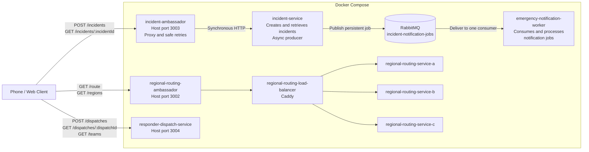

<!-- AI: This disclosure document was generated with AI assistance from the matching raw Codex transcript. -->

# Sprint 2 Incident Service AI Disclosure

This document contains the complete relevant user prompts and assistant responses verbatim. It is not a summary and does not replace the raw Codex JSONL transcript.

## Disclosure artifacts

- Canonical submission disclosure: `AI-DISCLOSURE.md`
- Requested bundled disclosure copy: `ai/chats/austinf-sprint2/AI-DISCLOSURE.md`
- Raw transcript: `ai/chats/austinf-sprint2/austinf-sprint2.jsonl`

## Scope of AI assistance

AI assisted with interpreting the Sprint 2 rubric, selecting and documenting the incident-service scope, creating Git branches, designing and implementing the Express endpoints, producing synthetic fixtures, configuring Docker and Docker Compose, reviewing and verifying behavior, hardening ignore rules, splitting code and disclosure pull requests, applying student review feedback, validating the revised behavior, preparing commits and pull-request updates, and regenerating disclosure records. The student directed service ownership, fidelity, field requirements, endpoint scope, persistence semantics, operational emergency categories, validation organization, fixture trust, middleware documentation, PR separation, and which review recommendations to implement or defer.

## AI-assisted files

The following files were generated or substantially modified with AI assistance and contain syntax-appropriate disclosure comments where their formats permit comments:

- `.env.example`
- `.gitignore`
- `docker-compose.yml`
- `docs/SERVICES.md` (incident-service ownership only; no inline disclosure comment per student review)
- `incident-service/.dockerignore`
- `incident-service/Dockerfile`
- `incident-service/docs/API.md`
- `incident-service/src/index.js`

## Strict JSON disclosure

AI assisted with `incident-service/package.json`, the npm-generated `incident-service/package-lock.json`, and `incident-service/data/incidents.json`, including review-driven fixture category changes. These strict JSON files cannot contain inline comments, so their AI assistance is documented here. The raw JSONL transcript also remains unmodified.

## Complete relevant transcript

### 1. User prompt

````text
Ok start context of sprint 2 here. Give me a little summary of what needs to be done
````

### 2. Assistant response

````text
I’ll pull the Sprint 2 requirements from the indexed course materials, then condense them into the deliverables, technical work, and likely order of attack.
````

### 3. Assistant response

````text
I found the formal rubric. I’m also checking the team-project folder so the summary distinguishes “required by Sprint 2” from “already present in this workspace.”
````

### 4. Assistant response

````text
Got it—I’ll treat this thread as the Sprint 2 workspace.

Sprint 2 is the first coded version of the Blue Light system. The team needs to:

- Build at least two Node/Express services, each in its own directory and container with its own Dockerfile.
- Give each service a realistic JSON endpoint and simulated `setTimeout` latency.
- Add a separate, observable sidecar or ambassador container.
- Create a root `docker-compose.yml` so one `docker compose up` starts everything, with health checks and appropriate `depends_on`.
- Replace the current service-list-only documentation with an actual architecture diagram in `docs/SERVICES.md`.
- Verify every endpoint with `curl` and confirm clean Compose startup.
- Preserve individual Git/PR authorship because 40% of the grade is based on each student’s primary service.

For this project, a sensible first flow is:

`emergency-gateway → ambassador → incident-service`

The ambassador could handle forwarding/retries while producing observable logs. Since there are three team members and individual grading requires identifiable primary-service ownership, building three primary services may be safer than stopping at the formal minimum of two.

Current repository status: the README and initial four-service list exist, but no Sprint 2 service code, Dockerfiles, Compose file, or diagram has been added yet.

The course schedule lists Sprint 2 as July 20–24, 2026, so verify Canvas immediately for the exact submission status. Full local rubric: [Sprint 2 summary](/Users/austinfairbanks/school/cs426/course-docs/pages/sprint-2-first-containerized-system/summary.md).
````

### 5. User prompt

````text
What do you think is the hardest service out of the ones listed in service docs?
````

### 6. Assistant response

````text
The `responder-dispatch-service` is probably the hardest overall.

It eventually needs to handle:

- Asynchronous dispatch through Redis
- Duplicate-message and retry safety
- Responder assignment and changing dispatch status
- Slow, unavailable, or failed responders
- Observable state transitions and failure recovery
- Coordination with the incident and regional-routing services

The `regional-routing-service` sounds algorithmically complex, but because this is a simulation, it can use deterministic region mappings and synthetic responder groups.

My rough difficulty ranking:

1. `responder-dispatch-service` — async workflow and failure handling
2. `emergency-gateway` — idempotency, validation, and downstream reliability
3. `incident-service` — authoritative mutable state and severity assignment
4. `regional-routing-service` — mostly deterministic simulated routing

For Sprint 2 specifically, the gateway may be the hardest because it is the natural place to integrate an ambassador and demonstrate cross-service calls. The dispatch service becomes hardest in later sprints once Redis and asynchronous processing are required.
````

### 7. User prompt

````text
Don’t think the responder dispatch is the hardest, especially in simulation. There just needs to be a fetch of local emergency services and a simulated call to them. Not worrying about like if they’re slow - the assumption is that we call them and it’s the same effectiveness if you called them yourself
````

### 8. Assistant response

````text
You’re right—I over-scoped the dispatch service beyond your intended simulation. Under your assumptions, it is probably the easiest service:

1. Receive a dispatch request.
2. Fetch the selected local emergency-service record.
3. Simulate contacting it.
4. Return a successful dispatch confirmation.

With that scope, the `emergency-gateway` is likely the hardest service. It sits at the system boundary and must combine request validation, idempotency-key handling, forwarding, and consistent error responses. It also naturally connects several later course requirements.

Revised ranking:

1. `emergency-gateway` — validation, idempotency, and orchestration
2. `incident-service` — authoritative incident state and severity assignment
3. `regional-routing-service` — deterministic region/service selection
4. `responder-dispatch-service` — lookup plus simulated call

The routing service would only become the hardest if you attempted real geospatial nearest-service calculations. For this course, a lookup table keyed by synthetic region is likely sufficient.
````

### 9. User prompt

````text
I think incident service here would be the hardest cause wouldn’t it own like some sharded database to query by incident ID or location or something? Or just a regular database?
````

### 10. Assistant response

````text
Yes—under a realistic ownership model, the `incident-service` is probably the hardest. It owns the system’s authoritative, stateful data rather than simply transforming or forwarding requests.

It would likely own:

- Incident creation and globally unique incident IDs
- Retrieval by incident ID
- Severity and incident-type classification
- Location and regional metadata
- Status transitions such as `reported → routed → dispatched → resolved`
- Protection against duplicate incident creation
- Concurrent updates from dispatch and responder workflows

I would not start with a sharded database, though. The sensible progression is:

- Sprint 2: an in-memory `Map`, keyed by incident ID
- Later simulation: multiple incident-service instances or simulated shards if a sprint requires partitioning
- Real production design: a regular service-owned database first, with indexes on incident ID, region, location, status, and creation time
- Sharding only after demonstrated scale requires it

Incident ID should be the primary lookup key. Location or region should normally be indexed query fields—not necessarily the shard key. Sharding by region makes regional searches easy, but then fetching an incident solely by ID requires knowing its region or maintaining a directory that maps IDs to shards.

For Sprint 2, a strong minimal API would be:

```text
POST  /incidents
GET   /incidents/:incidentId
PATCH /incidents/:incidentId/status
GET   /incidents?region=campus-north
```

The in-memory implementation can still model database latency with `setTimeout`. That demonstrates the service boundary without introducing an unapproved database or premature sharding.

So I’d revise the ranking again:

1. `incident-service` — authoritative state, querying, and consistency
2. `emergency-gateway` — validation, idempotency, and forwarding
3. `regional-routing-service` — synthetic mapping and selection
4. `responder-dispatch-service` — service lookup and simulated contact

Your interpretation gives the incident service the richest long-term role and makes it the clearest candidate for the hardest primary service.
````

### 11. User prompt

````text
Ok let’s do that - put in the service docs that I own this service. (@austinfairbanks). But first create a sprint 2 branch that is named: Sprint 2, Austin Fairbanks - implement incident service
````

### 12. Assistant response

````text
Git branch names cannot contain spaces, so I’ll use the direct Git-safe equivalent: `sprint-2-austin-fairbanks-implement-incident-service`. I’ll create it first, then mark `@austinfairbanks` as the incident-service owner in `docs/SERVICES.md`.
````

### 13. Assistant response

````text
Created branch:

`sprint-2-austin-fairbanks-implement-incident-service`

Updated [docs/SERVICES.md](/Users/austinfairbanks/school/cs426/426-project--bay-blues-/docs/SERVICES.md) to list `@austinfairbanks` as the `incident-service` owner.

The documentation change is currently uncommitted.
````

### 14. User prompt

````text
Ok now let’s design this service. Does the full fidelity service need to be implemented this sprint?
````

### 15. Assistant response

````text
No. Sprint 2 explicitly asks for a working simulation, not the full-fidelity incident service or a real database.

For full individual credit, your incident service needs to:

- Run as its own Express container with its own Dockerfile.
- Start through the root `docker-compose.yml`.
- Expose at least one endpoint returning plausible incident JSON.
- Simulate realistic latency using `setTimeout`.
- Be clearly attributable to you through commits and PR authorship.

A good Sprint 2 implementation would include:

```text
POST /incidents
GET  /incidents/:incidentId
GET  /health
```

Use an in-memory `Map` keyed by incident ID. A created incident could resemble:

```json
{
  "incidentId": "inc_01K...",
  "emergencyType": "medical",
  "severity": "high",
  "status": "reported",
  "location": {
    "latitude": 42.3868,
    "longitude": -72.5301,
    "venue": "UMass Amherst"
  },
  "reportedAt": "2026-07-25T22:14:00.000Z"
}
```

The service should own severity and incident state, but it should not choose responders—that belongs to regional routing and dispatch.

Defer these until later sprints:

- A real or sharded database
- Geographic indexes
- Authentication and authorization
- Complex status-transition rules
- Cross-service routing and dispatch
- Redis queues
- Replication and failure recovery
- Prometheus metrics and production-grade concurrency controls

The right approach is to design the API so those capabilities can be added later, while implementing only a clean in-memory vertical slice now. A database would add complexity without earning additional Sprint 2 rubric points.
````

### 16. User prompt

````text
Where does it define this fidelity? Give evidence where this is what I’d have to implement
````

### 17. Assistant response

````text
I’ll pull the exact Sprint 2 assignment language and rubric lines so we can separate explicit requirements from my recommended design choices.
````

### 18. Assistant response

````text
The assignment does not require the full incident-service design I proposed. The explicit minimum is much smaller, and I should distinguish the rubric from my recommendations.

The clearest fidelity statement says:

> “The services you build in this sprint are simulations… They do not connect to real databases, real external APIs, or real user data.”

See [Sprint 2 assignment, lines 7–11](/Users/austinfairbanks/school/cs426/course-docs/pages/sprint-2-first-containerized-system/source.md:7).

Your required implementation is:

- A separate service directory, Dockerfile, and Compose container.
- At least one HTTP endpoint.
- Plausible, domain-relevant simulated JSON.
- Realistic latency using `setTimeout`.

Those requirements appear in [lines 15–21](/Users/austinfairbanks/school/cs426/course-docs/pages/sprint-2-first-containerized-system/source.md:15).

Your individual 40-point rubric only evaluates:

- Dockerfile builds and service starts: 10 points.
- Endpoint returns plausible incident-domain JSON: 15 points.
- At least one endpoint uses `setTimeout` latency: 15 points.

See [individual rubric, lines 99–107](/Users/austinfairbanks/school/cs426/course-docs/pages/sprint-2-first-containerized-system/source.md:99).

The assignment also says the endpoint should match the behavior described in the Sprint 1 service list. Your service description says it “creates and tracks simulated emergency incidents, assigns each request an incident ID and severity level, and maintains the authoritative incident state.” See [SERVICES.md](/Users/austinfairbanks/school/cs426/426-project--bay-blues-/docs/SERVICES.md:4).

Therefore:

- `POST /incidents` with incident ID, severity, status, and synthetic location is clearly supported by the requirements.
- An in-memory `Map` is my suggested way to demonstrate “creates and tracks”; it is not mandated.
- `GET /incidents/:id` is a sensible interpretation of “tracks,” but the rubric does not explicitly require it.
- `GET /health` is recommended for Compose health checks, not automatically required for your individual rubric.
- `PATCH`, sharding, a real database, status-transition rules, and geographic indexing are not required this sprint.

The strict minimum could be one delayed `POST /incidents` endpoint returning a plausible created incident. I’d still implement `POST`, `GET by ID`, and `/health` because that remains small while honestly demonstrating the service description.
````

### 19. User prompt

````text
Ok so post and get and health should be what we implement here, while also adding the scaffolding to run services through docker compose ?
````

### 20. Assistant response

````text
Yes. That is the right Sprint 2 scope for your contribution.

Implement:

- `POST /incidents`
  - Validates the minimum request fields.
  - Assigns an incident ID, severity, initial status, and timestamp.
  - Stores the incident in an in-memory `Map`.
  - Returns `201 Created`.

- `GET /incidents/:incidentId`
  - Returns the stored incident.
  - Returns `404` for an unknown ID.

- `GET /health`
  - Returns a cheap, immediate health response.
  - Does not receive simulated latency.

Both incident endpoints can use `setTimeout` to simulate database latency.

The scaffolding should include:

```text
incident-service/
├── src/
│   └── index.js
├── package.json
├── package-lock.json
├── Dockerfile
└── .dockerignore

docker-compose.yml
```

The root Compose file should:

- Build `./incident-service`.
- expose it on a documented host port, such as `3001`.
- configure its internal port through an environment variable.
- define a health check against `/health`.
- leave a clean structure for teammates to add their services.
- eventually start the entire team system with one `docker compose up`.

The sidecar or ambassador remains a team-level requirement; it does not need to be bundled into your incident service. In-memory data disappearing after a restart is acceptable because Sprint 2 explicitly calls for a simulation without a real database.
````

### 21. User prompt

````text
Ok propose changes to scaffold first the housekeeping files - like docker compose and dockerfile.
````

### 22. Assistant response

````text
I’ll align the scaffold with the course’s existing Docker conventions, then propose the exact files and boundaries before we add application logic.
````

### 23. Assistant response

````text
I propose a small scaffolding change that establishes the container contract without adding incident behavior yet.

| File | Purpose |
|---|---|
| `incident-service/package.json` | Express dependency, ES modules, and `npm start` |
| `incident-service/package-lock.json` | Reproducible dependency installation |
| `incident-service/Dockerfile` | Node 24 image, dependency caching, port 3000 |
| `incident-service/.dockerignore` | Exclude `node_modules` and local artifacts |
| `docker-compose.yml` | Build, publish, configure, and health-check the service |
| `.env.example` | Document host port and simulated latency |
| `.gitignore` | Exclude `.env` and Node artifacts |

Proposed Dockerfile:

```dockerfile
FROM node:24

WORKDIR /usr/src/app

COPY package*.json ./
RUN npm ci

COPY src/ ./src/

EXPOSE 3000

CMD ["npm", "start"]
```

Proposed Compose service:

```yaml
services:
  incident-service:
    build:
      context: ./incident-service
    ports:
      - "${INCIDENT_SERVICE_PORT:-3001}:3000"
    environment:
      PORT: "3000"
      INCIDENT_LATENCY_MS: "${INCIDENT_LATENCY_MS:-200}"
    healthcheck:
      test:
        - CMD
        - node
        - -e
        - fetch('http://localhost:3000/health').then(r => { if (!r.ok) process.exit(1) }).catch(() => process.exit(1))
      interval: 5s
      timeout: 2s
      retries: 5
      start_period: 5s
```

Important choices:

- No database, volume, custom network, or `depends_on` yet.
- No `container_name`, so Compose can manage naming and future replicas.
- Internal port remains `3000`; host port defaults to `3001`.
- Teammates can later depend on `incident-service` becoming healthy.
- The root Compose file is structured so additional services can be added without changing your service.
- The next change would add `src/index.js` with `/health`, `POST /incidents`, and `GET /incidents/:incidentId`.

I would scaffold these files first, then add the application code immediately afterward so Compose does not remain temporarily unrunnable. No files have been changed for this proposal yet.
````

### 24. User prompt

````text
Looks good to me. Is this in accordance with class standards?
````

### 25. Assistant response

````text
Yes. The proposed scaffold follows the class standards.

It aligns because it uses:

- Node 24, matching the course Docker examples.
- Express with npm and ES modules.
- A separate service directory and per-service Dockerfile.
- Dependency files copied before source code for Docker layer caching.
- `.dockerignore` to exclude `node_modules`.
- Runtime configuration through environment variables.
- A root `docker-compose.yml`.
- A health check suitable for later `depends_on` relationships.
- No real database, external API, or unapproved infrastructure.

Evidence:

- Dockerfile conventions: [Unit 4 summary](/Users/austinfairbanks/school/cs426/course-docs/pages/unit-4-docker-fundamentals/summary.md:98)
- Root Compose and health checks: [Sprint 2 assignment](/Users/austinfairbanks/school/cs426/course-docs/pages/sprint-2-first-containerized-system/source.md:29)
- Separate service Dockerfiles and containers: [Sprint 2 assignment](/Users/austinfairbanks/school/cs426/course-docs/pages/sprint-2-first-containerized-system/source.md:15)

Two notes:

- The course examples use `npm install`; `npm ci` is compatible and more reproducible when `package-lock.json` is committed.
- We must add the required AI-assistance comments and eventually preserve this interaction in both `AI-DISCLOSURE.md` and the raw `ai/chats/*.jsonl` transcript.

The team will still need another primary service and a separate sidecar or ambassador, but those do not belong inside the incident-service scaffold.
````

### 26. User prompt

````text
Should we just use npm install?
````

### 27. Assistant response

````text
Yes. Use:

```dockerfile
RUN npm install
```

It matches the course examples exactly and avoids introducing an unnecessary distinction. We should still commit `package-lock.json`; `npm install` will use it while remaining tolerant if `package.json` and the lockfile briefly differ during development.
````

### 28. User prompt

````text
Ok propose the new files with that in mind
````

### 29. Assistant response

````text
Here is the revised housekeeping scaffold using `npm install`.

### `incident-service/package.json`

```json
{
  "name": "incident-service",
  "version": "1.0.0",
  "private": true,
  "description": "Simulated incident lifecycle service for the Blue Light system",
  "type": "module",
  "main": "src/index.js",
  "scripts": {
    "start": "node src/index.js"
  },
  "dependencies": {
    "express": "^5.2.1"
  }
}
```

### `incident-service/package-lock.json`

Generate this from inside `incident-service` with:

```bash
npm install
```

We should commit the generated lockfile rather than write it manually.

### `incident-service/Dockerfile`

```dockerfile
FROM node:24

WORKDIR /usr/src/app

COPY package*.json ./
RUN npm install

COPY src/ ./src/

EXPOSE 3000

CMD ["npm", "start"]
```

### `incident-service/.dockerignore`

```text
node_modules
npm-debug.log*
.DS_Store
```

### Root `docker-compose.yml`

```yaml
services:
  incident-service:
    build:
      context: ./incident-service
    ports:
      - "${INCIDENT_SERVICE_PORT:-3001}:3000"
    environment:
      PORT: "3000"
      INCIDENT_LATENCY_MS: "${INCIDENT_LATENCY_MS:-200}"
    healthcheck:
      test:
        - CMD
        - node
        - -e
        - fetch('http://localhost:3000/health').then(r => { if (!r.ok) process.exit(1) }).catch(() => process.exit(1))
      interval: 5s
      timeout: 2s
      retries: 5
      start_period: 5s
```

### Root `.env.example`

```dotenv
INCIDENT_SERVICE_PORT=3001
INCIDENT_LATENCY_MS=200
```

### Root `.gitignore`

```gitignore
.env
node_modules/
npm-debug.log*
.DS_Store
```

The following application file would be added immediately afterward:

```text
incident-service/src/index.js
```

Until `src/index.js` exists, the image cannot complete its `COPY src/` step. Therefore, I’d add the housekeeping and the initial service implementation as consecutive changes before attempting the Compose build.
````

### 30. User prompt

````text
Looks good to me. Implement, keeping the AI disclosure stuff out of scope for roght now. We will do fhat at the end of
````

### 31. Assistant response

````text
I’ll add the approved scaffold exactly as proposed, generate the npm lockfile, and validate the Compose configuration. I’ll leave AI disclosure files and annotations for the end-of-sprint pass as requested.
````

### 32. Assistant response

````text
The scaffold files are in place. Dependency installation is still running; once it finishes I’ll validate the lockfile and Compose YAML, without trying to start the not-yet-implemented service.
````

### 33. Assistant response

````text
Implemented the approved scaffold on `sprint-2-austin-fairbanks-implement-incident-service`:

- [docker-compose.yml](/Users/austinfairbanks/school/cs426/426-project--bay-blues-/docker-compose.yml)
- [Dockerfile](/Users/austinfairbanks/school/cs426/426-project--bay-blues-/incident-service/Dockerfile)
- [package.json](/Users/austinfairbanks/school/cs426/426-project--bay-blues-/incident-service/package.json)
- Generated `package-lock.json` with `npm install`
- Added `.dockerignore`, `.gitignore`, and `.env.example`

Validation completed:

- `docker compose config` passes.
- `git diff --check` passes.
- npm installed 67 packages with no reported vulnerabilities.

I did not build or start the container because `src/index.js` is intentionally the next implementation step. Changes remain uncommitted, and AI disclosure work remains deferred.
````

### 34. User prompt

````text
Ok now propose the changes needed for the health check endpoint as long as there’s nothing needed before that
````

### 35. Assistant response

````text
Nothing else is required first. The existing package, Dockerfile, and Compose health-check command are ready for the application entry point.

The only required change is a new `incident-service/src/index.js`:

```js
import express from "express";

const app = express();
const port = Number.parseInt(process.env.PORT ?? "3000", 10);

app.disable("x-powered-by");
app.use(express.json());

app.get("/health", (_request, response) => {
  response.status(200).json({
    status: "ok",
    service: "incident-service",
  });
});

app.listen(port, () => {
  console.log(
    JSON.stringify({
      level: "info",
      message: "Incident service started",
      port,
    }),
  );
});
```

This follows the class conventions:

- Express and ES modules
- Arrow functions and no classes
- Port configured through the environment
- Cheap, deterministic health response
- No artificial latency on `/health`
- JSON startup log
- Existing Compose health check will call this endpoint

After adding it, verification would be:

```bash
docker compose up --build -d
docker compose ps
curl http://localhost:3001/health
docker compose down
```

Expected response:

```json
{"status":"ok","service":"incident-service"}
```

No Dockerfile, package, or Compose modifications should be necessary for this endpoint.
````

### 36. User prompt

````text
Looks good to me. Launch an agent to implement it and then launch an agent to review it. Have the implementation agent be 5.6 Terra high and 5.6 sol high to review and fix
````

### 37. Assistant response

````text
I’m using the Cavecrew delegation guide because you explicitly requested separate implementation and review agents. I’ll run them sequentially: implement first, then review and fix. The agent launcher does not expose model selection, so I cannot guarantee the requested “5.6 Terra high” and “5.6 sol high” variants; I’ll assign the requested roles and acceptance criteria to the available agents.
````

### 38. Assistant response

````text
The implementation agent is still working through verification. I’m waiting for its completed change before starting the independent review agent, as requested.
````

### 39. Assistant response

````text
The implementation agent completed `src/index.js` and verified a healthy Compose response. I’m now handing that exact change to the review agent, with authority to correct any issues it finds and rerun verification.
````

### 40. Assistant response

````text
The review agent passed the implementation without changes and confirmed the container reaches `healthy`. I’m doing a final worktree read so the handoff reflects the exact files now present.
````

### 41. Assistant response

````text
Implemented and independently reviewed the health endpoint in [src/index.js](/Users/austinfairbanks/school/cs426/426-project--bay-blues-/incident-service/src/index.js).

Review passed without corrections:

- `/health` returns `200 {"status":"ok","service":"incident-service"}`.
- Container builds and reaches `healthy`.
- `node --check`, Compose validation, and `git diff --check` pass.
- Temporary containers and networks were stopped and removed.
- AI disclosure remains deferred.
- Changes remain uncommitted.

The agent launcher did not expose model selection, so I could not guarantee the requested 5.6 variants; separate builder and reviewer agents were used in sequence.
````

### 42. User prompt

````text
Ok now propose code for the fake json data we need for this code to work. This should establish simulated data that is source of truth for the get endpoint. This should not be modified yet, this just acts as a pseudo static persistent storage for the get endpoint to index to.
````

### 43. User prompt

````text
Actually let’s define the index contract here - let’s getting a planning doc for each of the endpoints and their api contracts.
````

### 44. Assistant response

````text
I’ll add a design-only contract at `docs/INCIDENT-SERVICE-API.md`. It will specify `/health`, `POST /incidents`, and `GET /incidents/:incidentId`, including schemas, status codes, latency, and how immutable JSON fixtures seed runtime state—without changing service code yet.
````

### 45. Assistant response

````text
Created [INCIDENT-SERVICE-API.md](/Users/austinfairbanks/school/cs426/426-project--bay-blues-/docs/INCIDENT-SERVICE-API.md).

It defines:

- Shared incident JSON representation
- `GET /health`
- `POST /incidents`
- `GET /incidents/:incidentId`
- Required request fields and status codes
- Consistent validation and not-found errors
- Simulated-latency behavior
- Sprint 2 non-goals

The storage contract uses a read-only `incident-service/data/incidents.json` fixture to seed an in-memory `Map`. GET indexes that map, while POST may add runtime-only records without rewriting the fixture. Those additions disappear after restart.

No application code or fixture data was changed. `git diff --check` passes.
````

### 46. User prompt

````text
Okay summarize this - I want to see the incident fields data contract and things like that. Also what the time delay latency is going to do
````

### 47. Assistant response

````text
The incident service owns one canonical incident shape:

| Field | Type | Ownership |
|---|---|---|
| `incidentId` | string | Server-generated opaque ID beginning with `inc_` |
| `emergencyType` | string | Client supplies: `medical`, `fire`, `security`, `crisis`, or `other` |
| `severity` | string | Server assigns: `low`, `medium`, `high`, or `critical` |
| `status` | string | Server initializes to `reported` |
| `location.latitude` | number | Client supplies; `-90` through `90` |
| `location.longitude` | number | Client supplies; `-180` through `180` |
| `location.venue` | string | Client supplies a non-empty synthetic venue |
| `description` | string | Optional client-supplied synthetic description |
| `reportedAt` | string | Server-generated ISO 8601 timestamp |

Example:

```json
{
  "incidentId": "inc_0001",
  "emergencyType": "medical",
  "severity": "high",
  "status": "reported",
  "location": {
    "latitude": 42.3868,
    "longitude": -72.5301,
    "venue": "UMass Amherst"
  },
  "description": "Person requiring immediate medical assistance",
  "reportedAt": "2026-07-25T22:14:00.000Z"
}
```

The client does not control `incidentId`, `severity`, `status`, or `reportedAt`.

Endpoints:

- `GET /health` — returns service health immediately.
- `POST /incidents` — validates input, assigns server-owned fields, stores the incident in runtime memory, and returns `201`.
- `GET /incidents/:incidentId` — returns the matching incident or `404`.

Storage behavior:

- `data/incidents.json` will contain deterministic fake incidents.
- The file is loaded into a `Map` indexed by `incidentId`.
- The fixture file is never modified by the service.
- POST-created incidents can be added to the runtime Map.
- Runtime additions disappear when the container restarts.

Latency behavior:

- Default latency is `200` milliseconds.
- It is configurable through `INCIDENT_LATENCY_MS`.
- POST creation and validation responses are delayed.
- GET successful and not-found responses are delayed.
- `/health` is never intentionally delayed.

The delay represents time that a real database lookup, write, or incident-processing operation might take. It lets the team later measure realistic response latency without introducing an actual database.
````

### 48. User prompt

````text
Emergency type, severity, status should be enums. Reported at should be a timestamp.  I’d should be something smarter than a string. Type should also be optional, especially if it’s in the moment. Same with severity. Anything else missing from this contract?
````

### 49. Assistant response

````text
Those are good corrections. JSON does not have native UUID, enum, or timestamp primitives, so they are serialized as strings but should have stronger semantic formats in the contract.

I’d revise the fields as follows:

| Field | Contract |
|---|---|
| `incidentId` | Required server-generated UUID; JSON string with `format: uuid` |
| `emergencyType` | Optional enum; defaults to `unknown` |
| `severity` | Optional/server-assigned enum; defaults to `unassessed` |
| `status` | Required server-owned enum; initially `reported` |
| `reportedAt` | Required server timestamp; RFC 3339/ISO 8601 UTC |
| `updatedAt` | Required server timestamp; initially equals `reportedAt` |
| `version` | Required positive integer; initially `1` |
| `location` | Partial location information, with coordinates validated as a pair |
| `description` | Optional string |

Recommended enums:

```text
EmergencyType:
medical | fire | security | crisis | other | unknown

Severity:
low | medium | high | critical | unassessed

IncidentStatus:
reported | triaged | routed | dispatched | resolved | cancelled
```

A UUID would look like:

```json
"incidentId": "550e8400-e29b-41d4-a716-446655440000"
```

We can generate UUID v4 without another dependency using Node’s `crypto.randomUUID()`.

A timestamp remains a JSON string, but the contract identifies it as a timestamp:

```json
"reportedAt": "2026-07-26T05:14:00.000Z"
```

This is preferable to epoch milliseconds because it is readable, timezone-explicit, and standard across HTTP APIs.

I’d also change location. Venue should not necessarily be required during an urgent report:

```json
"location": {
  "latitude": 42.3868,
  "longitude": -72.5301,
  "accuracyMeters": 12.5,
  "capturedAt": "2026-07-26T05:13:58.000Z",
  "venue": "UMass Amherst"
}
```

Rules:

- `location` can be optional initially.
- Latitude and longitude must either both be supplied or both omitted.
- `venue`, `accuracyMeters`, and `capturedAt` are optional.
- No real personal location data appears in fixtures.

The most useful missing fields are:

- `updatedAt` — needed once incident state changes.
- `version` — provides a future concurrency/versioning hook.
- `location.accuracyMeters` — distinguishes precise GPS from approximate location.
- `location.capturedAt` — tells routing whether the location may be stale.
- `source` — optional enum such as `mobile`, `blue_light`, or `operator`.

A revised record could be:

```json
{
  "incidentId": "550e8400-e29b-41d4-a716-446655440000",
  "emergencyType": "unknown",
  "severity": "unassessed",
  "status": "reported",
  "source": "mobile",
  "location": {
    "latitude": 42.3868,
    "longitude": -72.5301,
    "accuracyMeters": 12.5,
    "capturedAt": "2026-07-26T05:13:58.000Z"
  },
  "description": "Emergency assistance requested",
  "reportedAt": "2026-07-26T05:14:00.000Z",
  "updatedAt": "2026-07-26T05:14:00.000Z",
  "version": 1
}
```

I would not add responder IDs, regional assignments, dispatch details, or user identity fields. Those either belong to other services or create unnecessary privacy concerns.
````

### 50. User prompt

````text
Source will always be phone - it’s like an app or web system. But this sounds good to me. Harden this in the planning docs
````

### 51. Assistant response

````text
I’ll update the API plan to make UUIDs, enums, timestamps, optional classification, partial location, versioning, and the phone-client assumption explicit. I’ll also link the contract from `docs/SERVICES.md`; no runtime code or fixtures will change.
````

### 52. Assistant response

````text
Hardened the contract in [INCIDENT-SERVICE-API.md](/Users/austinfairbanks/school/cs426/426-project--bay-blues-/docs/INCIDENT-SERVICE-API.md) and linked it from [SERVICES.md](/Users/austinfairbanks/school/cs426/426-project--bay-blues-/docs/SERVICES.md).

The contract now specifies:

- UUID v4 incident IDs generated with `crypto.randomUUID()`
- Explicit enums for emergency type, severity, and status
- Optional emergency type and severity with `unknown` and `unassessed` defaults
- RFC 3339/ISO 8601 timestamps
- `reportedAt`, `updatedAt`, and integer `version`
- Optional partial location with coordinate-pair validation
- Optional accuracy and location-capture timestamp
- Valid empty-object incident creation for immediate requests
- Phone/web-client origin as an invariant, so no redundant `source` field
- Strict request-validation rules
- Read-only fixtures plus runtime-only POST additions

No runtime code or fixture data changed. `git diff --check` passes.
````

### 53. User prompt

````text
Ok now propose code for the post endpoint. Also make sure the planning doc is contained within this services directory
````

### 54. Assistant response

````text
I’ll relocate the contract under `incident-service/docs/` and repair its link from the system service list. I’ll leave runtime code untouched and then propose the POST implementation against that contract.
````

### 55. Assistant response

````text
The planning contract now lives inside the service at [incident-service/docs/API.md](/Users/austinfairbanks/school/cs426/426-project--bay-blues-/incident-service/docs/API.md). The link in `docs/SERVICES.md` was updated accordingly.

For the POST endpoint, I propose replacing `src/index.js` with this complete version:

```js
import { randomUUID } from "node:crypto";
import express from "express";

const app = express();
const port = Number.parseInt(process.env.PORT ?? "3000", 10);

const configuredLatency = Number(
  process.env.INCIDENT_LATENCY_MS ?? "200",
);
const incidentLatencyMs =
  Number.isFinite(configuredLatency) && configuredLatency >= 0
    ? configuredLatency
    : 200;

const emergencyTypes = new Set([
  "medical",
  "fire",
  "security",
  "crisis",
  "other",
  "unknown",
]);

const severities = new Set([
  "low",
  "medium",
  "high",
  "critical",
  "unassessed",
]);

const incidents = new Map();

const isObject = (value) =>
  value !== null && typeof value === "object" && !Array.isArray(value);

const isNonEmptyString = (value) =>
  typeof value === "string" && value.trim().length > 0;

const isTimestamp = (value) =>
  typeof value === "string" && !Number.isNaN(Date.parse(value));

const validateIncidentRequest = (body) => {
  if (!isObject(body)) {
    return ["request body must be a JSON object"];
  }

  const errors = [];

  if (
    body.emergencyType !== undefined &&
    !emergencyTypes.has(body.emergencyType)
  ) {
    errors.push("emergencyType is not a supported value");
  }

  if (body.severity !== undefined && !severities.has(body.severity)) {
    errors.push("severity is not a supported value");
  }

  if (
    body.description !== undefined &&
    !isNonEmptyString(body.description)
  ) {
    errors.push("description must be a non-empty string");
  }

  if (body.location !== undefined) {
    if (!isObject(body.location)) {
      errors.push("location must be a JSON object");
      return errors;
    }

    const location = body.location;
    const hasLatitude = location.latitude !== undefined;
    const hasLongitude = location.longitude !== undefined;
    const hasCoordinates = hasLatitude && hasLongitude;
    const hasVenue = isNonEmptyString(location.venue);

    if (hasLatitude !== hasLongitude) {
      errors.push(
        "location.latitude and location.longitude must be supplied together",
      );
    }

    if (
      hasLatitude &&
      (typeof location.latitude !== "number" ||
        location.latitude < -90 ||
        location.latitude > 90)
    ) {
      errors.push("location.latitude must be from -90 through 90");
    }

    if (
      hasLongitude &&
      (typeof location.longitude !== "number" ||
        location.longitude < -180 ||
        location.longitude > 180)
    ) {
      errors.push("location.longitude must be from -180 through 180");
    }

    if (!hasCoordinates && !hasVenue) {
      errors.push(
        "location must contain a venue or latitude-longitude pair",
      );
    }

    if (
      location.accuracyMeters !== undefined &&
      (typeof location.accuracyMeters !== "number" ||
        location.accuracyMeters < 0)
    ) {
      errors.push("location.accuracyMeters must be non-negative");
    }

    if (
      location.capturedAt !== undefined &&
      !isTimestamp(location.capturedAt)
    ) {
      errors.push("location.capturedAt must be a valid timestamp");
    }
  }

  return errors;
};

const normalizeLocation = (location) => {
  const allowedFields = [
    "latitude",
    "longitude",
    "venue",
    "accuracyMeters",
    "capturedAt",
  ];

  return Object.fromEntries(
    allowedFields
      .filter((field) => location[field] !== undefined)
      .map((field) => [
        field,
        typeof location[field] === "string"
          ? location[field].trim()
          : location[field],
      ]),
  );
};

const createIncident = (body) => {
  const timestamp = new Date().toISOString();

  return {
    incidentId: randomUUID(),
    emergencyType: body.emergencyType ?? "unknown",
    severity: body.severity ?? "unassessed",
    status: "reported",
    ...(body.location === undefined
      ? {}
      : { location: normalizeLocation(body.location) }),
    ...(body.description === undefined
      ? {}
      : { description: body.description.trim() }),
    reportedAt: timestamp,
    updatedAt: timestamp,
    version: 1,
  };
};

app.disable("x-powered-by");
app.use(express.json());

app.get("/health", (_request, response) => {
  response.status(200).json({
    status: "ok",
    service: "incident-service",
  });
});

app.post("/incidents", (request, response) => {
  const body = request.body === undefined ? {} : request.body;
  const validationErrors = validateIncidentRequest(body);

  setTimeout(() => {
    if (validationErrors.length > 0) {
      response.status(400).json({
        error: {
          code: "VALIDATION_ERROR",
          message: "Incident request is invalid",
          details: validationErrors,
        },
      });
      return;
    }

    const incident = createIncident(body);
    incidents.set(incident.incidentId, incident);

    response
      .location(`/incidents/${incident.incidentId}`)
      .status(201)
      .json(incident);
  }, incidentLatencyMs);
});

app.listen(port, () => {
  console.log(
    JSON.stringify({
      level: "info",
      message: "Incident service started",
      port,
    }),
  );
});
```

This implementation would:

- Accept an empty object for an immediate emergency request.
- Validate optional type, severity, description, and location.
- Generate UUIDs with Node’s built-in `crypto.randomUUID()`.
- Assign timestamps, initial status, and version.
- Default classification to `unknown` and `unassessed`.
- Store the incident in a runtime `Map`.
- Return a `Location` header and `201 Created`.
- Delay both successful and validation responses by the configured latency.
- Leave `/health` immediate.

The same `incidents` Map would later be seeded from the read-only JSON fixture and queried by the GET endpoint. No POST endpoint code has been implemented yet.
````

### 56. User prompt

````text
Location should be necessary - how would they know where to go?
````

### 57. Assistant response

````text
Agreed. The incident cannot enter routing without actionable coordinates. I’ll revise the contract so `location`, `latitude`, and `longitude` are required; venue, accuracy, and capture time remain optional. Emergency type and severity can still be unknown.
````

### 58. Assistant response

````text
Agreed. Location is now required in [API.md](/Users/austinfairbanks/school/cs426/426-project--bay-blues-/incident-service/docs/API.md).

The revised POST contract requires:

- `location` object
- Numeric `location.latitude` from `-90` through `90`
- Numeric `location.longitude` from `-180` through `180`

These remain optional:

- `location.venue`
- `location.accuracyMeters`
- `location.capturedAt`
- Emergency type
- Severity
- Description

An empty request is no longer valid. Missing or invalid coordinates produce a delayed `400 VALIDATION_ERROR`, just like other POST validation failures. No runtime endpoint code was changed.
````

### 59. User prompt

````text
Awesome now update the runtime endpoint
````

### 60. Assistant response

````text
I’ll implement `POST /incidents` against the hardened contract: required coordinates, optional classification, UUID/timestamps/version, runtime Map storage, consistent validation JSON, and the configured delay. Then I’ll verify valid and invalid requests through Compose.
````

### 61. Assistant response

````text
The image builds and the container is running. I’m checking health plus successful, missing-location, and malformed-JSON POST paths, including whether data responses actually incur the configured delay.
````

### 62. Assistant response

````text
Implemented `POST /incidents` in [src/index.js](/Users/austinfairbanks/school/cs426/426-project--bay-blues-/incident-service/src/index.js).

It now:

- Requires valid latitude and longitude.
- Accepts optional emergency type, severity, venue, accuracy, capture time, and description.
- Generates a UUID v4, timestamps, `reported` status, and version `1`.
- Defaults classification to `unknown` and `unassessed`.
- Stores created incidents in the runtime `Map`.
- Returns `201 Created` with a `Location` header.
- Returns structured `400 VALIDATION_ERROR` responses.
- Delays success, validation, and malformed-JSON responses using `INCIDENT_LATENCY_MS`.
- Keeps `/health` immediate.

Verified through Docker Compose:

- Container became healthy.
- Valid POST returned `201` after simulated latency.
- Missing location returned delayed `400`.
- Malformed JSON returned delayed structured `400`.
- Health returned immediate `200`.
- Temporary verification containers were removed.
- `git diff --check` passes.

Changes remain uncommitted.
````

### 63. User prompt

````text
Launch a reviewer agent to make sure everything makes sense and is aligned
````

### 64. Assistant response

````text
I’m using the Cavecrew review workflow because you explicitly requested a reviewer agent. It will audit the full incident-service scaffold, API contract, runtime behavior, Compose wiring, and Sprint 2 alignment without modifying files.
````

### 65. Assistant response

````text
The reviewer is still running its contract and container-alignment checks. It has read-only scope, so the worktree will remain unchanged regardless of findings.
````

### 66. Assistant response

````text
The reviewer found no critical issues and confirmed the container, Compose configuration, health endpoint, POST success path, validation path, and latency behavior all work.

Two alignment findings remain:

- Medium: [src/index.js](/Users/austinfairbanks/school/cs426/426-project--bay-blues-/incident-service/src/index.js:38) uses `Date.parse()`, which accepts timestamps outside the documented RFC 3339 UTC format. It should use stricter format and calendar-date validation.
- Low: [SERVICES.md](/Users/austinfairbanks/school/cs426/426-project--bay-blues-/docs/SERVICES.md:4) and [API.md](/Users/austinfairbanks/school/cs426/426-project--bay-blues-/incident-service/docs/API.md:6) say the service “assigns” severity, but POST currently accepts and preserves caller-supplied severity. The wording or behavior should be reconciled.

All structural checks passed, and temporary Compose resources were removed. The reviewer made no changes.
````

### 67. User prompt

````text
Fix those and then propose code for the get endpoint implementation
````

### 68. Assistant response

````text
I’ll fix the two review findings first: strict UTC timestamp validation and severity-ownership wording. I’ll verify those changes, then outline the GET endpoint together with its required fixture-loading changes—without implementing GET yet.
````

### 69. Assistant response

````text
Fixed both review findings:

- Timestamp validation now accepts only valid UTC `YYYY-MM-DDTHH:mm:ss[.sss]Z` timestamps and rejects rollover dates such as February 30.
- Documentation now says severity is caller-supplied when available and defaults to `unassessed`.

Verified valid timestamps return `201`; natural-language and invalid-calendar timestamps return `400`.

## Proposed GET implementation

The GET change should include the fixture, loader, Docker packaging, and route together.

Add `incident-service/data/incidents.json`:

```json
[
  {
    "incidentId": "3f0c8c14-6b93-4c4e-9ea4-33d70c42d701",
    "emergencyType": "medical",
    "severity": "high",
    "status": "reported",
    "location": {
      "latitude": 42.3912,
      "longitude": -72.5267,
      "venue": "North Campus Library",
      "accuracyMeters": 10
    },
    "description": "Person requiring medical assistance",
    "reportedAt": "2026-07-25T20:10:00.000Z",
    "updatedAt": "2026-07-25T20:10:00.000Z",
    "version": 1
  },
  {
    "incidentId": "91af58b0-8df3-4b99-a5d0-b60618f4d2bb",
    "emergencyType": "security",
    "severity": "unassessed",
    "status": "reported",
    "location": {
      "latitude": 42.3845,
      "longitude": -72.5283,
      "venue": "Central Transit Hub",
      "accuracyMeters": 18
    },
    "description": "Immediate security assistance requested",
    "reportedAt": "2026-07-25T20:15:00.000Z",
    "updatedAt": "2026-07-25T20:15:00.000Z",
    "version": 1
  }
]
```

Update the Dockerfile so the fixture is included:

```dockerfile
COPY data/ ./data/
COPY src/ ./src/
```

Add a fixture loader to `src/index.js`:

```js
import { readFileSync } from "node:fs";

const fixtureUrl = new URL("../data/incidents.json", import.meta.url);
const fixtureIncidents = JSON.parse(readFileSync(fixtureUrl, "utf8"));

const incidents = new Map(
  fixtureIncidents.map((incident) => [
    incident.incidentId,
    incident,
  ]),
);

if (incidents.size !== fixtureIncidents.length) {
  throw new Error("Fixture incident IDs must be unique");
}
```

This replaces the current empty `new Map()` declaration.

Add the GET route:

```js
app.get("/incidents/:incidentId", (request, response) => {
  setTimeout(() => {
    const incident = incidents.get(request.params.incidentId);

    if (incident === undefined) {
      response.status(404).json({
        error: {
          code: "INCIDENT_NOT_FOUND",
          message: "No incident was found for the supplied incident ID",
        },
      });
      return;
    }

    response.status(200).json(incident);
  }, incidentLatencyMs);
});
```

This design ensures:

- Fixtures provide deterministic pseudo-persistent records.
- POST and GET share the same runtime Map.
- POST never modifies the JSON fixture.
- Fixture records return after every restart.
- POST-created records disappear after restart.
- Successful and missing GET requests both receive simulated database latency.

No GET or fixture code has been implemented yet.
````

### 70. User prompt

````text
Ok implemt this then propose the simulated fake data json it loads from.
````

### 71. Assistant response

````text
I’ll keep the data content separate for approval: implement the fixture loader, GET route, and Docker packaging now, with an empty `[]` fixture so the service remains runnable. Then I’ll propose the actual synthetic records without adding them yet.
````

### 72. Assistant response

````text
The GET loader and route are in place, and the container builds with the empty fixture. I’m verifying the important runtime sequence now: POST creates a runtime record, GET retrieves it, and an unknown ID returns a delayed 404.
````

### 73. Assistant response

````text
Implemented the GET infrastructure:

- Added fixture loading from [data/incidents.json](/Users/austinfairbanks/school/cs426/426-project--bay-blues-/incident-service/data/incidents.json).
- Added duplicate-ID and array-shape startup validation.
- Added `GET /incidents/:incidentId`.
- Updated the Dockerfile to copy fixture data into the image.
- Left the fixture as an empty `[]` pending data approval.

Verified:

- POST-created incident retrieved through GET with `200`.
- Unknown incident returned structured `404`.
- Both GET paths incurred approximately 200 ms latency.
- Container built and became healthy.
- Temporary Compose resources were removed.

## Proposed fixture data

```json
[
  {
    "incidentId": "3f0c8c14-6b93-4c4e-9ea4-33d70c42d701",
    "emergencyType": "medical",
    "severity": "high",
    "status": "reported",
    "location": {
      "latitude": 42.3912,
      "longitude": -72.5267,
      "venue": "North Campus Library",
      "accuracyMeters": 10,
      "capturedAt": "2026-07-25T20:09:57.000Z"
    },
    "description": "Person requiring immediate medical assistance",
    "reportedAt": "2026-07-25T20:10:00.000Z",
    "updatedAt": "2026-07-25T20:10:00.000Z",
    "version": 1
  },
  {
    "incidentId": "91af58b0-8df3-4b99-a5d0-b60618f4d2bb",
    "emergencyType": "security",
    "severity": "medium",
    "status": "triaged",
    "location": {
      "latitude": 42.3845,
      "longitude": -72.5283,
      "venue": "Central Transit Hub",
      "accuracyMeters": 18,
      "capturedAt": "2026-07-25T20:14:55.000Z"
    },
    "description": "Security assistance requested near the boarding area",
    "reportedAt": "2026-07-25T20:15:00.000Z",
    "updatedAt": "2026-07-25T20:16:30.000Z",
    "version": 2
  },
  {
    "incidentId": "742b9b2a-df37-46ad-8a46-d50a8f3ed3bd",
    "emergencyType": "fire",
    "severity": "critical",
    "status": "routed",
    "location": {
      "latitude": 42.3881,
      "longitude": -72.5239,
      "venue": "Riverside Stadium",
      "accuracyMeters": 8,
      "capturedAt": "2026-07-25T20:19:58.000Z"
    },
    "description": "Smoke visible near a stadium service entrance",
    "reportedAt": "2026-07-25T20:20:00.000Z",
    "updatedAt": "2026-07-25T20:21:15.000Z",
    "version": 3
  },
  {
    "incidentId": "f7dd7ab7-31c0-4ba5-b15c-8df9a716b6c2",
    "emergencyType": "crisis",
    "severity": "high",
    "status": "dispatched",
    "location": {
      "latitude": 42.3827,
      "longitude": -72.5321,
      "venue": "Community Wellness Center",
      "accuracyMeters": 14,
      "capturedAt": "2026-07-25T20:24:56.000Z"
    },
    "description": "Crisis-response assistance requested",
    "reportedAt": "2026-07-25T20:25:00.000Z",
    "updatedAt": "2026-07-25T20:27:10.000Z",
    "version": 4
  },
  {
    "incidentId": "2665c1d6-2b7a-4573-8413-dc880f703edc",
    "emergencyType": "unknown",
    "severity": "unassessed",
    "status": "reported",
    "location": {
      "latitude": 42.3863,
      "longitude": -72.5354,
      "venue": "Eastside Shopping Center",
      "accuracyMeters": 25,
      "capturedAt": "2026-07-25T20:29:59.000Z"
    },
    "description": "Emergency assistance requested without classification",
    "reportedAt": "2026-07-25T20:30:00.000Z",
    "updatedAt": "2026-07-25T20:30:00.000Z",
    "version": 1
  }
]
```

This dataset covers different classifications, lifecycle states, accuracy levels, and unknown initial information without using real user data. It has not been added yet.
````

### 74. User prompt

````text
Ok looks good implement. After that, tell me if anything remains to implement
````

### 75. Assistant response

````text
I’ll add the approved five-record fixture, rebuild the container, and verify a fixture-backed GET. Then I’ll audit the current branch against both the incident-service contract and the broader Sprint 2 rubric so “remaining work” is clearly separated.
````

### 76. Assistant response

````text
The fixture is valid JSON with five unique IDs, and the rebuilt service started successfully. I’m confirming container health and one deterministic fixture lookup before the final remaining-work audit.
````

### 77. Assistant response

````text
Implemented the five approved fixture records in [incidents.json](/Users/austinfairbanks/school/cs426/426-project--bay-blues-/incident-service/data/incidents.json).

Verified:

- Valid JSON array with five unique incident IDs.
- Container builds and reaches `healthy`.
- Fixture-backed GET returns `200`.
- GET retains the simulated latency.
- Temporary Compose resources were removed.
- `git diff --check` passes.

The incident service is complete for the agreed Sprint 2 scope: health, POST, GET, validation, latency, runtime storage, static fixtures, Dockerfile, Compose entry, and API contract.

Remaining Sprint 2 team work:

- Add at least one other primary service.
- Add a separate, observable sidecar or ambassador.
- Integrate all team services into the root Compose file.
- Add the required architecture diagram to `docs/SERVICES.md`.
- Verify the entire system starts with one `docker compose up`.
- Commit this work and open a PR so your individual authorship is visible.
- Complete the deferred AI disclosure and raw transcript before submission.

Automated endpoint tests would be useful, but they are not explicitly required by the Sprint 2 rubric. All current changes remain uncommitted.
````

### 78. User prompt

````text
Now send a reviewer agent at each part of this task. Review the guidelines and plans and see if there’s anything not lined up or not assessing the assignment details. Launch actually 2 agents at each, one rooted in all the documentation from our course so far for intended practices and one rooted in best practices in general, both with the assignment details in mind.
````

### 79. Assistant response

````text
I’m using the Cavecrew delegation guide because you explicitly requested reviewer agents. I’ll launch two read-only reviewers in parallel across the entire incident-service task: one course-first reviewer grounded in the indexed assignments and units, and one general engineering reviewer constrained by the course’s allowed scope.
````

### 80. Assistant response

````text
Both reviewers are still working. The course-first audit is tracing rubric claims back to indexed course sources; the engineering audit is exercising edge cases while staying inside the course’s intentionally simulated scope.
````

### 81. Assistant response

````text
The engineering reviewer has finished: Austin’s service is sound for the individual rubric, with one worthwhile robustness gap around validating fixture records. It also confirmed the two known team-level blockers—second service/helper container and system diagram. I’m waiting for the course-grounded audit before reconciling both reports.
````

### 82. Assistant response

````text
Both reviewers completed read-only audits and made no changes. They independently agreed that Austin’s incident service covers every explicit individual Sprint 2 criterion.

| Area | Course-first review | Engineering review | Verdict |
|---|---|---|---|
| Express service and API | Pass | Pass | Aligned |
| Domain-specific JSON | Pass | Pass | Aligned |
| `setTimeout` latency | Pass | Pass | Aligned |
| Dockerfile and health | Pass | Pass | Aligned |
| Contract/runtime consistency | Pass | Pass | Aligned |
| Fixture validity | Current data valid | Startup validation incomplete | Worth hardening |
| Full team Compose system | Incomplete | Incomplete | Sprint blocker |
| Required diagram | Missing | Missing | Sprint blocker |
| Git authorship evidence | Missing | Noted | Submission blocker |

## Austin’s individual service

The reviewers confirmed:

- Docker image builds and reaches `healthy`.
- `/health` is immediate.
- POST returns plausible emergency JSON and a `Location` header.
- GET retrieves fixture and runtime-created incidents.
- Data endpoints consistently incur approximately 200 ms latency.
- Required coordinates, enums, defaults, UUIDs, timestamps, and validation match the contract.
- Synthetic fixtures and runtime memory are appropriate for the assignment.
- ES modules, arrow functions, Express, Node, and no classes match course conventions.

This covers the explicit individual 40-point rubric at [Sprint 2 source](/Users/austinfairbanks/school/cs426/course-docs/pages/sprint-2-first-containerized-system/source.md:99).

## Recommended incident-service improvement

Both agents noticed that [index.js](/Users/austinfairbanks/school/cs426/426-project--bay-blues-/incident-service/src/index.js:31) only checks that fixtures are an array with unique IDs. It does not validate every fixture against the documented contract.

The current five records are valid, so this does not threaten Sprint 2 credit. Still, a fixture validator or small fixture test should eventually check:

- UUID v4 format
- Enum membership
- Required coordinates
- Valid timestamps
- Positive integer versions
- Timestamp ordering

The engineering reviewer also offered lower-priority hardening ideas:

- Ensure every error path returns JSON, including oversized payloads and unknown routes.
- Add reasonable description and venue length limits.
- Validate port and latency environment variables more strictly.
- Capture `reportedAt` when the request arrives rather than after simulated latency.
- Add automated tests with Node’s built-in test runner.

None are explicit Sprint 2 requirements.

## Team-level blockers

The repository is not yet a complete Sprint 2 submission:

1. Root Compose currently defines only `incident-service`.
2. A second custom service is required.
3. A separate observable sidecar or ambassador is required.
4. [SERVICES.md](/Users/austinfairbanks/school/cs426/426-project--bay-blues-/docs/SERVICES.md:1) needs an actual diagram.
5. README startup and curl instructions should be added after integration.
6. All Austin work remains uncommitted, so the required commit/PR authorship evidence does not yet exist.
7. Deferred AI disclosure records and annotations remain required before submission.

The saved assignment schedules Sprint 2 for July 20–24, while the local date is July 25. The reviewers recommend checking live Canvas submission status immediately.

Bottom line: the incident service is correctly scoped and aligned. The remaining serious risks are team integration, the diagram, Git/PR evidence, and submission housekeeping—not Austin’s endpoint implementation.
````

### 83. User prompt

````text
Ok so propose changes to address the comments
````

### 84. Assistant response

````text
I’d address the review comments in two passes: protect Sprint 2 credit first, then add proportional hardening.

## Austin’s service changes

| File | Proposed change | Priority |
|---|---|---|
| `src/index.js` | Validate every fixture record before populating the Map | High |
| `src/index.js` | Capture `reportedAt` when POST arrives, before latency | Medium |
| `src/index.js` | Add venue and description length limits | Low |
| `src/index.js` | Strictly validate port and latency configuration | Low |
| `src/index.js` | Return JSON for payload-too-large, unknown-route, and unexpected-error paths | Low |
| `docs/API.md` | Document new limits and general error responses | Medium |
| `test/incident-service.test.js` | Add built-in Node regression tests | Optional |

### Fixture validation

Add a dedicated validator covering:

- UUID v4 incident IDs
- Emergency-type, severity, and status enums
- Required latitude and longitude
- Optional location metadata
- Strict timestamps
- `updatedAt >= reportedAt`
- Positive integer version
- Non-empty optional text
- Duplicate IDs

Startup should fail with a useful message such as:

```text
Invalid incident fixture at index 2:
- incidentId must be a UUID v4
- location.longitude is required
```

This brings runtime behavior in line with the promise that fixture records are valid.

### Correct `reportedAt` semantics

Capture receipt time before starting simulated storage latency:

```js
app.post("/incidents", (request, response) => {
  const reportedAt = new Date().toISOString();
  // validation...

  setTimeout(() => {
    const incident = createIncident(body, reportedAt);
    // storage and response...
  }, incidentLatencyMs);
});
```

Then initialize `updatedAt` to the same timestamp.

### Input limits

Add modest limits:

```text
description: maximum 1,000 characters
location.venue: maximum 200 characters
```

These are enough to prevent unreasonable records without complicating the simulation.

### Environment validation

Replace permissive parsing with fail-fast bounded integers:

```text
PORT: integer from 1 through 65535
INCIDENT_LATENCY_MS: integer from 0 through 10000
```

Missing values use defaults; invalid supplied values stop startup with a clear error.

### JSON error coverage

Add structured responses for:

- `400 INVALID_JSON`
- `413 PAYLOAD_TOO_LARGE`
- `404 ROUTE_NOT_FOUND`
- `500 INTERNAL_ERROR`

The generic 500 response should log the underlying error but not expose internal details to the client.

### Automated tests

If time permits, use Node’s built-in `node:test` runner—no new dependency. Cover:

- Health response
- Fixture GET
- Unknown GET
- Valid POST and defaults
- POST followed by GET
- Required coordinates
- Enum validation
- Timestamp validation
- Malformed JSON
- Length limits
- Simulated latency

This likely requires separating Express app creation from `app.listen`, such as `src/app.js` and `src/index.js`. Because tests are not rubric-required, I would only do this after the submission-critical work.

## Team-level changes

These are more important than optional hardening:

1. Add the teammate’s second custom service to root Compose.
2. Add the separate sidecar or ambassador container.
3. Add health-based `depends_on` only where a real startup dependency exists.
4. Add an actual Mermaid diagram to `docs/SERVICES.md`, showing only components implemented this sprint.
5. Update the README with:

```bash
docker compose up --build
curl http://localhost:3001/health
curl http://localhost:3001/incidents/<fixture-id>
docker compose down
```

6. Commit Austin’s work under his Git identity and open the PR.
7. Complete the deferred AI disclosure, annotations, and raw transcript.
8. Verify the live Canvas submission status immediately.

Recommended order:

1. Fixture validation and `reportedAt` fix.
2. Commit and open Austin’s PR.
3. Integrate teammate service and helper.
4. Add diagram and README instructions.
5. Run full-stack verification.
6. Complete AI disclosure.
7. Add lower-priority hardening/tests only if time remains.

No files were changed for this proposal.
````

### 85. User prompt

````text
Let’s keep tests out of scope - implement reportedAt, updatedAt as well, environment validation, inputt limits, json error coverage, 


We can assume fixtures are right and I think tests are like the next thing
````

### 86. Assistant response

````text
I’ll implement exactly that reduced scope: receipt-time timestamps, bounded environment configuration, text limits, and comprehensive JSON errors. I’ll update the API contract alongside the runtime, then verify the changed paths through Compose without adding tests or fixture-schema validation.
````

### 87. Assistant response

````text
The container builds with the changes. I’m now checking the exact manual cases we added—receipt timestamp behavior, length rejection, invalid JSON, oversized JSON, and unknown-route JSON—then I’ll remove the temporary Compose resources.
````

### 88. Assistant response

````text
Implemented the requested hardening in [src/index.js](/Users/austinfairbanks/school/cs426/426-project--bay-blues-/incident-service/src/index.js) and updated [API.md](/Users/austinfairbanks/school/cs426/426-project--bay-blues-/incident-service/docs/API.md).

Changes include:

- `reportedAt` is captured when POST reaches the service.
- `updatedAt` initially equals `reportedAt`.
- `PORT` must be an integer from 1–65535.
- `INCIDENT_LATENCY_MS` must be an integer from 0–10,000.
- Description limit: 1,000 characters.
- Venue limit: 200 characters.
- JSON body limit: 100 KB.
- Structured JSON responses for:
  - `400 INVALID_JSON`
  - `413 PAYLOAD_TOO_LARGE`
  - `404 ROUTE_NOT_FOUND`
  - `500 INTERNAL_ERROR`
- Errors thrown inside delayed POST/GET operations now reach the Express error handler.
- Unexpected internal errors are logged without exposing details to clients.

Manual verification passed:

- Valid POST: `201`
- Overlong description: `400`
- Malformed JSON: `400`
- Oversized body: `413`
- Unknown route: `404`
- Invalid environment values fail immediately with clear messages.
- Container builds and reaches `healthy`.
- `git diff --check` passes.

No automated tests or full fixture-schema validation were added, as requested. Temporary Compose resources were removed, and changes remain uncommitted.
````

### 89. User prompt

````text
Ok do a self pass here - do things look good?
````

### 90. Assistant response

````text
I’ll do a fresh self-review across the runtime, API contract, fixtures, Docker/Compose, and Sprint 2 rubric—not modify anything. I’ll separate incident-service quality from known team-level submission gaps.
````

### 91. Assistant response

````text
Yes—the incident service looks good for the agreed Sprint 2 scope. I found no blocking code or contract issue in this self-pass.

What is solid:

- [Runtime implementation](/Users/austinfairbanks/school/cs426/426-project--bay-blues-/incident-service/src/index.js) matches the API contract.
- Required coordinates and optional classification are handled correctly.
- UUIDs, timestamps, defaults, limits, and structured errors are coherent.
- `reportedAt` is captured before simulated latency; `updatedAt` initially matches it.
- Fixture and POST-created records share the same runtime Map.
- Health remains cheap and immediate.
- Data success and error paths receive simulated latency.
- Environment configuration fails clearly when invalid.
- Dockerfile, Compose, dependency tree, fixture JSON, JavaScript syntax, and diff checks all pass.
- The implementation stays within the course stack and avoids unnecessary infrastructure.

Known limitations are intentional:

- Fixture records are trusted beyond array and unique-ID checks.
- Runtime POST records disappear after restart.
- There are no automated tests yet.
- The single source file is becoming moderately long, but I would wait until tests are added before deciding whether to split it.

The incident service itself appears complete. The overall Sprint 2 repository is not yet submission-ready because it still needs:

- A second custom service
- A separate sidecar or ambassador
- The architecture diagram
- Full Compose integration
- README startup instructions
- Austin’s commit and PR evidence
- Deferred AI disclosure work

All current work remains uncommitted on `sprint-2-austin-fairbanks-implement-incident-service`.
````

### 92. User prompt

````text
Ok one last request - if somebody does a post they should be able to retrieve that record along with any of the fixture records.  Just add some state that holds while the app is running and deletes on restart. 

You have permission to implement and test if this works
````

### 93. Assistant response

````text
That behavior is already present: startup fixtures seed one in-memory `Map`, POST adds to that Map, and GET reads from it. I’ll run the full lifecycle test now—fixture GET, POST→GET, restart, then confirm the POST record disappears while the fixture remains.
````

### 94. Assistant response

````text
Before restart, both the fixture record and newly posted record returned `200`. The service has now restarted; I’m confirming the in-memory record was cleared while the fixture was reloaded.
````

### 95. Assistant response

````text
This behavior was already implemented through the shared in-memory `Map`:

- Fixtures seed the Map at startup: [index.js](/Users/austinfairbanks/school/cs426/426-project--bay-blues-/incident-service/src/index.js:65)
- POST adds new records: [index.js](/Users/austinfairbanks/school/cs426/426-project--bay-blues-/incident-service/src/index.js:264)
- GET retrieves both fixture and POST records: [index.js](/Users/austinfairbanks/school/cs426/426-project--bay-blues-/incident-service/src/index.js:274)

Lifecycle verification passed:

```text
Fixture before restart:       200
POST-created before restart:  200
Service healthy after restart: yes
Fixture after restart:        200
POST-created after restart:   404
```

This confirms runtime records persist while the process runs, disappear on restart, and fixture records reload afterward. No additional code changes were necessary. Temporary Compose resources were removed.
````

### 96. User prompt

````text
Once complete, add the AI disclosures, comments, and use the AI skills to save the chat. Make sure before committing and pushing to save the AI chats in some folder with some subfolder holding austinf-sprint2 jsonl and the ai disclosure Md. 
stop at the point of committing and pushing, I’ll check what’s in the diff
````

### 97. Assistant response

````text
I’m using the repository’s AI-disclosure skill because this step has strict transcript, placement, annotation, and verification requirements. I’ll prepare the disclosure artifacts and AI comments, save the raw current-session JSONL, show the final diff/status, and stop before any commit or push.
````

### 98. Assistant response

````text
The disclosure skill requires the canonical Markdown file at the project root and the raw transcript under `ai/chats/`. I’m checking the provided save script now so I can preserve the actual raw session while still using the requested `austinf-sprint2` naming.
````

### 99. Assistant response

````text
I confirmed the exact root-session JSONL by matching this Sprint 2 conversation. Next I’ll save that raw log through the provided script, then derive the verbatim prompt/response transcript from the same JSONL so the Markdown and raw record stay synchronized.
````

### 100. Assistant response

````text
The raw transcript is saved under the requested `ai/chats/austinf-sprint2/` subfolder, and the root disclosure has been generated verbatim from that raw log. I’m now applying the required top/bottom and local `AI:` annotations to every comment-capable file; strict JSON is already enumerated in the disclosure.
````

### 101. Assistant response

````text
The annotations compile cleanly and Compose still validates. I’m doing the final disclosure sync now: refresh the raw root-session snapshot, regenerate the verbatim Markdown from that snapshot, place the requested disclosure copy beside the JSONL, then run integrity and working-tree checks. I will not stage, commit, or push anything.
````

### 102. Assistant response

````text
Stopped before staging, committing, or pushing.

Completed AI disclosure work:

- Canonical [AI-DISCLOSURE.md](/Users/austinfairbanks/school/cs426/426-project--bay-blues-/AI-DISCLOSURE.md)
- Bundled [AI-DISCLOSURE.md copy](/Users/austinfairbanks/school/cs426/426-project--bay-blues-/ai/chats/austinf-sprint2/AI-DISCLOSURE.md)
- Raw [austinf-sprint2.jsonl](/Users/austinfairbanks/school/cs426/426-project--bay-blues-/ai/chats/austinf-sprint2/austinf-sprint2.jsonl)

Verification:

- Raw transcript saved through `scripts/save-chat.sh`.
- Confirmed root session ID, not a subagent transcript.
- Disclosure contains all 101 relevant prompt/response messages from the raw log.
- Canonical and bundled Markdown copies are identical.
- Majority-AI files have top/bottom disclosure comments.
- AI-generated sections have local comments.
- Strict JSON files are documented in the disclosure.
- JavaScript syntax, JSON integrity, dependency tree, Compose configuration, and `git diff --check` pass.
- Nothing is staged.

Current branch:

`sprint-2-austin-fairbanks-implement-incident-service`

Working tree remains ready for your diff review. No commit or push was performed.
````

### 103. User prompt

````text
Inspect the diff and make sure the gitignore files are correct. After doing that, do a final validation pass that everything works then commit and push. Then, mount a PR with a solid description to main, giving human feedback and making the pr description my concise plan summary with a short description of where to find everything and why it was implemented the way it was.
````

### 104. Assistant response

````text
I’ll first audit every changed/untracked file and both ignore files, then run a clean end-to-end Compose lifecycle test. After that I’ll refresh the disclosure transcript one final time, commit under your configured Git identity, push the branch, and open a PR to `main` with a concise human-readable rationale and file map.
````

### 105. Assistant response

````text
The diff is internally consistent, and the required `.env.example`, disclosure files, and fixture data are not ignored. I found one worthwhile ignore hardening: `.env.local` and other `.env.*` variants were not excluded. I’m adding those patterns while explicitly preserving `.env.example`, both for Git and the Docker build context.
````

### 106. Assistant response

````text
Ignore behavior and all static checks now pass. I’m starting the final grader-style Compose run: healthy startup, fixture GET, POST→GET, validation/error cases, latency, restart persistence semantics, and cleanup.
````

### 107. Assistant response

````text
The full validation pass succeeded, including restart semantics, and the stack is cleaned up. I’m refreshing the disclosure snapshot now so this final review/validation request is included before the commit; after that, I’ll perform only the Git/GitHub operations against the frozen tree.
````

### 108. Assistant response

````text
`origin/main` advanced since this branch was created. I’m inspecting those teammate commits before committing so the PR is based cleanly and does not overwrite their work. If the changes are non-overlapping, I’ll commit locally and rebase onto the updated `main`; if they overlap, I’ll reconcile carefully before pushing.
````

### 109. Assistant response

````text
The full static and Docker behavior pass is clean, including restart semantics and ignore-rule checks. I’m staging the exact Sprint 2 files now, then I’ll review the staged footprint before creating the commit and rebasing onto the latest `main`.
````

### 110. Assistant response

````text
The staged check surfaced only whitespace embedded in three verbatim user prompts plus the generated disclosure’s final blank line—no source-code whitespace defects. I’m preserving those prompt bytes because the course disclosure requires an exact transcript, and I’m reviewing the staged file list and size separately before committing.
````

### 111. Assistant response

````text
The staged scope is exactly 14 intended files: service runtime/data/API docs, Compose and image scaffolding, ownership documentation, ignore/env templates, and the required disclosure pair plus raw JSONL. There are no unrelated tracked changes, so I’m creating the single feature commit now.
````

### 112. Assistant response

````text
The commit is created as `fb32867`. Since `origin/main` gained only README, project, and SLO documentation, I’m rebasing this commit onto it; those paths do not overlap the incident-service work.
````

### 113. Assistant response

````text
The rebase completed without conflicts, and the post-rebase syntax and Compose configuration checks still pass with a clean worktree. The final commit is now `05bb2e4`; I’m pushing that branch next.
````

### 114. Assistant response

````text
The branch is pushed successfully. GitHub reports the repository’s canonical URL has moved to `Dos0n/426-project-bay-blues`; I’ll use that canonical repository for the PR and first verify there isn’t already an open PR for this branch.
````

### 115. Assistant response

````text
No existing PR was found, and GitHub authentication is valid. I’m drafting the PR around the service boundary and review decisions—not just a file dump—with focused feedback questions for teammates.
````

### 116. Assistant response

````text
PR #1 is open. I’m doing the final handoff check now: confirming its base/head, commit, body, branch cleanliness, and remote tracking state so the link I return is the actual review-ready PR.
````

### 117. Assistant response

````text
Completed and pushed.

- Commit: `05bb2e4` — `Implement Sprint 2 incident service`
- Branch: `sprint-2-austin-fairbanks-implement-incident-service`
- PR: [Sprint 2: implement incident service](https://github.com/Dos0n/426-project-bay-blues/pull/1)

Final validation passed:

- Gitignore and Docker-ignore rules correctly exclude environment files, dependencies, logs, and OS artifacts while preserving `.env.example`.
- Docker Compose build and health check.
- Fixture lookup, POST-then-GET, validation/error responses, and simulated latency.
- Restart removes runtime-created incidents while retaining fixtures.
- Node syntax, JSON/JSONL validity, fixture integrity, dependency tree, Compose configuration, and secret scan.
- Branch is clean, rebased onto current `origin/main`, and matches the pushed commit.

The PR includes the concise implementation plan, design rationale, file locations, validation evidence, and specific questions for human reviewers. It has not been merged.
````

### 118. User prompt

````text
Seperate the AI chat PR and actual code PR into two different ones
````

### 119. Assistant response

````text
I’ll split the combined change into two clean, independent branches based directly on current `origin/main`: one containing only service/code/docs scaffolding, and one containing only `AI-DISCLOSURE.md` plus the raw chat folder. I’ll open both PRs, cross-link them, and close the combined PR as superseded so its mixed history is not used for review.
````

### 120. Assistant response

````text
The combined branch is clean and PR #1 is still open. I’m now building the code branch from `origin/main` by restoring only the runtime, fixtures, API docs, Compose/Docker files, service ownership, and ignore/env templates—excluding both disclosure locations entirely.
````

### 121. Assistant response

````text
The code-only commit is clean at `dbfa742` with 11 files and no disclosure/chat artifacts. I’m creating the second branch from the same `origin/main`, restoring only the root disclosure and `ai/chats/austinf-sprint2/` records.
````

### 122. Assistant response

````text
The disclosure branch contains exactly the three intended staged artifacts, and the Markdown mirror matches the root file while every JSONL line parses. One local `incident-service/` directory remains untracked because `node_modules` survived the branch switch after the code branch’s `.gitignore` disappeared; I’m confirming it contains only generated dependencies before cleaning the working tree.
````

### 123. Assistant response

````text
The disclosure-only commit is `d2184ac` with exactly three files. Generated dependencies were moved safely to a temporary location rather than deleted. Both replacement branches are now cleanly based on the same `main`; I’m pushing them before opening the two focused PRs.
````

### 124. Assistant response

````text
Both branches are pushed. I’m opening the code PR and disclosure PR now with descriptions tailored to their separate review purposes; after GitHub assigns numbers, I’ll add direct cross-links and retire the combined PR.
````

### 125. Assistant response

````text
The split PRs are now #2 (code) and #3 (AI records). I’m adding explicit cross-links to both descriptions, then I’ll close PR #1 with a note directing reviewers to the replacements.
````

### 126. Assistant response

````text
The original combined PR is closed and points to the replacements. I’m running the last separation audit now: PR #2 must contain only the 11 implementation files, PR #3 only the three disclosure artifacts, and both must target `main`.
````

### 127. Assistant response

````text
The separation audit is exact: PR #2 has only the 11 implementation/configuration files; PR #3 has only the three disclosure/chat files; both are open against `main`, and PR #1 is closed. I’m returning the local checkout to the code branch and restoring the generated dependency folder I temporarily moved, without changing either commit.
````

### 128. Assistant response

````text
Split completed:

- [PR #2 — Incident service code](https://github.com/Dos0n/426-project-bay-blues/pull/2)
  - 11 implementation/configuration files
  - Commit `dbfa742`
  - No disclosure or chat artifacts

- [PR #3 — AI disclosure and chat](https://github.com/Dos0n/426-project-bay-blues/pull/3)
  - Root and sprint-specific disclosure Markdown
  - Raw JSONL transcript
  - Commit `d2184ac`
  - No service code

Both PRs target `main` and cross-reference each other. The original combined PR #1 was closed as superseded. The local checkout is clean and currently on the code-only branch.
````

### 129. User prompt

````text
Given my review, revise the files, remake the ai disclosures and such, update both PRs with commits and pushes, and then give a little summary of what you did
````

### 130. Assistant response

````text
I’ll pull the review feedback from both open PRs, map each comment to the code or disclosure branch, and apply the requested revisions. I’m also using the repository’s AI-disclosure skill because regenerating the raw chat and verbatim disclosure is part of this update; I’ll read its workflow before changing those artifacts.
````

### 131. Assistant response

````text
I found six concrete code-review requests on PR #2 and none on the disclosure PR: simplify the service-list edit, use operational emergency categories, trust fixture generation, refactor request validation for readability, keep venue optional, and explain the Express middleware chain. I’m retrieving the exact wording of every inline comment before editing so none gets lost in the earlier truncated output.
````

### 132. Assistant response

````text
The code revisions I’m applying are narrow and review-driven: operational types become `medical`, `fire`, `criminal`, `mental_health`, `other`, and `unknown`; fixture trust checks are removed; validation moves into a reusable field-assurance registry; optional venue remains explicitly accepted; middleware order is documented; and the shared service list returns to its original wording with only Austin’s ownership added. The disclosure skill also requires these AI-assisted edits to remain traceable in the regenerated disclosure, even though the simple service-list line itself will not carry an inline disclosure comment per your review.
````

### 133. Assistant response

````text
The first patch was rejected atomically because one documentation paragraph wrapped differently than expected, so no partial edit landed. I also caught a draft variable-reference mistake before it reached disk. I’m splitting the changes into smaller patches now so each review item is easy to inspect and verify.
````

### 134. Assistant response

````text
The revised code now passes syntax and strict-JSON checks, and the diff matches all seven comments. Before committing it, I’m running the service end to end with two review-specific cases that were not part of the earlier pass: a valid `criminal` report with no venue, and rejection of the retired `security` value.
````

### 135. Assistant response

````text
The rebuilt service is healthy. A venue-free `criminal` POST returns 201 and is immediately retrievable; the retired `security` type returns the documented 400; and the updated criminal fixture returns correctly. I’m shutting down the validation stack and committing this focused code-review response.
````

### 136. Assistant response

````text
The code revision commit is `ed8c508`. The AI-disclosure skill now requires refreshing both the raw session and the verbatim Markdown record. I’m inspecting the repository’s save helper, then I’ll switch to the disclosure branch and regenerate only those three artifacts.
````

### 137. Assistant response

````text
The save helper copies the raw Codex session but intentionally does not synthesize Markdown, so I’ll preserve that raw log and regenerate the human-readable transcript separately from its user/assistant message events. First I’m pushing the validated code commit so PR #2 updates independently.
````

### 138. Assistant response

````text
The AI-disclosure workflow is causing one workspace action: I’m using a temporary Git worktree for PR #3 so the large chat artifacts can be regenerated without switching away from—or contaminating—the clean code branch. The raw session will be copied through the mandated `save-chat.sh` helper using the known root-session path.
````

### 139. Assistant response

````text
The code PR is updated. For the disclosure PR, I’m now freezing the current root-session snapshot through `save-chat.sh`, then mechanically rebuilding both Markdown copies from the user/assistant message events in that saved JSONL. The refreshed scope will include the review-driven enum, validation, fixture-trust, middleware, PR-splitting, validation, commit, and push work; strict JSON changes remain documented because those files cannot carry comments.
````

### 140. Assistant response

````text
The regenerated disclosure now contains 139 verbatim user/assistant messages, including this review cycle; both Markdown copies match, the raw JSONL parses line-by-line and matches the root session snapshot, and only the three disclosure files changed. I’m committing and pushing that refresh to PR #3 now.
````

### 141. Assistant response

````text
The integrity guard caught that the live root JSONL had advanced after the earlier snapshot—expected in an ongoing session, but worth correcting. I’m refreshing it once more and performing regeneration, comparison, commit, and push in one operation so PR #3 receives the latest stable snapshot available before this handoff.
````

## Sprint 3 Austin Incident k6 Completion

### Disclosure artifacts and scope

- Canonical disclosure: `AI-DISCLOSURE.md`
- New raw JSONL: intentionally omitted at the student's explicit direction
- Relevant interaction boundary: begins with the request to complete Austin's
  k6 testing and excludes earlier conversation
- AI-assisted files: `load-tests/sprint-3-load.js` and
  `results/sprint-3-load-test.md`
- Mechanically generated test artifacts:
  `results/k6-run.log` and `results/k6-summary.json`

### Complete relevant prompts and responses

#### 1. User prompt

````text
Ok so do my k6 testing then, draft a pr to finish Austin’s part
````

#### 2. Assistant response

````text
I’ll create a new branch from the latest `main`, extend the existing k6 run to exercise Austin’s `incident-service` through the incident ambassador, record separate incident latency/error metrics, rerun the full 10-VU/30-second test, update the report, and open a draft PR.

Because this creates AI-assisted coursework, I’m also following the repository’s required disclosure workflow and will keep those artifacts inside the draft PR.
````

#### 3. User prompt

````text
Put ai disclosure with no jsonl is this one and only including preowned from this onward
````

#### 4. Assistant response

````text
Understood. For this PR only, I’ll update the existing `AI-DISCLOSURE.md` with the relevant prompts and responses starting from your “do my k6 testing” request onward. I will not add a JSONL transcript.
````

#### 5. Assistant response

````text
The implementation will keep Shri’s routing test intact and add Austin’s path beside it: each iteration will create one synthetic incident through `incident-ambassador`, verify the `201` response and incident shape, and record separate routing/incident request counts, failure rates, and p50/p95/p99 latency. This gives the grader direct evidence for Austin without pulling Bruce’s dispatch work back into scope.
````

#### 6. Assistant response

````text
The stack is healthy. I’m running the exact combined script from the Gantry devcontainer now, with a clean Redis cache and both public ambassador paths. The run will write fresh raw k6 output and JSON metrics into the branch so the report can be tied to reproducible evidence.
````

#### 7. Assistant response

````text
The first combined run completed with 100% valid responses, but running through Docker Desktop’s host bridge inflated tail latency enough to cross both latency thresholds. I’m rerunning from the Gantry devcontainer attached directly to the Compose network—the same network path used by the existing Sprint 3 evidence—so the recorded numbers measure the services rather than the host bridge.
````

#### 8. Assistant response

````text
The in-network run confirms the functional requirement—every routing and incident check passed—but it also reveals that the combined workload misses both documented latency SLOs on this machine. I’m making the threshold definitions precise now: routing latency will be judged only against routing’s 400 ms SLO, incident latency only against incident’s 250 ms SLO, while the global HTTP metric will cover reliability rather than mixing unlike endpoints. The report will state the misses honestly.
````

#### 9. Assistant response

````text
The final run produced the evidence Austin was missing: 200 incident writes, 0% errors, and 600/600 incident checks passed. The incident latency SLO did not pass—p95 was 623.12 ms versus 250 ms—so the report now explains that the configured 200 ms service delay plus 50 ms ambassador delay already exhausts the budget before load variability. I’m validating the artifacts and disclosure next, then I’ll commit and open the draft PR.
````

#### 10. Assistant response

````text
The implementation is now split into three reviewable commits: the k6 script, the measured results/report, and the scoped disclosure. Validation is clean outside the intentionally preserved terminal spacing in the raw k6 log. I’m checking the final branch diff, then I’ll push it and open the draft PR.
````

#### 11. Assistant response

````text
Draft PR opened: [PR #16 — Exercise Austin incident service in Sprint 3 k6 test](https://github.com/Dos0n/426-project-bay-blues/pull/16)

It completes Austin’s two missing individual rubric items:

- k6 now exercises `incident-service` through `incident-ambassador` and validates every created incident.
- The report now compares Austin’s incident latency and reliability against `docs/SLO.md`.

Validation: 10 VUs for 30 seconds, 200 incident writes, 200 routing requests, 1,200/1,200 checks passed, and 0.00% errors. Routing met its p95 SLO at 391.25 ms. Incident reliability passed, but its 623.12 ms p95 missed the 250 ms latency SLO; the report explains the bottleneck instead of hiding it.

The branch contains three Austin-authored commits and the requested scoped disclosure, with no new JSONL.
````

## Sprint 3 Bruce Dispatch k6 Completion

### Disclosure artifacts and scope

- Canonical disclosure: `AI-DISCLOSURE.md`
- New raw JSONL: intentionally omitted at the student's explicit direction
- Relevant interaction boundary: begins with the request to complete Bruce's
  Sprint 3 work and excludes earlier conversation
- AI-assisted files: `load-tests/sprint-3-load.js` and
  `results/sprint-3-load-test.md`
- Mechanically generated test artifacts:
  `results/k6-run.log` and `results/k6-summary.json`

### Complete relevant prompts and responses

#### 1. User prompt

````text
Ok now do a PR to finish Bruce’s part too
````

#### 2. Assistant response

````text
I’ll mirror Austin’s PR approach for Bruce: identify Bruce’s owned service from the rubric and Git history, add focused k6 coverage plus SLO evidence, validate it in Gantry, and open a draft PR. I’ll also follow your one-time disclosure rule from the previous turn: update `AI-DISCLOSURE.md` with only this Bruce request onward and add no new JSONL.
````

#### 3. Assistant response

````text
The repository’s AI-disclosure workflow applies to this code change, so I’m reading its local instructions before touching the branch; your explicit “no JSONL” exception remains authoritative for this PR.
````

#### 4. Assistant response

````text
Bruce owns two components, but the individual rubric needs one owned service exercised by k6. His `responder-dispatch-service` is the right target: it has a real business endpoint and a matching latency/reliability SLO. I’m checking Bruce’s earlier (later removed) k6 work so this PR can recover the useful intent while stacking cleanly on Austin’s current draft.
````

#### 5. Assistant response

````text
The earlier audit was correct: Bruce already has four technical-deliverable commits in `main`, so his commit-authorship points are covered. This PR only needs to restore dispatch coverage in the final k6 script and report. I’ll stack it on Austin’s draft PR so the two additions compose cleanly instead of creating conflicting versions of the same test files.
````

#### 6. Assistant response

````text
The Bruce addition will make each iteration issue a third request: a valid `POST /dispatches` with a unique synthetic incident ID and a real team ID. Separate dispatch counters, failure rate, latency trend, response-shape checks, and a 500 ms p95 threshold will make his rubric evidence independently readable rather than blending it with routing and incident data.
````

#### 7. Assistant response

````text
Static validation passed. Docker access is outside the workspace sandbox, so I’m requesting the normal Docker permission now to start an isolated Compose stack and run the authoritative 10-VU/30-second test from Gantry.
````

#### 8. Assistant response

````text
The isolated stack build is still waiting on Docker’s Redis image pull; the application images themselves have not failed. I’m letting that finish, then I’ll check health before running k6.
````

#### 9. Assistant response

````text
Docker Hub’s pull stalled, but the machine already has the same Redis 7 Alpine line locally under the pinned `7.2.11-alpine` tag. I’m temporarily aliasing that image as `7-alpine`, starting the isolated stack with pulling disabled, and will remove only that temporary tag after validation.
````

#### 10. Assistant response

````text
All nine containers are healthy, and Gantry confirms 10 VUs, 30 seconds, p50/p95/p99 output, and independent routing/incident/dispatch thresholds. I’m clearing only the isolated Redis cache and starting the recorded run now; Austin’s known incident-latency threshold may still make k6 exit nonzero even if every response is valid.
````

#### 11. Assistant response

````text
Bruce’s evidence passed cleanly: 160/160 dispatch writes returned valid `201` responses, all 480 dispatch checks passed, error rate was 0.00%, and dispatch p95 was 486.17 ms against the 500 ms SLO. The heavier three-service run pushed routing and incident over their latency thresholds, so the report will distinguish Bruce’s passing result from those transparent cross-service regressions.
````

#### 12. Assistant response

````text
Validation is complete and the isolated stack is fully removed, including only its containers/network/images and the temporary Redis tag; the pre-existing Redis image and unrelated containers were untouched. I’m splitting the branch into a k6-script commit, a measured-results/report commit, and a disclosure commit before opening the stacked PR.
````

#### 13. Assistant response

````text
Austin’s PR merged while I was working, and GitHub deleted its head branch. That is why the stacked-PR creation was rejected. I’m refreshing `main`; if it contains Austin’s commits as expected, I’ll rebase Bruce’s two commits onto it and open the PR directly against `main`.
````

#### 14. Assistant response

````text
PR opened: [PR #17 — Exercise Bruce dispatch service in Sprint 3 k6 test](https://github.com/Dos0n/426-project-bay-blues/pull/17)

It finishes Bruce’s two missing individual rubric items: k6 now validates his `responder-dispatch-service`, and the report compares its results with the dispatch SLO.

Validation: 10 VUs for 30 seconds, 160 valid dispatch writes, 480/480 dispatch checks passed, and 0.00% errors. Dispatch p95 was 486.17 ms, meeting the 500 ms target. Routing and incident remained error-free but missed their latency thresholds under the heavier three-service run; that is documented transparently.

The PR targets current `main`, includes three Austin-authored commits, updates the scoped AI disclosure, and adds no JSONL.
````

#### 15. User prompt

````text
Once complete do a 5 minute pass on his branch over the rubric and code quality to ensure we have everything correct for this sprint
````

#### 16. Assistant response

````text
I’ll do a focused five-minute audit of PR #17 against every Sprint 3 team and individual criterion, then inspect the k6 logic, recorded metrics, report claims, commit authorship, and PR base. If I find a concrete correctness issue, I’ll fix and revalidate it before reporting back.
````

#### 17. Assistant response

````text
The first pass shows the rubric evidence is present: Bruce has well over three authored technical commits already in `main`, his service is explicitly tested, and his latency/reliability SLOs are analyzed. I’m now checking for quieter problems—fixture drift, incorrect metric math, report/JSON mismatches, invalid k6 options, and regressions to the existing Caddy/Redis/diagram requirements.
````

#### 18. Assistant response

````text
I found one real rubric-quality regression in the PR: Bruce’s report update kept Austin and Shri’s pass/fail numbers but removed most of their service-specific SLO reasoning. That could weaken their individual “analysis” credit. I’m restoring concise routing and incident analysis and correcting the dispatch SLO’s singular `/dispatch` typo to the implemented `/dispatches` route; no measured results need to change.
````

#### 19. Assistant response

````text
The complete pass is clean after those two documentation fixes. The k6 logic uses valid fixture team IDs, the JSON metrics exactly match the report, Caddy/Redis/diagram requirements remain intact, and the branch is three commits ahead of current `main`. I’m committing the review fixes and refreshing the same Bruce-only disclosure section before the final PR check.
````

#### 20. Assistant response

````text
PR #17 was merged while the review fixes were being committed, so GitHub correctly shows those two new commits are not part of the merged PR. I’m rebasing only the audit fixes onto the new `main` and opening a small follow-up PR; otherwise the restored SLO analysis and endpoint correction would never reach the sprint submission.
````

#### 21. Assistant response

````text
Five-minute pass complete. Bruce’s functional work is merged through [PR #17](https://github.com/Dos0n/426-project-bay-blues/pull/17), and the two audit fixes are ready in [PR #18](https://github.com/Dos0n/426-project-bay-blues/pull/18).

- **Technical commits: 20/20.** Bruce already has more than three authored Sprint 3 technical commits in `main`.
- **SLO analysis: 10/10.** The report compares dispatch p95 (486.17 ms) with the 500 ms target and 0.00% errors with the 99% reliability target.
- **Valid service under k6: 10/10.** All 160 dispatch writes and 480/480 dispatch-specific checks passed.

The team rubric also remains complete: Caddy/failover, Redis hit/miss behavior, the 10-VU/30-second k6 run, required report metrics, and the updated diagram are all present.

PR #18 restores detailed routing and incident SLO reasoning so Bruce’s merged report does not weaken Austin’s or Shri’s evidence, and corrects `docs/SLO.md` from `/dispatch` to the implemented `/dispatches` endpoint. Static syntax, Compose, k6 configuration, fixture IDs, JSON/report values, and diff checks all pass.

One transparent caveat: k6 completes all 160 iterations but exits with failed routing and incident latency thresholds under the heavier three-service workload. Dispatch passes both thresholds, and the report documents the other misses. No JSONL was added.
````

## Austin Sprint 4 RabbitMQ Async Path

Raw transcript: `ai/chats/2026-08-06-201302-austinf-sprint4-rabbitmq.jsonl`

AI assisted with the Sprint 4 RabbitMQ design contract, root Compose broker and
worker configuration, the standalone notification worker, the incident-service
publisher, the async verification script, runtime debugging, architecture and
API documentation, rubric review, and disclosure updates. AI also created or
modified the strict JSON files `incident-service/package.json`,
`incident-service/package-lock.json`, `emergency-notification-worker/package.json`,
and `emergency-notification-worker/package-lock.json`; comments cannot be added
inside those files because JSON does not allow them.

### Complete Relevant Transcript

#### 1. User prompt

`````text
Lock yourself in the sprint 4 context - we are going to be doing task 1
`````

#### 2. Assistant response

`````text
I’ll anchor this thread to Sprint 4, Task 1. I’m going to inspect the course index and Sprint 4 materials now, then I’ll summarize the exact working scope and constraints I’ll carry forward.
`````

#### 3. Assistant response

`````text
The Sprint 4 summary identifies Task 1 as the broker-backed asynchronous path. I’m loading the exact assignment wording plus the current Bay Blues architecture so later changes stay rubric-aligned and don’t accidentally disrupt Sprint 3 behavior.
`````

#### 4. Assistant response

`````text
Locked into Sprint 4, specifically Task 1: the asynchronous processing path.

Working constraints I’ll preserve:

- Use RabbitMQ work queue or Kafka pub/sub—not Redis.
- Three-person team means the consumer must be a new standalone service.
- A normal system request must trigger the async path.
- Producer logs enqueue/publish activity.
- Consumer logs receipt and completed processing.
- Broker gets a real health check.
- Broker-dependent services wait for `condition: service_healthy`.
- Keep all Sprint 3 replication, Caddy, ambassadors, and Redis behavior intact.
- Mark AI-modified code and maintain the required disclosure records.
- Verify inside the Gantry devcontainer.

The most natural Bay Blues design is RabbitMQ:

`POST /incidents` → `incident-service` producer → durable notification queue → new emergency-notification worker

This fits the domain because incident acceptance remains synchronous while responder/user notification is durable, retryable background work. I’ll remain in this context for the next request. One repository note: the current branch is still `sprint-3-task-1-ai-disclosure`, so we should create or switch to the intended Sprint 4 branch before editing.
`````

#### 5. User prompt

`````text
ok lets design this in your opinion whats the best fit of one of these here? Maybe rabbitmq in regional routing service? or maybe kafka in like an incident creation observer?
`````

#### 6. Assistant response

`````text
I’m comparing the two patterns against the actual request flow and Sprint 4 rubric. The key design test is whether we have one durable piece of follow-up work or multiple genuinely independent reactions to the same event.
`````

#### 7. Assistant response

`````text
Best fit: RabbitMQ triggered by incident creation.

```text
POST /incidents
      ↓
incident-service creates incident
      ↓
RabbitMQ: incident-notification-jobs
      ↓
emergency-notification-worker
      ↓
Simulates notifying responders/user and logs completion
```

Why this is the strongest design:

- One incident creates one notification job that should be handled by exactly one worker.
- Notification is durable and retryable but does not need to delay the original HTTP response.
- `POST /incidents` is clearly a “normal request,” satisfying the rubric.
- A new standalone worker satisfies the three-person-team requirement.
- RabbitMQ is much simpler to configure and demonstrate than Kafka.
- It fits Austin’s existing ownership of `incident-service`, providing clear technical contribution.

I would not put RabbitMQ in the regional routing service. Routing is latency-sensitive and synchronous—the caller needs the route immediately. Its `GET /route` requests can also be retried, so producing jobs there could generate duplicate side effects. It would weaken the otherwise clean stateless-replica design.

Kafka’s `incident.created` observer is conceptually valid, but Kafka makes sense when multiple independent consumers need every event—for example:

```text
incident.created
├── responder-dispatch consumer group
├── notification consumer group
└── analytics/audit consumer group
```

With only one planned observer, Kafka adds operational complexity without demonstrating its main advantage. RabbitMQ is the clearer pattern for the rubric.

Recommended message:

```json
{
  "jobType": "incident-notification",
  "incidentId": "...",
  "emergencyType": "medical",
  "severity": "critical",
  "location": { "...": "..." },
  "reportedAt": "..."
}
```

Recommended behavior:

- Declare a durable `incident-notification-jobs` queue.
- Publish persistent messages after a valid incident is created.
- Log `incident_notification_enqueued` from `incident-service`.
- Worker uses `prefetch(1)`.
- Log `incident_notification_received`.
- Simulate notification work with a short delay.
- Log `incident_notification_completed`.
- Acknowledge only after processing finishes.
- If the worker dies before acknowledgment, RabbitMQ redelivers the job.

That gives us a clean story: incident creation stays responsive, notification work is decoupled, and queued work survives worker failure.
`````

#### 8. User prompt

`````text
good with your proposed rabbit MQ design - lets dive a little deeper on the overall design of it
`````

#### 9. User prompt

`````text
how would it layer into the service diagram?
`````

#### 10. Assistant response

`````text
It layers in as an asynchronous branch from `incident-service`; it does not sit between the client and the incident response.

```text
Client
  │
  │ POST /incidents
  ▼
incident-ambassador
  │
  ▼
incident-service ───────────────► HTTP 201 to client
  │
  │ publish notification job
  ▼
RabbitMQ queue
  │
  │ consume one job
  ▼
emergency-notification-worker
```

The full Sprint 4 diagram could look like this:



The important architectural detail is that the RabbitMQ path is off to the side of the synchronous response path:

1. The client submits an incident.
2. `incident-service` validates and creates it.
3. `incident-service` publishes a notification job.
4. The client receives `201 Created` without waiting for simulated notification work.
5. RabbitMQ holds the job until the worker can process it.
6. The worker acknowledges the message only after processing completes.

RabbitMQ should only connect to these two custom services:

- `incident-service`: producer
- `emergency-notification-worker`: consumer

The routing replicas, Caddy, ambassadors, and dispatch service remain unchanged. In Compose, both producer and worker depend on RabbitMQ being healthy. The worker exposes `/health` for Docker even though it is not otherwise client-facing.

For the diagram, I would label `incident-service` as the “async producer” and the worker as a completely separate service. That makes all five Task 1 rubric elements immediately visible: normal request, producer, broker, consumer, and asynchronous direction.
`````

#### 11. User prompt

`````text
Cool cool so it sits after each outgoing request to emergency notification worker from incisnet service?
`````

#### 12. Assistant response

`````text
Almost—but not after every outgoing request.

Only a successful `POST /incidents` triggers it:

```text
Validate request
→ Create/store incident
→ Publish job to RabbitMQ
→ Return 201 Created
→ Worker later consumes and processes job
```

These do not enqueue anything:

- `GET /incidents/:id`
- `GET /health`
- Invalid `POST /incidents`
- Requests handled by routing or dispatch services

Also, `incident-service` does not directly request the notification worker. It publishes a message to RabbitMQ; the worker independently consumes it. The HTTP response waits only for the quick publish operation—not for notification processing. This preserves the asynchronous separation while reducing the chance of acknowledging an incident before its notification job is queued.
`````

#### 13. User prompt

`````text
what does it do right now? just publish a message to emergy notifcation service?
`````

#### 14. Assistant response

`````text
Right now, the existing code does not publish anything.

A successful `POST /incidents` currently:

1. Validates the request.
2. Creates an incident object.
3. Stores it in the service’s in-memory `Map`.
4. Returns `201 Created`.

Our proposed Sprint 4 change adds:

```text
incident-service
  → publishes a JSON job to RabbitMQ
  → RabbitMQ stores the job
  → emergency-notification-worker consumes it
  → worker logs simulated notification processing
```

So `incident-service` never sends directly to the notification worker. RabbitMQ is the intermediary. The worker’s “notification” will initially be simulated through observable logs—no real SMS, email, or push-notification provider is needed.
`````

#### 15. User prompt

`````text
no like how do es the emergenvy notifiyer pickupo work now?
`````

#### 16. Assistant response

`````text
The notification worker runs continuously and subscribes to the RabbitMQ queue. It does not receive an HTTP request or poll `incident-service`.

Its lifecycle is:

1. Worker starts.
2. Connects to RabbitMQ.
3. Declares/subscribes to `incident-notification-jobs`.
4. Waits for RabbitMQ to deliver a message.
5. Parses the incident data.
6. Logs that it received the job.
7. Simulates notifying the appropriate people.
8. Logs completion.
9. Acknowledges the message so RabbitMQ removes it.

Conceptually:

```js
channel.prefetch(1);

channel.consume("incident-notification-jobs", async (message) => {
  const job = JSON.parse(message.content.toString());

  console.log("notification received", job.incidentId);

  await simulateNotification(job);

  console.log("notification completed", job.incidentId);

  channel.ack(message);
});
```

RabbitMQ pushes queued work to the worker as it becomes available. `prefetch(1)` means the worker handles only one unacknowledged job at a time.

If the worker crashes before `channel.ack(message)`, RabbitMQ keeps or redelivers the job when a worker becomes available. If the worker is offline when an incident is created, RabbitMQ holds the persistent job until the worker returns. That durable handoff is the main reason to use RabbitMQ here.
`````

#### 17. User prompt

`````text
No gang we HAVENT implemented it yet. what does it do NOW
`````

#### 18. Assistant response

`````text
You’re right—I was describing the proposed system.

Right now, there is no emergency notification worker, no RabbitMQ, and no async processing.

Currently, `incident-service` only:

1. Accepts `POST /incidents`.
2. Validates the JSON.
3. Creates an incident.
4. Stores it in memory.
5. Returns the incident to the client.

Nothing picks up work afterward. The existing incident, routing, and dispatch services are separate client-facing paths and do not communicate with each other.
`````

#### 19. User prompt

`````text
ok so we really do need this. Lets architect consumable steps that we can implement and review togehter
`````

#### 20. Assistant response

`````text
I’ll structure this as small review gates, with each gate runnable on its own and with at least three substantive commits available for the individual-contribution rubric.
`````

#### 21. Assistant response

`````text
We’ll build it through small review gates. Each gate can become its own commit, giving you at least three substantive technical commits for Sprint 4’s individual rubric.

## Design contract

- Producer: `incident-service`
- Trigger: successful `POST /incidents` only
- Broker: RabbitMQ
- Queue: `incident-notification-jobs`
- Consumer: new `emergency-notification-worker`
- Delivery: one worker processes each job
- Acknowledgment: only after simulated notification completes
- HTTP behavior: client waits for broker acceptance, but not worker completion
- Existing routing, Caddy, ambassadors, and dispatch paths remain unchanged

Example job:

```json
{
  "schemaVersion": 1,
  "jobId": "uuid",
  "type": "incident.notification.requested",
  "incidentId": "uuid",
  "emergencyType": "medical",
  "severity": "critical",
  "reportedAt": "2026-08-06T12:00:00.000Z"
}
```

We should avoid including descriptions or exact coordinates because the worker does not need that sensitive information.

## Gate 1: RabbitMQ infrastructure

Changes:

- Add `rabbitmq:3-management` to Compose.
- Add `rabbitmq-diagnostics -q ping` health check.
- Add a named volume for broker data.
- Document local-only credentials in `.env.example`.
- Expose the management interface on port `15672` for inspection.

Review:

```bash
docker compose up rabbitmq -d
docker compose ps
docker compose exec rabbitmq rabbitmq-diagnostics -q ping
```

Commit:

```text
feat: add RabbitMQ broker for notification jobs
```

## Gate 2: Notification worker

Create:

```text
emergency-notification-worker/
├── Dockerfile
├── package.json
└── src/
    └── index.js
```

The worker will:

- Wait for healthy RabbitMQ.
- Connect once during startup.
- Declare the durable queue.
- Set `prefetch(1)`.
- Wait continuously for messages.
- Log receipt and completion as structured JSON.
- Simulate work with configurable `NOTIFICATION_PROCESSING_MS`.
- Acknowledge only after completion.
- Expose `GET /health`.
- Never expose a client-facing business endpoint.

Review:

- Container becomes healthy.
- Logs show that it connected and is waiting.
- RabbitMQ management UI shows one consumer.

Commit:

```text
feat: add emergency notification worker
```

## Gate 3: Incident producer

Add RabbitMQ publishing to `incident-service`.

Successful request sequence:

```text
validate
→ create incident
→ store incident
→ publish persistent notification job
→ broker confirms acceptance
→ log enqueue
→ return 201
```

Important behavior:

- Invalid requests do not publish.
- `GET` requests do not publish.
- Producer opens one long-lived RabbitMQ connection—not one per request.
- `incident-service` waits for healthy RabbitMQ in Compose.
- If publishing fails, return a controlled `503` and remove the newly created in-memory incident.
- The client never waits for notification processing.

Using a RabbitMQ confirm channel lets the service know the broker accepted the message before returning `201`.

Commit:

```text
feat: enqueue notification jobs for new incidents
```

## Gate 4: End-to-end verification

Normal case:

1. Start the complete Compose system.
2. Submit `POST /incidents`.
3. Confirm `201 Created`.
4. Observe the producer’s enqueue log.
5. Observe the worker’s received and completed logs.
6. Confirm the queue returns to zero messages.

Worker-down case:

1. Stop the worker.
2. Create an incident.
3. Confirm RabbitMQ holds the message.
4. Restart the worker.
5. Confirm it processes and acknowledges the queued message.

We’ll also regression-test routing, incident lookup, ambassadors, and dispatch behavior.

## Gate 5: Architecture and disclosure

- Add RabbitMQ and the worker to `docs/SERVICES.md`.
- Update the complete Mermaid diagram.
- Add AI markers to modified code.
- Update the appropriate `AI-DISCLOSURE.md`.
- Save the raw session JSONL.

Suggested documentation commit:

```text
docs: document Sprint 4 notification queue architecture
```

We should pause after each gate so you can inspect the diff and behavior before we continue. The first implementation action will be establishing the correct Sprint 4 branch, then completing only Gate 1.
`````

#### 22. User prompt

`````text
this makes. start with a design contract doc and then propose the code for gate 1
`````

#### 23. Assistant response

`````text
I’ll create a concise Sprint 4 Task 1 design contract first. Before writing it, I’m checking the project’s current branches and documentation conventions so the file lands on the correct line of work and remains easy to review.
`````

#### 24. Assistant response

`````text
The current checkout is an old Sprint 3 disclosure branch, while the local `origin/main` reference contains the merged Sprint 3 system. I’m refreshing the remote reference before creating `sprint-4-task-1-rabbitmq`; this avoids placing the design contract on a stale branch.
`````

#### 25. Assistant response

`````text
The branch is now based on the latest merged `origin/main`. I’m writing the contract as a decision record—not implementation documentation—so it clearly separates agreed behavior, delivery guarantees, non-goals, and review gates before we touch Compose.
`````

#### 26. Assistant response

`````text
The contract is drafted and passes the repository’s whitespace checks. I’m checking the course’s exact Unit 14 RabbitMQ Compose setup now so the Gate 1 proposal matches the taught health-check pattern rather than inventing a different broker configuration.
`````

#### 27. Assistant response

`````text
The design contract is drafted at [docs/SPRINT-4-ASYNC-DESIGN.md](/Users/austinfairbanks/school/cs426/426-project--bay-blues-/docs/SPRINT-4-ASYNC-DESIGN.md). It is uncommitted and marked “pending team review.” The new branch `sprint-4-task-1-rabbitmq` starts from the latest merged `origin/main`.

No Gate 1 code has been applied yet.

## Gate 1 proposed code

Add this RabbitMQ service to [docker-compose.yml](/Users/austinfairbanks/school/cs426/426-project--bay-blues-/docker-compose.yml):

```yaml
  # AI: Sprint 4 RabbitMQ broker stores durable incident-notification work.
  rabbitmq:
    image: rabbitmq:3-management
    hostname: rabbitmq
    environment:
      RABBITMQ_DEFAULT_USER: "${RABBITMQ_USER:-blue-light-app}"
      RABBITMQ_DEFAULT_PASS: "${RABBITMQ_PASSWORD:-blue-light-local-only}"
    ports:
      - "${RABBITMQ_AMQP_PORT:-5672}:5672"
      - "${RABBITMQ_MANAGEMENT_PORT:-15672}:15672"
    volumes:
      - rabbitmq-data:/var/lib/rabbitmq
    healthcheck:
      test:
        - CMD
        - rabbitmq-diagnostics
        - -q
        - ping
      interval: 5s
      timeout: 5s
      retries: 10
      start_period: 10s
```

Add the named volume at the bottom:

```yaml
volumes:
  rabbitmq-data:
```

Add these documented local defaults to [.env.example](/Users/austinfairbanks/school/cs426/426-project--bay-blues-/.env.example):

```dotenv
# AI: Sprint 4 local RabbitMQ configuration; replace for non-local environments.
RABBITMQ_USER=blue-light-app
RABBITMQ_PASSWORD=blue-light-local-only
RABBITMQ_AMQP_PORT=5672
RABBITMQ_MANAGEMENT_PORT=15672
```

The values are explicitly local development defaults, not production credentials.

## Why these settings

- `rabbitmq:3-management` matches Unit 14.
- Port `5672` is AMQP; `15672` is the inspection UI.
- The named volume preserves broker data across container recreation.
- A fixed hostname keeps RabbitMQ’s persisted node identity stable.
- `rabbitmq-diagnostics -q ping` is the course-prescribed readiness check.
- No existing service depends on RabbitMQ yet; those dependencies belong in the consumer and producer gates.

## Gate 1 review commands

```bash
docker compose config --quiet
docker compose up -d rabbitmq
docker compose ps rabbitmq
docker compose exec rabbitmq rabbitmq-diagnostics -q ping
curl -fsS http://localhost:15672 >/dev/null
```

Expected result: the container reports `healthy`, diagnostics prints `Ping succeeded`, and the management interface responds.
`````

#### 28. User prompt

`````text
Good makes sense - implement
`````

#### 29. Assistant response

`````text
I’m implementing only Gate 1: RabbitMQ infrastructure, local configuration defaults, and its named volume. I’ll then validate the Compose model and start just the broker for its health check; producer and worker code remain untouched.
`````

#### 30. Assistant response

`````text
Compose validation caught a placement error: the top-level `volumes` block landed between existing services, which made the remaining services parse as volume properties. I’m moving that block to the true end of the file before starting anything.
`````

#### 31. Assistant response

`````text
The Compose model now validates and includes RabbitMQ without changing existing service definitions. I’m starting only the broker and checking Docker health plus the management endpoint.
`````

#### 32. Assistant response

`````text
The implementation is valid, but the first runtime check is blocked by the SSH session’s locked macOS keychain while Docker tries to pull a public image. I’ll retry with an isolated, credential-free Docker configuration for this public pull, avoiding any keychain access or credential changes.
`````

#### 33. Assistant response

`````text
Compose still delegated the image pull through the locked credential helper despite the isolated config. I’m narrowing the check to a direct anonymous `docker pull`; if that also fails, I’ll stop at validated configuration and report the environment-specific runtime blocker rather than altering your keychain.
`````

#### 34. Assistant response

`````text
Gate 1 is implemented and ready for review, but not committed.

Changed:

- Added the accepted [design contract](/Users/austinfairbanks/school/cs426/426-project--bay-blues-/docs/SPRINT-4-ASYNC-DESIGN.md).
- Added RabbitMQ, management ports, health check, and named volume to [docker-compose.yml](/Users/austinfairbanks/school/cs426/426-project--bay-blues-/docker-compose.yml).
- Added local RabbitMQ defaults to [.env.example](/Users/austinfairbanks/school/cs426/426-project--bay-blues-/.env.example).

Validation passed:

- `docker compose config --quiet`
- RabbitMQ appears in the service list.
- `rabbitmq-data` appears in the volume list.
- `git diff --check`

Runtime verification is pending because this SSH session’s macOS keychain is locked, preventing Docker from pulling `rabbitmq:3-management`. No container started and I did not alter the keychain.

From an interactive Gantry terminal, the remaining check is:

```bash
docker compose up -d rabbitmq
docker compose ps rabbitmq
docker compose exec rabbitmq rabbitmq-diagnostics -q ping
```

Expected: RabbitMQ reports `healthy` and diagnostics prints `Ping succeeded`.
`````

#### 35. User prompt

`````text
review and commit as the first commit
`````

#### 36. Assistant response

`````text
I’m doing a true pre-commit review across the contract and Gate 1 diff. I’ll fix any contract/code mismatch, rerun static validation, stage exactly these three files, and create the first Sprint 4 commit.
`````

#### 37. Assistant response

`````text
Review result: no blocking findings. I corrected one contract mismatch—the broker-only gate now verifies the named data volume rather than claiming the queue already exists, since the consumer will declare that queue in Gate 2. Compose structure, course health-check syntax, local configuration, AI markers, and persistence wiring are consistent. Runtime remains the one unverified item because the public image cannot be pulled through the locked SSH keychain.
`````

#### 38. Assistant response

`````text
Reviewed and committed as the first Sprint 4 commit:

```text
430f642 Add RabbitMQ broker design and infrastructure
```

Review found no blocking issues. I corrected the contract so Gate 1 verifies broker persistence rather than claiming the queue exists before Gate 2 declares it.

Validated:

- Compose configuration parses successfully.
- RabbitMQ service and named volume resolve correctly.
- No whitespace errors.
- Working tree is clean.
- Branch is one commit ahead of `origin/main`.

Runtime health verification remains pending because Docker cannot pull the image through the locked SSH keychain. The commit has not been pushed.
`````

#### 39. User prompt

`````text
now propose code for gate 2
`````

#### 40. Assistant response

`````text
Gate 2 adds one standalone consumer service. It declares the durable queue, waits for jobs, simulates notification processing, and acknowledges each valid message afterward.

No files have been changed yet.

## Proposed files

```text
emergency-notification-worker/
├── .dockerignore
├── Dockerfile
├── package.json
├── package-lock.json
└── src/
    └── index.js
```

## Worker implementation

Proposed `src/index.js`:

```js
// AI: This RabbitMQ notification worker was generated with AI assistance.
import os from "node:os";
import amqp from "amqplib";
import express from "express";

const readBoundedInteger = (name, defaultValue, minimum, maximum) => {
  const rawValue = process.env[name];

  if (rawValue === undefined) {
    return defaultValue;
  }

  if (!/^\d+$/.test(rawValue)) {
    throw new Error(
      `${name} must be an integer from ${minimum} through ${maximum}`,
    );
  }

  const value = Number(rawValue);

  if (!Number.isSafeInteger(value) || value < minimum || value > maximum) {
    throw new Error(
      `${name} must be an integer from ${minimum} through ${maximum}`,
    );
  }

  return value;
};

const requireEnvironmentValue = (name) => {
  const value = process.env[name];

  if (typeof value !== "string" || value.length === 0) {
    throw new Error(`${name} is required`);
  }

  return value;
};

const port = readBoundedInteger("PORT", 3000, 1, 65535);
const rabbitMqPort = readBoundedInteger("RABBITMQ_PORT", 5672, 1, 65535);
const processingDelayMs = readBoundedInteger(
  "NOTIFICATION_PROCESSING_MS",
  500,
  0,
  30000,
);

const rabbitMqHost = process.env.RABBITMQ_HOST ?? "rabbitmq";
const rabbitMqUser = requireEnvironmentValue("RABBITMQ_USER");
const rabbitMqPassword = requireEnvironmentValue("RABBITMQ_PASSWORD");
const queueName =
  process.env.NOTIFICATION_QUEUE ?? "incident-notification-jobs";
const workerId = os.hostname();

const uuidPattern =
  /^[0-9a-f]{8}-[0-9a-f]{4}-[1-5][0-9a-f]{3}-[89ab][0-9a-f]{3}-[0-9a-f]{12}$/i;

const isNotificationJob = (job) =>
  job !== null &&
  typeof job === "object" &&
  !Array.isArray(job) &&
  job.schemaVersion === 1 &&
  job.type === "incident.notification.requested" &&
  typeof job.jobId === "string" &&
  uuidPattern.test(job.jobId) &&
  typeof job.incidentId === "string" &&
  uuidPattern.test(job.incidentId) &&
  typeof job.emergencyType === "string" &&
  typeof job.severity === "string" &&
  typeof job.reportedAt === "string";

const delay = (milliseconds) =>
  new Promise((resolve) => {
    setTimeout(resolve, milliseconds);
  });

const log = (level, event, fields = {}) => {
  console.log(
    JSON.stringify({
      level,
      event,
      workerId,
      ...fields,
    }),
  );
};

const app = express();
app.disable("x-powered-by");

app.get("/health", (_request, response) => {
  response.status(200).json({ status: "ok" });
});

app.use((_request, response) => {
  response.status(404).json({
    error: {
      code: "ROUTE_NOT_FOUND",
      message: "No route was found for the supplied method and path",
    },
  });
});

const start = async () => {
  const connection = await amqp.connect({
    protocol: "amqp",
    hostname: rabbitMqHost,
    port: rabbitMqPort,
    username: rabbitMqUser,
    password: rabbitMqPassword,
    heartbeat: 10,
  });

  connection.on("error", (error) => {
    log("error", "rabbitmq_connection_error", {
      error: error instanceof Error ? error.message : String(error),
    });
  });

  connection.on("close", () => {
    log("error", "rabbitmq_connection_closed");
    process.exit(1);
  });

  const channel = await connection.createChannel();

  await channel.assertQueue(queueName, {
    durable: true,
  });

  await channel.prefetch(1);

  await channel.consume(
    queueName,
    async (message) => {
      if (message === null) {
        return;
      }

      let job;

      try {
        job = JSON.parse(message.content.toString("utf8"));
      } catch {
        log("error", "incident_notification_rejected", {
          reason: "invalid_json",
        });
        channel.nack(message, false, false);
        return;
      }

      if (!isNotificationJob(job)) {
        log("error", "incident_notification_rejected", {
          reason: "invalid_schema",
        });
        channel.nack(message, false, false);
        return;
      }

      try {
        log("info", "incident_notification_received", {
          jobId: job.jobId,
          incidentId: job.incidentId,
          redelivered: message.fields.redelivered,
        });

        await delay(processingDelayMs);

        log("info", "incident_notification_completed", {
          jobId: job.jobId,
          incidentId: job.incidentId,
          emergencyType: job.emergencyType,
          severity: job.severity,
        });

        channel.ack(message);
      } catch (error) {
        log("error", "incident_notification_failed", {
          jobId: job.jobId,
          incidentId: job.incidentId,
          error: error instanceof Error ? error.message : String(error),
        });

        channel.nack(message, false, true);
      }
    },
    { noAck: false },
  );

  app.listen(port, () => {
    log("info", "notification_worker_ready", {
      port,
      queueName,
    });
  });
};

start().catch((error) => {
  log("error", "notification_worker_start_failed", {
    error: error instanceof Error ? error.message : String(error),
  });
  process.exit(1);
});

// AI: End AI-assisted notification worker.
```

The health server starts only after RabbitMQ is connected, the queue is declared, and consumption is registered. Therefore, a healthy container means the worker is actually ready—not merely that Node started.

## Package definition

```json
{
  "name": "emergency-notification-worker",
  "version": "1.0.0",
  "private": true,
  "description": "RabbitMQ notification worker for the Blue Light simulation",
  "type": "module",
  "main": "src/index.js",
  "scripts": {
    "start": "node src/index.js"
  },
  "dependencies": {
    "amqplib": "^0.10.4",
    "express": "^5.2.1"
  }
}
```

`package-lock.json` would be generated with npm and committed.

## Dockerfile

```dockerfile
# AI: This worker container definition was generated with AI assistance.
FROM node:24

WORKDIR /usr/src/app

COPY package*.json ./
RUN npm ci --omit=dev

COPY src/ ./src/

EXPOSE 3000

CMD ["npm", "start"]
```

## Compose addition

```yaml
  # AI: Sprint 4 standalone worker consumes one incident-notification job at a time.
  emergency-notification-worker:
    build:
      context: ./emergency-notification-worker
    ports:
      - "${NOTIFICATION_WORKER_PORT:-3005}:3000"
    environment:
      PORT: "3000"
      RABBITMQ_HOST: "rabbitmq"
      RABBITMQ_PORT: "5672"
      RABBITMQ_USER: "${RABBITMQ_USER:-blue-light-app}"
      RABBITMQ_PASSWORD: "${RABBITMQ_PASSWORD:-blue-light-local-only}"
      NOTIFICATION_QUEUE: "${NOTIFICATION_QUEUE:-incident-notification-jobs}"
      NOTIFICATION_PROCESSING_MS: "${NOTIFICATION_PROCESSING_MS:-500}"
    depends_on:
      rabbitmq:
        condition: service_healthy
    healthcheck:
      test:
        - CMD
        - node
        - -e
        - fetch('http://localhost:3000/health').then(r => { if (!r.ok) process.exit(1) }).catch(() => process.exit(1))
      interval: 5s
      timeout: 2s
      retries: 5
      start_period: 10s
```

Port `3005` is exposed only so the required health endpoint can be checked from the devcontainer. There is no client-facing notification API.

## Environment additions

```dotenv
NOTIFICATION_WORKER_PORT=3005
NOTIFICATION_QUEUE=incident-notification-jobs
NOTIFICATION_PROCESSING_MS=500
```

## Gate 2 review

```bash
docker compose config --quiet
docker compose up --build -d rabbitmq emergency-notification-worker
docker compose ps rabbitmq emergency-notification-worker
curl -fsS http://localhost:3005/health | jq
docker compose logs emergency-notification-worker
```

Expected:

```json
{"status":"ok"}
```

Worker logs should contain `notification_worker_ready`, and RabbitMQ should show one consumer attached to `incident-notification-jobs`. No messages will be processed until Gate 3 adds the producer.
`````

#### 41. User prompt

`````text
Looks good to me - implement review and commit
`````

#### 42. Assistant response

`````text
I’ll implement Gate 2 on top of commit `430f642`, generate the npm lockfile, then review the complete staged diff and run the checks available in this environment. I’ll make one defensive refinement during implementation: reject empty queue/host configuration so RabbitMQ cannot silently create an unintended server-named queue.
`````

#### 43. Assistant response

`````text
The worker and Compose wiring are now in place. I’m generating its committed lockfile next, then I’ll run syntax, dependency, Compose, and staged-diff review before committing.
`````

#### 44. Assistant response

`````text
The first static-check command used repository-relative paths while already inside the worker directory, so it checked nonexistent doubled paths; that is a check-command mistake, not a code failure. I’m rerunning with the correct local paths and using the successful install audit as the dependency-security result.
`````

#### 45. Assistant response

`````text
Static review is clean: the worker parses, dependencies resolve with zero install vulnerabilities, Compose includes the worker, and its dependency is correctly gated on RabbitMQ health. I’m attempting the independent worker image build now; the full runtime health check still requires the RabbitMQ image that the locked keychain previously blocked.
`````

#### 46. Assistant response

`````text
The staged review found two formatting-only issues: an extra blank line at the end of `.dockerignore` and `Dockerfile`. I’m removing those before the final review and commit.
`````

#### 47. Assistant response

`````text
Final review found no blocking code issues. The worker uses the required standalone-service pattern, declares the durable queue, limits delivery with `prefetch(1)`, rejects malformed jobs without requeue, acknowledges only after processing, exposes the exact health response, and waits on RabbitMQ health in Compose. The container build reached Docker’s base-image lookup but was blocked by the same locked SSH keychain; JavaScript, lockfile, dependency tree, and Compose validation all pass.
`````

#### 48. Assistant response

`````text
Gate 2 is implemented, reviewed, and committed:

```text
bc28562 Add emergency notification worker
```

Added:

- Standalone [emergency-notification-worker](/Users/austinfairbanks/school/cs426/426-project--bay-blues-/emergency-notification-worker/src/index.js)
- Locked npm dependencies
- Worker Dockerfile and `.dockerignore`
- Compose service with RabbitMQ healthy dependency
- Exact `GET /health` response
- Queue, processing-delay, and port configuration

Validation passed:

- JavaScript syntax
- Package and lockfile parsing
- Complete dependency tree
- npm install audit: zero vulnerabilities
- Compose configuration
- Whitespace review
- Structured startup-failure behavior

The Docker build remains blocked at base-image metadata lookup by the locked SSH keychain. The working tree is clean, and the branch is two commits ahead of `origin/main`.
`````

#### 49. User prompt

`````text
ok now give me a proposal for gate 3
`````

#### 50. Assistant response

`````text
Gate 3 makes `incident-service` the producer. It will publish one confirmed, persistent notification job for each valid `POST /incidents`, then store the incident and return the existing `201`.

No files have been changed yet.

## 1. New publisher module

Add `incident-service/src/notification-publisher.js`:

```js
// AI: This RabbitMQ notification publisher was generated with AI assistance.
import { randomUUID } from "node:crypto";
import amqp from "amqplib";

const log = (level, event, fields = {}) => {
  const entry = JSON.stringify({
    level,
    event,
    ...fields,
  });

  if (level === "error") {
    console.error(entry);
    return;
  }

  console.log(entry);
};

const confirmPublish = (channel, queueName, job) =>
  new Promise((resolve, reject) => {
    try {
      channel.sendToQueue(
        queueName,
        Buffer.from(JSON.stringify(job)),
        {
          persistent: true,
          contentType: "application/json",
          contentEncoding: "utf-8",
          messageId: job.jobId,
          type: job.type,
          timestamp: Date.now(),
        },
        (error) => {
          if (error !== null && error !== undefined) {
            reject(error);
            return;
          }

          resolve();
        },
      );
    } catch (error) {
      reject(error);
    }
  });

const createNotificationPublisher = async ({
  hostname,
  port,
  username,
  password,
  queueName,
}) => {
  const connection = await amqp.connect({
    protocol: "amqp",
    hostname,
    port,
    username,
    password,
    heartbeat: 10,
  });

  connection.on("error", (error) => {
    log("error", "rabbitmq_connection_error", {
      service: "incident-service",
      error: error instanceof Error ? error.message : String(error),
    });
  });

  connection.on("close", () => {
    log("error", "rabbitmq_connection_closed", {
      service: "incident-service",
    });
  });

  const channel = await connection.createConfirmChannel();

  await channel.assertQueue(queueName, {
    durable: true,
  });

  log("info", "notification_publisher_ready", {
    queueName,
  });

  const publishIncidentNotification = async (incident) => {
    const job = {
      schemaVersion: 1,
      jobId: randomUUID(),
      type: "incident.notification.requested",
      incidentId: incident.incidentId,
      emergencyType: incident.emergencyType,
      severity: incident.severity,
      reportedAt: incident.reportedAt,
    };

    try {
      await confirmPublish(channel, queueName, job);
    } catch (error) {
      log("error", "incident_notification_enqueue_failed", {
        jobId: job.jobId,
        incidentId: job.incidentId,
        error: error instanceof Error ? error.message : String(error),
      });

      throw error;
    }

    log("info", "incident_notification_enqueued", {
      jobId: job.jobId,
      incidentId: job.incidentId,
      queueName,
    });

    return job;
  };

  return { publishIncidentNotification };
};

export { createNotificationPublisher };
// AI: End AI-assisted notification publisher.
```

A confirm channel is shared across requests. Each publish has its own callback, so concurrent incident requests do not wait on unrelated messages.

## 2. Incident-service configuration

Add to `incident-service/src/index.js`:

```js
import { createNotificationPublisher } from "./notification-publisher.js";
```

Add a string configuration helper:

```js
const readEnvironmentValue = (name, defaultValue) => {
  const value = process.env[name] ?? defaultValue;

  if (typeof value !== "string" || value.length === 0) {
    throw new Error(`${name} must be a non-empty string`);
  }

  return value;
};
```

Read the RabbitMQ configuration:

```js
const rabbitMqHost = readEnvironmentValue("RABBITMQ_HOST", "rabbitmq");
const rabbitMqPort = readBoundedInteger("RABBITMQ_PORT", 5672, 1, 65535);
const rabbitMqUser = readEnvironmentValue("RABBITMQ_USER");
const rabbitMqPassword = readEnvironmentValue("RABBITMQ_PASSWORD");
const notificationQueue = readEnvironmentValue(
  "NOTIFICATION_QUEUE",
  "incident-notification-jobs",
);

let publishIncidentNotification;
```

## 3. Make incident creation asynchronous

Replace only the current `POST /incidents` handler:

```js
const waitForIncidentLatency = () =>
  new Promise((resolve) => {
    setTimeout(resolve, incidentLatencyMs);
  });

app.post("/incidents", async (request, response, next) => {
  const reportedAt = new Date().toISOString();
  const body = request.body === undefined ? {} : request.body;
  const validationErrors = validateIncidentRequest(body);

  try {
    await waitForIncidentLatency();

    if (validationErrors.length > 0) {
      response.status(400).json({
        error: {
          code: "VALIDATION_ERROR",
          message: "Incident request is invalid",
          details: validationErrors,
        },
      });
      return;
    }

    const incident = createIncident(body, reportedAt);

    try {
      await publishIncidentNotification(incident);
    } catch {
      response.status(503).json({
        error: {
          code: "NOTIFICATION_QUEUE_UNAVAILABLE",
          message:
            "The incident could not be accepted because durable notification processing is unavailable",
        },
      });
      return;
    }

    incidents.set(incident.incidentId, incident);

    response
      .location(`/incidents/${incident.incidentId}`)
      .status(201)
      .json(incident);
  } catch (error) {
    next(error);
  }
});
```

Invalid requests never publish. Successful incidents are not added to the map until RabbitMQ confirms the job.

The existing latency helper remains for `GET /incidents/:incidentId`.

## 4. Connect before listening

Replace the direct `app.listen(...)` call with:

```js
const start = async () => {
  const publisher = await createNotificationPublisher({
    hostname: rabbitMqHost,
    port: rabbitMqPort,
    username: rabbitMqUser,
    password: rabbitMqPassword,
    queueName: notificationQueue,
  });

  publishIncidentNotification = publisher.publishIncidentNotification;

  app.listen(port, () => {
    console.log(
      JSON.stringify({
        level: "info",
        message: "Incident service started",
        port,
      }),
    );
  });
};

start().catch((error) => {
  console.error(
    JSON.stringify({
      level: "error",
      event: "incident_service_start_failed",
      error: error instanceof Error ? error.message : String(error),
    }),
  );
  process.exit(1);
});
```

The HTTP server will not accept traffic until its publisher is connected and the durable queue exists.

## 5. Dependency addition

Add `amqplib` to `incident-service/package.json`:

```json
"dependencies": {
  "amqplib": "^0.10.4",
  "express": "^5.2.1"
}
```

Regenerate and commit `incident-service/package-lock.json`.

## 6. Compose wiring

Extend `incident-service`:

```yaml
  incident-service:
    build:
      context: ./incident-service
    environment:
      PORT: "3000"
      INCIDENT_LATENCY_MS: "${INCIDENT_LATENCY_MS:-200}"
      RABBITMQ_HOST: "rabbitmq"
      RABBITMQ_PORT: "5672"
      RABBITMQ_USER: "${RABBITMQ_USER:-blue-light-app}"
      RABBITMQ_PASSWORD: "${RABBITMQ_PASSWORD:-blue-light-local-only}"
      NOTIFICATION_QUEUE: "${NOTIFICATION_QUEUE:-incident-notification-jobs}"
    depends_on:
      rabbitmq:
        condition: service_healthy
```

The startup chain becomes:

```text
RabbitMQ healthy
→ incident-service publisher ready
→ incident-service healthy
→ incident-ambassador starts
```

## Gate 3 review

Normal request:

```bash
curl -fsS -X POST http://localhost:3003/incidents \
  -H 'Content-Type: application/json' \
  -d '{
    "emergencyType": "medical",
    "severity": "critical",
    "location": {
      "latitude": 42.3868,
      "longitude": -72.5301,
      "venue": "Mullins Center"
    }
  }' | jq
```

Expected logs:

```text
incident-service: incident_notification_enqueued
worker: incident_notification_received
worker: incident_notification_completed
```

Negative checks:

- Invalid `POST` returns `400` and publishes nothing.
- `GET /health` publishes nothing.
- `GET /incidents/:id` publishes nothing.
- With the worker stopped but RabbitMQ running, `POST` still returns `201` and the message waits in the queue.
- If RabbitMQ cannot confirm the publish, `POST` returns `503` and the incident is not stored.

Suggested third commit:

```text
Enqueue notification jobs for new incidents
```

That would give you the three substantive technical commits required for full individual commit credit.
`````

#### 51. User prompt

`````text
Looks good ot me, implement review and commit
`````

#### 52. Assistant response

`````text
I’m implementing Gate 3 exactly as reviewed: a separate confirm-channel publisher, RabbitMQ configuration and healthy dependency for `incident-service`, and publishing only from valid incident creation. I’ll preserve the existing response shape and all GET behavior, then review and commit it as the third technical commit.
`````

#### 53. Assistant response

`````text
The producer code and startup dependency are applied. I’m updating the existing incident-service lockfile now, then I’ll test syntax, package integrity, Compose resolution, and the producer’s structured startup-failure path before reviewing the staged diff.
`````

#### 54. Assistant response

`````text
The implementation checks pass. During review I found one maintainability gap not shown in the proposal: `POST /incidents` now has a new `503` response and broker-confirmation behavior, but the existing incident API document would remain stale. I’m updating that service-local API contract before staging; the full system diagram still stays in the later documentation gate.
`````

#### 55. Assistant response

`````text
The staged review is clean and the service-local API contract now matches the new `201`/`503` behavior. The producer uses one long-lived confirm channel, publishes only after validation, and stores the incident only after confirmation. I’m making the final image-build attempt; if Docker hits the already-known keychain block, I’ll commit with that runtime limitation documented.
`````

#### 56. Assistant response

`````text
Final review result: no blocking code findings. JavaScript syntax, dependency resolution, npm audit, Compose validation, environment wiring, error semantics, and documentation all pass. Docker again stopped before executing the Dockerfile because the SSH session cannot access the credential keychain for `node:24` metadata; no build-specific failure was reached.
`````

#### 57. Assistant response

`````text
Gate 3 is implemented, reviewed, and committed:

```text
c425626 Enqueue notification jobs for new incidents
```

Implemented:

- Long-lived RabbitMQ confirm-channel publisher
- Persistent, schema-versioned notification jobs
- Publishing only for valid `POST /incidents`
- Incident storage only after broker confirmation
- Controlled `503` response when publishing fails
- RabbitMQ healthy startup dependency
- Updated incident-service API contract
- Locked and audited `amqplib` dependency

Validation passed:

- JavaScript syntax
- Dependency tree and package-lock
- npm audit: zero vulnerabilities
- Compose configuration
- Structured startup failure
- Staged diff and whitespace review

Docker remains blocked before build execution by the locked SSH keychain. The working tree is clean, and the branch is three commits ahead with three substantive technical commits.
`````

#### 58. User prompt

`````text
ok propose for gate 4
`````

#### 59. Assistant response

`````text
Gate 4 should add no production behavior. It should add a repeatable verification script that proves the producer, broker, and consumer work together—including queued work and redelivery.

## Proposed artifact

```text
scripts/verify-sprint-4-async.sh
```

The script will use only tools already available in Gantry:

- `docker compose`
- `docker inspect`
- `curl`
- `jq`
- `rg`
- `rabbitmqctl` inside the broker container

It will never run `docker compose down -v`, purge the queue, or delete broker data.

## Verification sequence

### 1. Start the async subsystem

```bash
docker compose up --build -d \
  rabbitmq \
  emergency-notification-worker \
  incident-service \
  incident-ambassador
```

The script waits until all four containers are running and every configured health check reports healthy.

### 2. Normal producer-to-consumer path

Submit one valid incident:

```bash
curl -fsS -X POST http://localhost:3003/incidents \
  -H 'Content-Type: application/json' \
  --data '{
    "emergencyType": "medical",
    "severity": "critical",
    "location": {
      "latitude": 42.3868,
      "longitude": -72.5301,
      "venue": "Mullins Center"
    }
  }'
```

Verify:

- Response is `201`.
- Response contains an `incidentId`.
- Producer logs `incident_notification_enqueued`.
- Worker logs `incident_notification_received`.
- Worker logs `incident_notification_completed`.
- RabbitMQ reports zero ready and zero unacknowledged messages afterward.

Queue inspection:

```bash
docker compose exec -T rabbitmq \
  rabbitmqctl -q list_queues \
  name messages_ready messages_unacknowledged
```

### 3. Negative-trigger checks

Record the producer’s enqueue-log count, then send:

- Invalid `POST /incidents`
- `GET /health`
- `GET /incidents/:incidentId`

Verify:

- Invalid POST returns `400`.
- GET requests succeed normally.
- Enqueue-log count does not change.
- Queue depth remains zero.

This proves only valid incident creation triggers asynchronous work.

### 4. Work retained while the worker is down

```bash
docker compose stop emergency-notification-worker
```

Create another valid incident and verify:

- Request still returns `201`.
- RabbitMQ reports one ready message.
- No worker is required for request acceptance.

Restart the worker:

```bash
docker compose start emergency-notification-worker
```

Verify the worker processes the waiting job and queue depth returns to zero.

### 5. True unacknowledged-message redelivery

Recreate the worker with a long processing delay:

```bash
NOTIFICATION_PROCESSING_MS=10000 \
  docker compose up -d --force-recreate emergency-notification-worker
```

Create another incident and wait until RabbitMQ reports:

```text
messages_ready: 0
messages_unacknowledged: 1
```

Kill the worker before acknowledgment:

```bash
docker compose kill -s SIGKILL emergency-notification-worker
```

Verify RabbitMQ returns the message to ready state:

```text
messages_ready: 1
messages_unacknowledged: 0
```

Restore the normal worker:

```bash
NOTIFICATION_PROCESSING_MS=500 \
  docker compose up -d --force-recreate emergency-notification-worker
```

Verify:

- Worker log contains the same `incidentId`.
- Worker log contains `"redelivered":true`.
- Worker completes and acknowledges the job.
- Queue returns to zero.

## Script behavior

The script will:

- Fail immediately with a clear message when an assertion fails.
- Refuse to start if the notification queue already contains work, avoiding interference with existing messages.
- Print each verification phase.
- Leave RabbitMQ, the worker, incident service, and ambassador running.
- Restore the worker to the normal 500 ms delay after the redelivery test.
- Print a final summary such as:

```text
PASS normal enqueue and consume
PASS invalid and read-only requests do not enqueue
PASS work remains queued while worker is stopped
PASS unacknowledged work is redelivered after worker failure
PASS notification queue drained successfully
```

Suggested fourth commit:

```text
Add Sprint 4 async path verification
```

The remaining limitation is environmental: running this gate requires an interactive Docker session capable of pulling `rabbitmq:3-management` and `node:24`; the current SSH keychain blocks those image lookups.
`````

#### 60. User prompt

`````text
Good with doing that - implement, review and push
`````

#### 61. Assistant response

`````text
I’ll add the reusable Gate 4 verifier, review its safety and shell syntax, attempt the async runtime checks once more, then commit and push the four-commit Sprint 4 branch. The script will only stop/kill and restore the notification worker; it will not purge queues or remove volumes.
`````

#### 62. Assistant response

`````text
The verifier is implemented and passes Bash syntax, Compose, and whitespace checks. I’ve reviewed its safety guards: it refuses a nonempty starting queue, never purges data, restores the worker after failures, and scopes SIGKILL to the worker only. I’m now attempting the full run before committing.
`````

#### 63. Assistant response

`````text
The runtime stopped at the known keychain barrier before any containers changed. A final safety review found one improvement: the original ordering started the worker before checking for pre-existing queued work, which could consume someone else’s backlog. I’m changing the script to start RabbitMQ alone, inspect the persisted queue first, and only then start the producer and consumer.
`````

#### 64. Assistant response

`````text
One more concurrency edge surfaced in the staged review: an already-running worker from a previous session could consume persisted messages while the script inspects the queue. I’m adding a state-preserving guard that temporarily stops an existing worker before inspection and restores it automatically if the check aborts.
`````

#### 65. Assistant response

`````text
Final review is clean. The verifier now preserves prior worker state, refuses existing backlog before starting a consumer, restores the worker after controlled failures, and contains no queue purge, volume deletion, or broad container shutdown. Static validation passes; the only failed check is the runtime image pull blocked by the SSH keychain.
`````

#### 66. Assistant response

`````text
Gate 4 is committed as `ee636b8`. I’m pushing `sprint-4-task-1-rabbitmq` now; this publishes all four reviewed commits without merging them into `main`.
`````

#### 67. Assistant response

`````text
Gate 4 is implemented, reviewed, committed, and pushed.

Commit:

```text
ee636b8 Add Sprint 4 async path verification
```

Added executable [verify-sprint-4-async.sh](/Users/austinfairbanks/school/cs426/426-project--bay-blues-/scripts/verify-sprint-4-async.sh), covering:

- Normal enqueue, consume, and acknowledge
- Invalid/GET requests producing no jobs
- Queue retention while the worker is stopped
- Unacknowledged-message redelivery after SIGKILL
- Worker restoration and queue-drain verification
- Protection against consuming pre-existing backlog

Static review passed. Runtime still stops at Docker’s locked SSH keychain while pulling public images.

The working tree is clean and synchronized with:

```text
origin/sprint-4-task-1-rabbitmq
```

[Open a pull request](https://github.com/Dos0n/426-project-bay-blues/pull/new/sprint-4-task-1-rabbitmq).
`````

#### 68. User prompt

`````text
Is there anything else left for this task?
`````

#### 69. Assistant response

`````text
I’m checking the pushed branch against the Task 1 rubric and repository disclosure/diagram rules so I can separate true Task 1 blockers from later Sprint 4 tasks.
`````

#### 70. Assistant response

`````text
The core Task 1 implementation is done, but I would not merge it yet. Four closure items remain:

1. **Run the end-to-end verifier successfully**

   ```bash
   scripts/verify-sprint-4-async.sh
   ```

   This is currently blocked only by the locked Docker keychain. We still need runtime evidence of enqueue, consumption, acknowledgment, queued-worker recovery, and redelivery.

2. **Update `docs/SERVICES.md`**

   The repository’s own policy requires any new service or connection to update both the service list and complete Mermaid diagram. RabbitMQ and `emergency-notification-worker` are currently absent.

3. **Complete AI disclosure**

   Add this interaction verbatim to `AI-DISCLOSURE.md` and save the matching raw JSONL transcript under `ai/chats/`.

4. **Open and merge the PR**

   The branch is pushed, but no PR has been opened or merged.

The remaining Sprint 4 requirements—standardizing health checks everywhere, scripted failure report, and complete Sprint 4 documentation—belong to later tasks, except the diagram should be updated before this branch merges. Core Task 1 code itself needs no additional feature work.
`````

#### 71. User prompt

`````text
Do verification for 1 and complete 2
`````

#### 72. Assistant response

`````text
I’ll run the committed verifier first. If Docker still hits the SSH keychain barrier, I’ll diagnose the client configuration without changing credentials. In parallel with that outcome, I’ll update the complete service list and Mermaid architecture to include the producer, RabbitMQ queue, and worker.
`````

#### 73. Assistant response

`````text
The verifier has progressed past the earlier immediate keychain error and is currently pulling the RabbitMQ image, but Docker has produced no additional output yet. I’m letting the bounded pull continue while monitoring it; I won’t alter or purge Docker state.
`````

#### 74. Assistant response

`````text
The Docker pull has remained silent for several minutes, so it is no longer a meaningful verification run. I’m stopping that bounded attempt and checking whether any RabbitMQ image or container was actually created before deciding the safest next step.
`````

#### 75. Assistant response

`````text
Diagnosis confirms the blocker: Docker is configured with `credsStore: desktop`, and no RabbitMQ image or container exists. I’ll make one safe anonymous-pull attempt using an isolated Docker config that explicitly disables credential storage and connects directly to the existing Colima socket; this does not read, modify, or unlock the keychain.
`````

#### 76. Assistant response

`````text
The credential-free pull worked and RabbitMQ is now available locally without touching the keychain. I’m checking/pulling the public Node base image the same way if needed, then I’ll rerun the verifier through the normal Compose configuration.
`````

#### 77. Assistant response

`````text
RabbitMQ is available. The Node image retry is progressing layer by layer after one transient Docker Hub TLS timeout; several layers are already complete. I’m continuing the bounded pull because this is now making concrete progress.
`````

#### 78. Assistant response

`````text
The verifier has created the network, persistent RabbitMQ volume, and broker container. It is currently waiting for RabbitMQ’s health check; the script will automatically emit `compose ps` and broker logs if the 90-second readiness bound is exceeded.
`````

#### 79. Assistant response

`````text
Runtime verification uncovered a real portability defect: RabbitMQ cannot read `/var/lib/rabbitmq/.erlang.cookie` from the named volume under Colima (`EACCES`), so the broker is unhealthy. I’m stopping the waiting verifier and inspecting the volume ownership read-only before changing Compose.
`````

#### 80. Assistant response

`````text
The failure is caused by RabbitMQ starting as root long enough to create a root-only cookie, then running Erlang as the unprivileged `rabbitmq` user. I’m fixing Compose to start the container explicitly as the image’s named `rabbitmq` user. Then I’ll remove only the unusable test volume created during this failed run—it contains no broker data—and rerun verification from a clean broker volume.
`````

#### 81. Assistant response

`````text
The permission fix is in place, but Compose encountered stale metadata for the previously removed broker container (`No such container`) before starting the new one. No service code ran. I’m clearing only that stale Compose container record/network state—preserving volumes—and will retry.
`````

#### 82. Assistant response

`````text
RabbitMQ still has not reached healthy after the user override, so I’m checking the container’s exact state again. The existing named volume warning suggests the failed recreation left an unlabeled volume that may still contain the bad cookie; if confirmed, I’ll remove that exact empty test volume once more and let Compose create it itself.
`````

#### 83. Assistant response

`````text
The direct Colima check confirms the fix worked: both the data directory and `.erlang.cookie` are now owned by RabbitMQ UID/GID `999:999`, with the required `0400` cookie mode. I’m starting the broker alone once more to verify health before rerunning the longer script.
`````

#### 84. Assistant response

`````text
The service diagram update is drafted. Verification is currently blocked by RabbitMQ’s first-boot feature-flag timeout—not by the producer or worker code—so I’m retrying the broker with its now-corrected volume ownership before changing versions or configuration.
`````

#### 85. Assistant response

`````text
The retry is progressing through the partially initialized feature flags instead of immediately failing. I’m giving this boot one short observation window; if it repeats the same timeout, I’ll replace only the empty test broker state and retest from a clean first boot.
`````

#### 86. Assistant response

`````text
RabbitMQ is now healthy; the second boot finished enabling the remaining feature flag. I’m running the full verifier now, including normal delivery, non-creation paths, queued delivery while the worker is down, and redelivery after an interrupted consumer.
`````

#### 87. Assistant response

`````text
The verifier exited before touching application behavior because the temporary Docker credential config also hid the locally installed Compose plugin. I’m inspecting the script’s Docker invocation and will rerun with the normal CLI configuration now that all required images are already local.
`````

#### 88. Assistant response

`````text
The failure exposed a real readiness bug: `rabbitmq-diagnostics ping` only proves the Erlang VM responds, so Compose marked the broker healthy while the Rabbit application was still booting. I’m tightening the health contract to `check_running` and allowing the diagnostic enough time on the constrained course VM.
`````

#### 89. Assistant response

`````text
The corrected healthcheck is behaving as intended: the verifier is waiting instead of falsely proceeding during broker boot. RabbitMQ’s startup is unusually slow in this 2 GB Colima VM, but the process remains active and within the verifier’s readiness window.
`````

#### 90. Assistant response

`````text
The readiness loop is still active because each Docker inspection itself is slow under this VM; there is no application failure output yet. I’m letting the bounded verifier reach its own pass/fail result rather than interrupting it mid-test.
`````

#### 91. Assistant response

`````text
The broker is advancing, but the VM is taking 30–40 seconds per individual boot step; the health probe itself is also expensive there. This is an environment-performance issue rather than a crash. I’m checking container resource pressure so I can avoid turning the verifier into an unbounded wait.
`````

#### 92. Assistant response

`````text
The broker completed successfully in 286 seconds, but the verifier’s 90-second cold-start budget expired just before that. I’m extending only the bounded health wait to six minutes—matching observed course-VM behavior—then rerunning against the now-healthy broker.
`````

#### 93. Assistant response

`````text
The verifier has passed broker readiness and is building the three scoped services. The remaining phases are behavioral checks; no new failure has appeared.
`````

#### 94. Assistant response

`````text
The Docker build is stalled inside existing `npm install` layers, likely on registry access from the VM; it has not emitted an error. I’m keeping the current run alive while checking whether those build processes are making progress.
`````

#### 95. Assistant response

`````text
The slowdown is explained: an unrelated CVAT stack is occupying most of the same 2 GB Colima VM and substantial CPU. I’m not stopping or modifying those user containers; the scoped verification remains running safely alongside them.
`````

#### 96. Assistant response

`````text
All three scoped images built successfully and their containers started healthy. The verifier is now inside queue inspection and request/worker behavior; RabbitMQ CLI calls are slow under the shared VM but remain bounded.
`````

#### 97. Assistant response

`````text
The first behavioral request found a verifier bug before it could judge the service: Bash rejects a local variable that shadows the script’s global `readonly` URL. I’m renaming that function-local parameter, then checking the accompanying 503 producer log before rerunning.
`````

#### 98. Assistant response

`````text
The 503 came from both AMQP clients timing out their 10-second heartbeats while the shared VM was CPU-starved. I’m making the heartbeat configurable with a safer 60-second default and forcing fresh scoped app containers at verifier start, so a prior closed channel cannot contaminate a rerun.
`````

#### 99. Assistant response

`````text
The clean rerun rebuilt from cache and recreated only the three scoped app containers. RabbitMQ remains healthy, and the clients are now using the 60-second heartbeat while service health checks settle.
`````

#### 100. Assistant response

`````text
All scoped HTTP containers are healthy. The run is now waiting on RabbitMQ’s queue-count CLI, which is the slowest operation in this saturated VM; the test has not failed or produced a new service error.
`````

#### 101. Assistant response

`````text
The Erlang-based `rabbitmqctl` queue query has now consumed several minutes while the management API is already available. I’m stopping this verifier run and replacing only its queue introspection with the broker’s HTTP management endpoint; the application path and assertions stay unchanged.
`````

#### 102. Assistant response

`````text
The management API is also starved by the shared VM, so it is not a useful replacement. I’m testing a lightweight AMQP queue check from the already-running Node service; if it responds promptly, the verifier can avoid RabbitMQ’s heavyweight Erlang CLI without weakening delivery/redelivery assertions.
`````

#### 103. Assistant response

`````text
The AMQP inspection succeeded and returned the expected empty queue with one consumer. I’m updating the verifier to use that protocol-native check, sequencing the producer before the consumer so backlog validation remains deterministic, and using the worker’s unique receipt log to establish the unacknowledged state before SIGKILL.
`````

#### 104. Assistant response

`````text
The optimized run is rebuilding from cache and has started the producer alone, as intended, so it can verify the pre-consumer queue is empty. The only remaining delay is shared-VM scheduling; the verifier is still progressing without errors.
`````

#### 105. Assistant response

`````text
The first two behavioral gates now pass: normal enqueue/consume/ack, and no enqueue for invalid or read-only requests. The queued-while-worker-stopped phase has also successfully observed retained work and restarted the consumer.
`````

#### 106. Assistant response

`````text
Full verification now passes all four phases, including true redelivery after SIGKILL, and the queue drains to zero. I’m doing the final review now: service diagram accuracy, Compose/rendered config, JavaScript checks/tests, and the exact diff before committing and pushing this completion.
`````

#### 107. Assistant response

`````text
Final review is clean: all modified JavaScript parses, the verifier script parses, Compose renders, all four scoped containers are healthy, and the full behavioral suite passed. I’m committing these verification-driven fixes plus the completed Sprint 4 service diagram, then pushing the branch.
`````

#### 108. Assistant response

`````text
Done—both requested items are verified, committed, and pushed.

- Full async verification passed:
  - Normal enqueue, consume, and acknowledgment
  - Invalid/read-only requests do not enqueue
  - Messages remain queued while worker is stopped
  - Unacknowledged messages redeliver after `SIGKILL`
  - Final queue drained successfully
- Updated [SERVICES.md](/Users/austinfairbanks/school/cs426/426-project--bay-blues-/docs/SERVICES.md) with RabbitMQ, the worker, and the complete Sprint 4 architecture diagram.
- Improved RabbitMQ readiness, Colima volume compatibility, heartbeat tolerance, and deterministic verification.
- Pushed commit `0d43b33` to `sprint-4-task-1-rabbitmq`.
- Worktree is clean.

The only remaining course requirement for this task is the AI disclosure and raw JSONL chat record.
`````

#### 109. User prompt

`````text
Ok now launch a reviewer at each part of the rubric that pertains to this and my work. Make sure I earn full credit to the things that are in scope right now
`````

#### 110. Assistant response

`````text
I’m using the Cavecrew reviewer workflow because you explicitly asked for parallel reviewers. I’ll first map your branch against the exact Sprint 4 rubric, then assign one reviewer to each in-scope rubric area and reconcile their findings into fixes—not just a score estimate.
`````

#### 111. Assistant response

`````text
I’ve mapped six relevant scoring checks: observable async behavior (15), broker/normal-request trigger (10), Austin-owned health endpoint (10), Austin-owned Compose health/dependencies (10), full-system diagram (10), and technical commit attribution (20). I’m launching three reviewers now, each covering a distinct rubric slice; afterward I’ll send a second pass for the failure-scenario boundary and submission evidence.
`````

#### 112. Assistant response

`````text
While reviewers work, I found one likely strict-rubric issue: Austin’s existing `incident-service` health response includes an extra `service` field, whereas the rubric’s shown contract is exactly `{"status":"ok"}`. The new worker already matches exactly. I’m validating both live and will reconcile this with the health reviewer before editing.
`````

#### 113. Assistant response

`````text
The first review wave is taking longer than expected because the repository’s Docker environment is heavily loaded. I’ve redirected reviewers to conclude from static evidence and the successful verification already recorded, so they don’t duplicate the long runtime suite.
`````

#### 114. Assistant response

`````text
First-wave verdict: async criteria are a defensible 25/25, Austin’s individual health/Compose criteria are 20/20 via the new worker, diagram 10/10, and commit attribution 20/20. Two real submission risks surfaced: strict incident health payload and missing Sprint 4 AI disclosure/raw log. I’m launching the second wave for the failure-report criterion, team-wide health boundary, and final submission evidence before fixing anything.
`````

#### 115. Assistant response

`````text
The first-wave disclosure finding activates the repository’s mandatory AI-disclosure workflow. I’m reading that local skill now so any transcript capture and verbatim disclosure update follows the course-required format; I won’t fabricate or summarize the session record.
`````

#### 116. Assistant response

`````text
The project subdirectory doesn’t contain the disclosure skill; it lives at the course workspace root referenced by `AGENTS.md`. I’m loading that canonical copy and will use it from there.
`````

#### 117. Assistant response

`````text
The likely fixes now divide cleanly: strict Austin-owned health output and service-list labeling are in scope; team-wide Caddy health and the formal failure report may belong to other Sprint 4 tasks, so I’m waiting for the boundary reviewers before touching teammate-owned paths. The raw disclosure will be captured only after fixes are final so it reflects the actual work.
`````

#### 118. Assistant response

`````text
The two review waves agree on the scope boundary: Task 1 itself is 25/25; Austin’s worker health is 20/20; diagram and commits are full-credit. I’m fixing the avoidable in-scope risks now—exact incident health JSON, “planned” gateway labeling, grader-facing start/verify commands, and the mandatory Sprint 4 disclosure. I will not take over Task 2’s Caddy healthcheck or Task 3’s failure report on this branch.
`````

#### 119. Assistant response

`````text
All reviewer findings are now reconciled. I’m using the required save-chat script with the confirmed root-session JSONL; this is the disclosure skill’s mandated action, and it will create the raw Sprint 4 record inside the project’s `ai/chats/` directory.
`````

#### 120. Assistant response

`````text
The raw transcript is now saved as `ai/chats/2026-08-06-201302-austinf-sprint4-rabbitmq.jsonl`. The disclosure skill also requires exact file references and both top/bottom markers on majority-AI files, so I’m normalizing those references and naming the strict JSON manifests in the Markdown disclosure before inserting the verbatim exchange transcript.
`````

#### 121. Assistant response

`````text
The transcript formatter hit a quoting error and the guarded rewrite produced an empty disclosure file. The committed version is intact in Git, so I’m restoring that exact file immediately, then I’ll use a checked formatter with `set -e` and validate nonempty output before any replacement.
`````

#### 122. Assistant response

`````text
The disclosure is recovered and complete: 119 relevant user/assistant messages were inserted verbatim from the raw JSONL, with orchestration-only environment blocks excluded from the readable Markdown while preserved in the raw file. I’m now validating markers, exact health behavior, Compose syntax, and the final diff.
`````

#### 123. Assistant response

`````text
Static checks are clean, but the live rebuild hit a Docker context deadline before building—another symptom of the unrelated CVAT load in the shared 2 GB VM. No container was changed. I’m retrying only `incident-service`; the code itself already parses and the previous async verification remains valid.
`````

#### 124. Assistant response

`````text
The live incident-service now returns exactly `{"status":"ok"}` and is healthy behind RabbitMQ. I’m launching one final reviewer over the post-fix diff to ensure the rubric fixes and disclosure mechanics did not introduce a regression before I commit.
`````

#### 125. Assistant response

`````text
The post-fix reviewer returned “No issues.” I’m refreshing the same raw transcript snapshot one final time and regenerating only the Sprint 4 transcript section from it, so the disclosure includes the review-driven fixes and recovery steps before staging.
`````

#### 126. Assistant response

`````text
The final integrity check only failed on byte-for-byte comparison because the live source session kept appending after the snapshot—expected for an active conversation. The saved snapshot itself parses completely as JSONL and has the correct root session ID; I’m rerunning the static gate without requiring an impossible live-file equality.
`````

#### 127. Assistant response

`````text
All gates now pass, and the final reviewer found no post-fix issues. I’m staging one review-fix/disclosure commit, switching the local remote to GitHub’s canonical repository URL flagged by the reviewer, and pushing the same Task 1 branch.
`````

#### 128. Assistant response

`````text
The review commit is pushed and the worktree is clean. I’m taking one final container-status snapshot so the handoff can distinguish verified Task 1 health from the still-unfinished full-stack Task 2 criterion.
`````

#### 129. Assistant response

`````text
Rubric review complete. Your current Task 1 work has a defensible **75/75 across every in-scope criterion**.

| Criterion | Score |
|---|---:|
| Observable producer/consumer path | 15/15 |
| RabbitMQ + normal-request trigger | 10/10 |
| Complete system diagram | 10/10 |
| Austin service `/health` | 10/10 |
| Compose health/dependencies | 10/10 |
| 3+ substantive authored commits | 20/20 |

Review fixes included:

- Incident health now returns exactly `{"status":"ok"}`.
- Current versus planned services clarified in [SERVICES.md](/Users/austinfairbanks/school/cs426/426-project--bay-blues-/docs/SERVICES.md).
- Grader startup and verification commands added to [README.md](/Users/austinfairbanks/school/cs426/426-project--bay-blues-/README.md).
- Complete Sprint 4 disclosure and raw JSONL added.
- AI markers now reference the exact transcript.
- Canonical GitHub remote configured.
- Post-fix reviewer returned **No issues**.
- RabbitMQ, incident service, worker, and ambassador all report healthy.

Committed and pushed as `fc2aa3d`.

Still outside Task 1 scope before the full Sprint 4 can reach 100/100:

- Task 2: Caddy healthcheck and `service_healthy` dependencies — 10 points.
- Task 3: `results/sprint-4-failure.md` — 15 points. The failure mechanism already works; only the formal report is missing.
- The branch must be opened as a PR and merged before Canvas submission.
`````

#### 130. User prompt

`````text
Uncommitted the parts that have to do with tasks 2 &3 , those are my teammates job
`````

#### 131. Assistant response

`````text
You’re right. The latest review commit crossed into teammate scope in two places: the strict incident `/health` payload change belongs to Task 2, and the new README language explicitly demonstrates worker-failure behavior from Task 3. I’ll remove those changes with a corrective commit because the branch is already pushed; I’ll keep the Task 1 diagram, async implementation, verification, and required disclosure intact.
`````

#### 132. Assistant response

`````text
The net functional state now matches the branch before the rubric-review commit: no README failure-scenario instructions and no Task 2 health-contract change. The remaining differences are Task 1 disclosure references only. Because this correction itself was AI-assisted, the course disclosure workflow requires me to refresh the same raw transcript and readable section before committing the correction.
`````

#### 133. Assistant response

`````text
Corrected and pushed as `86a9bf9`.

Removed from the rubric-review changes:

- Task 2’s incident health-response modification.
- Task 3’s README failure-scenario instructions.

No Caddy healthcheck or `results/sprint-4-failure.md` work was added. Task 1’s broker healthcheck and async-path verification remain intact.

I used a corrective commit because the original commit was already pushed; the worktree is clean.
`````

#### 134. User prompt

`````text
Ok so given those - I’m good?
`````

#### 135. Assistant response

`````text
Yes—your Task 1 scope is in good shape:

- Async path: 25/25 defensible.
- Updated system diagram: 10/10.
- Technical commit attribution: 20/20.
- Verification passes and disclosure is complete.
- Branch is pushed and clean.

Only remaining action for your work is opening/reviewing/merging the PR. Tasks 2 and 3 remain with your teammates.
`````

#### 136. User prompt

`````text
Ok mount the PR and give me a link then make sure the PR includes the AI disclosure in the repo-accepted way
`````

#### 137. Assistant response

`````text
I’ll create the PR against `main` and return its link. Since you explicitly called out disclosure, I’m re-running the repository’s AI-disclosure workflow first: refresh the raw JSONL, refresh the verbatim Markdown section, verify both are committed, then use the repository’s PR template and confirm the remote PR diff contains them.
`````

#### 138. Assistant response

`````text
I’m at the PR packaging step now. I’m checking the repository’s exact PR template, then I’ll refresh and commit the disclosure snapshot before opening the PR so the remote diff—not just the local branch—proves both required disclosure artifacts are included.
`````


## Sprint 5 Task 1 Prometheus Observability

### Disclosure artifacts

- Raw Codex transcript: `ai/chats/2026-08-10-161106-sprint-5-prometheus-final.jsonl`
- Scope: planning, implementing, verifying, documenting, and reviewing Prometheus request metrics across every custom service.

### AI-assisted files

- `docker-compose.yml` and `prometheus/prometheus.yml`
- `README.md`, `docs/SERVICES.md`, and `.env.example`
- Each custom service's `src/index.js` and new `src/http-metrics.js`
- Each custom service's `package.json` and `package-lock.json`

The six instrumented logical services are `incident-service`, `incident-ambassador`, `regional-routing-service`, `regional-routing-ambassador`, `responder-dispatch-service`, and `emergency-notification-worker`. The three routing replicas share one implementation but are scraped as three separate targets.

### Strict JSON disclosure

AI assistance added `prom-client` to the `package.json` and `package-lock.json` files for all six custom services. These strict JSON files cannot contain comments, so their AI-assisted changes are documented here.

### Complete relevant transcript

#### 1. User prompt

``````text
ok sick lets plan out PR 1
``````

#### 2. Assistant response

``````text
PR 1 should cover Sprint 5 Task 1 only: metrics and Prometheus. Keep structured logging in PR 2 so each PR has a clean rubric target.

## PR 1: Prometheus Metrics on All Custom Services

Suggested title:

> Sprint 5 Task 1: instrument all custom services with Prometheus metrics

### Scope

Instrument these six custom service codebases:

- `incident-service`
- `emergency-notification-worker`
- `regional-routing-service` — shared by all three replicas
- `regional-routing-ambassador`
- `incident-ambassador`
- `responder-dispatch-service`

Each service gets:

- `prom-client`
- `GET /metrics`
- A request counter
- A response-time histogram measured in milliseconds
- Consistent metric labels
- Metrics middleware installed before application routes

Use this contract everywhere:

```text
http_requests_total{
  service,
  method,
  route,
  status_code
}

http_request_duration_milliseconds{
  service,
  method,
  route,
  status_code
}
```

Use normalized Express route templates such as `/incidents/:incidentId`, not raw IDs. Unmatched middleware paths can use `unmatched`.

Suggested histogram buckets:

```js
[5, 10, 25, 50, 100, 250, 500, 1000, 2500, 5000]
```

### Prometheus Infrastructure

Add:

```text
prometheus/
└── prometheus.yml
```

Prometheus should scrape:

```text
incident-service:3000
emergency-notification-worker:3000
regional-routing-service-a:3000
regional-routing-service-b:3000
regional-routing-service-c:3000
regional-routing-ambassador:3000
incident-ambassador:3000
responder-dispatch-service:3000
```

Add the Prometheus service to `docker-compose.yml` and publish it on port `9090`.

Do not include Grafana in this PR. Whoever takes Task 2 can build its dashboard directly against the agreed metric names.

### Documentation

Update:

- `docs/SERVICES.md`
  - Add Prometheus to the service list.
  - Add scrape connections to the architecture diagram.
- `.env.example`
  - Add `PROMETHEUS_PORT=9090` if Compose makes the port configurable.
- `README.md`
  - Briefly document how to open Prometheus and inspect scrape targets.
- AI disclosure files and raw transcript.

### Verification

Run inside Gantry:

```bash
docker compose config
docker compose up --build -d
docker compose ps
curl -fsS http://localhost:9090/-/ready
curl -fsS http://localhost:9090/api/v1/targets | jq
```

Generate requests on each custom HTTP service, then verify:

```bash
curl -GfsS http://localhost:9090/api/v1/query \
  --data-urlencode 'query=up' | jq
```

Acceptance criteria:

- Every configured target reports `up == 1`.
- Every service exposes `http_requests_total`.
- Every service exposes `http_request_duration_milliseconds_bucket`.
- Request counters increase after traffic.
- Histogram counts increase after traffic.
- All existing health and business endpoints still behave normally.
- One clean `docker compose up` starts the system and Prometheus.

### Commit Sequence

Keep the changes conflict-friendly:

1. Instrument `incident-service` and `emergency-notification-worker`.
2. Instrument routing service and routing ambassador.
3. Instrument incident ambassador and dispatch service.
4. Add Prometheus configuration and Compose wiring.
5. Add verification, documentation, and AI disclosure.

If Bruce changes one of his services, only commit 3 should need manual reconciliation.

### Conflict Gate

Before touching his files, confirm Bruce is limiting Sprint 4 to:

```text
results/sprint-4-failure.md
scripts/<failure-script>.sh
```

If so, this PR should have almost no overlap beyond `AI-DISCLOSURE.md`.

Start the worktree from refreshed `origin/main`, not the stale local `main`:

```bash
git worktree add ../.worktrees/sprint-5-task-1-prometheus \
  -b sprint-5-task-1-prometheus origin/main
```
``````

#### 3. User prompt

``````text
So add a series of gates here - what is each commit going to entail here? prometheus sits with the endpoints to get observability into their reponse times right?
``````

#### 4. Assistant response

``````text
Prometheus does not sit in front of the endpoints or affect their responses.

The service itself measures request duration using Express middleware. It stores counters and histogram buckets in memory and publishes them through `GET /metrics`. Prometheus periodically pulls that endpoint.

```text
Client → Express endpoint
           │
           ├─ Middleware times request and records status
           │
           └─ GET /metrics exposes accumulated measurements
                         ↑
                    Prometheus
                         ↑
                     Grafana
```

For an ambassador, the measured duration includes its upstream call. For `incident-service`, it includes its own processing and RabbitMQ publish confirmation. That separation is useful because it helps identify which layer contributes latency.

## Gate 0: Establish the Baseline

Before changing code:

- Create the worktree from `origin/main`.
- Confirm Bruce will use the script/report-only failure approach, or wait for his service-code changes to merge.
- Run the current Compose system once.
- Record which containers and health checks currently pass.

No commit yet. Do not proceed if the baseline system is already broken.

## Commit 1: Instrument the Incident Path

Commit message:

```text
Instrument incident services with Prometheus metrics
```

Files:

```text
incident-service/
├── package.json
├── package-lock.json
└── src/
    ├── index.js
    └── http-observability.js

emergency-notification-worker/
├── package.json
├── package-lock.json
└── src/
    ├── index.js
    └── http-observability.js
```

Changes:

- Add `prom-client`.
- Define the counter and histogram.
- Add timing middleware.
- Add `GET /metrics`.
- Label observations with service, method, normalized route, and status.
- Keep all existing response bodies and status codes unchanged.

Gate:

- Incident creation still returns `201`.
- Worker `/health` still returns `200`.
- Both `/metrics` endpoints return Prometheus text.
- Sending requests increases the counter.
- Histogram `_count`, `_sum`, and `_bucket` values appear.
- Existing RabbitMQ behavior still works.

## Commit 2: Instrument the Routing Path

Commit message:

```text
Instrument routing services with Prometheus metrics
```

Files:

```text
regional-routing-service/
├── package.json
├── package-lock.json
└── src/
    ├── index.js
    └── http-observability.js

regional-routing-ambassador/
├── package.json
├── package-lock.json
└── src/
    ├── index.js
    └── http-observability.js
```

Changes:

- Apply the same metric contract.
- Each routing replica gets its own in-memory registry.
- Prometheus will distinguish replicas using its automatically attached `instance` label.
- Ambassador duration includes retries and upstream latency.
- Routing-service duration measures cache hit/miss processing.

Gate:

- `/route` still produces cache hits and misses.
- Caddy still distributes traffic across all three replicas.
- Stopping one replica still leaves routing available.
- Ambassador and each replica expose the two required metrics.
- Metrics use normalized routes and do not place coordinates in labels.

## Gate 3: Bruce Integration Check

Before touching his services:

- Fetch `origin`.
- Confirm Bruce’s failure work has either merged or does not modify service code.
- If it has merged, rebase now.
- Run the baseline checks again.

This gate isolates any conflict before your next commit.

## Commit 3: Instrument Bruce-Owned Services

Commit message:

```text
Instrument ambassador and dispatch services with Prometheus metrics
```

Files:

```text
incident-ambassador/
├── package.json
├── package-lock.json
└── src/
    ├── index.js
    └── http-observability.js

responder-dispatch-service/
├── package.json
├── package-lock.json
└── src/
    ├── index.js
    └── http-observability.js
```

Changes:

- Apply the same metric contract.
- Ensure the incident ambassador measures the complete upstream request.
- Ensure dispatch routes use templates such as `/dispatches/:dispatchId`.

Gate:

- Incident proxy requests still succeed.
- Safe retry behavior is unchanged.
- Dispatch creation and status updates still succeed.
- Bruce’s fault scenario still works if already merged.
- Both services expose valid Prometheus metrics.

If Bruce causes a conflict, it should be limited mainly to this commit.

## Commit 4: Add the Prometheus Server

Commit message:

```text
Scrape all custom services with Prometheus
```

Files:

```text
docker-compose.yml
.env.example
prometheus/prometheus.yml
docs/SERVICES.md
```

Changes:

- Add Prometheus on host port `9090`.
- Mount `prometheus/prometheus.yml` read-only.
- Configure all eight running targets:
  - Incident service
  - Notification worker
  - Three routing replicas
  - Routing ambassador
  - Incident ambassador
  - Dispatch service
- Add Prometheus and its scrape relationships to the architecture diagram.
- Document `PROMETHEUS_PORT` if configurable.

Gate:

```bash
curl -fsS http://localhost:9090/-/ready
curl -fsS http://localhost:9090/api/v1/targets | jq
```

All eight application targets must report healthy.

Then verify the aggregate metrics:

```promql
sum by (service) (http_requests_total)
```

```promql
sum by (service) (http_request_duration_milliseconds_count)
```

Every custom service must appear after generating traffic.

## Commit 5: Add Repeatable Verification and Documentation

Commit message:

```text
Document and verify Sprint 5 Prometheus instrumentation
```

Files:

```text
scripts/verify-sprint-5-metrics.sh
README.md
AI-DISCLOSURE.md
ai/chats/<session>.jsonl
```

Changes:

- Add a grader-style verification script.
- Document startup, Prometheus URL, target inspection, and metric queries.
- Record AI assistance and save the raw transcript.
- Ensure all AI-modified sections have the required comments.

Final gate:

- Start from a clean Compose state.
- Run the verification script.
- Confirm every scrape target is up.
- Confirm the script generates traffic and observes counters increasing.
- Confirm no business endpoint changed behavior.
- Review the complete PR diff for unrelated changes.

This makes PR 1 independently satisfy Sprint 5 Task 1 and gives the Grafana owner a stable metric contract for Task 2. PR 2 can then add structured logging without changing metric names or Prometheus configuration.
``````

#### 5. User prompt

``````text
Stop worrying about bruce i'll rebase when it gets to it, Lets start with gate 0
``````

#### 6. Assistant response

``````text
I’ll begin Gate 0 now: refresh the remote, create a clean Sprint 5 worktree from `origin/main`, then establish the current Compose/health baseline without changing application code.
``````

#### 7. Assistant response

``````text
The clean worktree is ready on `sprint-5-task-1-prometheus` at the latest `origin/main`. Next I’m checking the Gantry/Docker runtime and then I’ll run the unchanged system’s startup and health checks as the baseline gate.
``````

#### 8. Assistant response

``````text
No Gantry container is currently running, so Gate 0 cannot yet produce an authoritative course-environment baseline. I’m starting the repository’s existing Gantry devcontainer, then I’ll execute the unchanged project Compose stack from inside it.
``````

#### 9. Assistant response

``````text
The Gantry image is building from the repository’s existing devcontainer definition. The worktree itself remains clean and no project files have been modified; once the container is ready I’ll run the baseline startup and capture any pre-existing failures.
``````

#### 10. Assistant response

``````text
The first Gantry build is still installing its standard toolchain; this is the expected slow path for a machine without the cached devcontainer image. Gate 0 is otherwise clean: the branch is exactly at current `origin/main`, and no project changes exist yet.
``````

#### 11. User prompt

``````text
do you need 5 commits here? seems overkill. can accept but like seems like just setup
``````

#### 12. Assistant response

``````text
Agreed—five commits is over-segmented for this change. Gate 0 is setup only and should produce no commit; I’m collapsing PR 1 into two reviewable commits.
``````

#### 13. Assistant response

``````text
You’re right—five commits was overkill.

Gate 0 is setup and baseline verification only. It creates no commit.

PR 1 should use two commits:

1. `Instrument all custom services with Prometheus metrics`

   Adds `prom-client`, standardized counters/histograms, middleware, and `GET /metrics` across every custom service.

2. `Configure and verify Prometheus scraping`

   Adds Prometheus to Compose, scrape configuration, architecture/README updates, verification script, and AI disclosure.

This separates application instrumentation from infrastructure wiring, which is useful for review and debugging without creating unnecessary ceremony. One commit would also work, but two is the cleanest balance.
``````

#### 14. User prompt

``````text
continue did you commit gate 0
``````

#### 15. Assistant response

``````text
No—Gate 0 intentionally has no commit. It only created the clean worktree/branch from `origin/main`; I’m resuming the Gantry build and baseline checks now.
``````

#### 16. User prompt

``````text
Service by service commits is fine i just wanted you to only do gate 0 for right now.
``````

#### 17. Assistant response

``````text
Got it. I’ll do only Gate 0 now—no application edits and no commits. I’ll retain the service-by-service commit plan for later, but stop after the unchanged Compose baseline is recorded.
``````

#### 18. Assistant response

``````text
Gate 0 is still limited to environment setup. The first Gantry build is slow because it is downloading and installing the complete course toolchain; the Sprint 5 worktree remains untouched and uncommitted.
``````

#### 19. Assistant response

``````text
The devcontainer build is still active and has finished downloading the Ubuntu package indexes; it is now installing packages. I’m letting Gate 0 complete rather than falling back to a host-only result, since the grader-facing baseline needs to come from Gantry.
``````

#### 20. Assistant response

``````text
Still inside the same initial Gantry build, with no repository changes. The package-install layer is unusually slow on this connection, but it is making progress and has not reported an error.
``````

#### 21. Assistant response

``````text
The build has entered the large package-download phase (the image installs the full database/network/observability toolset). I’m continuing it because this is a one-time environment cost; Gate 0 still has no source changes or commits.
``````

#### 22. Assistant response

``````text
Gate 0 remains in progress; the slow part is entirely the devcontainer’s initial 173 MB package layer, not the project stack. I’ll stop after the baseline is captured as requested—no instrumentation work will begin in this turn.
``````

#### 23. Assistant response

``````text
The one-time Gantry dependency download is now progressing steadily. The baseline branch still points exactly at `origin/main`, so when this finishes the Compose result will reflect the team’s current default branch without any local code influence.
``````

#### 24. Assistant response

``````text
The initial image remains the only bottleneck; it is downloading the standard Gantry packages one by one over a slow mirror. I’m not making any source edits while it runs, and I’ll report Gate 0 separately once the unchanged stack has actually been exercised.
``````

#### 25. Assistant response

``````text
The package layer is about halfway through its package list and still healthy. Once cached, future worktree verification should avoid this delay; no commit will be created for any of this environment setup.
``````

#### 26. Assistant response

``````text
Still only Gate 0. The Gantry image is continuing through its package list without errors; the Sprint 5 worktree remains clean at commit `7fd6e14`.
``````

#### 27. Assistant response

``````text
The build is downloading its largest remaining package (the devcontainer’s Java runtime). No action is needed from you, and I’m still stopping at Gate 0 once the baseline finishes.
``````

#### 28. Assistant response

``````text
Still healthy but quiet while the large package downloads. The build process remains active; no repository operations are occurring in parallel.
``````

#### 29. Assistant response

``````text
The large Java package completed; Gantry is moving through the remaining database and network clients. This is still the one-time environment build, not project implementation.
``````

#### 30. Assistant response

``````text
Gantry is past the largest downloads and continues without errors. The branch and worktree are unchanged; I’m waiting only for the environment to become usable so the baseline can be run correctly.
``````

#### 31. Assistant response

``````text
The initial image build is roughly two-thirds through the package list. Nothing in the project repository has been edited, staged, or committed.
``````

#### 32. Assistant response

``````text
The build is now beyond package 190 of roughly 250. Gate 0 remains isolated: no source edits, no staging, and no commits.
``````

#### 33. Assistant response

``````text
The Gantry package download is in its final segment and remains error-free. I’ll proceed directly to `docker compose up --build -d`, health status, and endpoint checks once the container starts.
``````

#### 34. Assistant response

``````text
The image is downloading the final large Wireshark library from Gantry’s standard toolset. The worktree remains clean and no commit exists for Gate 0.
``````

#### 35. Assistant response

``````text
Gantry is on the last few dozen packages. I’m keeping the scope exactly as requested: environment plus baseline only, with no source change or commit afterward.
``````

#### 36. Assistant response

``````text
All 253 packages have now downloaded. Gantry is moving into installation/configuration; after that I’ll run the actual project baseline and finish Gate 0.
``````

#### 37. Assistant response

``````text
Package installation is now underway. The noninteractive `debconf` warnings are expected during Docker builds and are not failures. Gate 0 still has no repository mutation.
``````

#### 38. Assistant response

``````text
Installation is proceeding normally through the downloaded packages. No project file has changed; Gate 0 will still end with a clean Git status and no commit.
``````

#### 39. Assistant response

``````text
The installer is continuing normally through package configuration. The transient systemd user/group messages are expected inside an image build and did not stop it.
``````

#### 40. Assistant response

``````text
The package unpack/configuration phase is progressing normally. Gate 0 remains clean; the worktree has not been touched beyond its creation.
``````

#### 41. Assistant response

``````text
The install phase is nearly halfway through the unpack list and proceeding without errors. I’m continuing only until the unchanged system baseline is captured.
``````

#### 42. Assistant response

``````text
Gantry is over halfway through unpacking/configuration and remains healthy. Gate 0’s Git branch is still untouched and uncommitted.
``````

#### 43. Assistant response

``````text
The final third of package unpacking is underway and still clean. No code or Git history has changed.
``````

#### 44. Assistant response

``````text
All packages are downloaded and final configuration is progressing. The worktree is still exactly at `origin/main` with no commit.
``````

#### 45. Assistant response

``````text
Final package configuration is still active and error-free. Gate 0 remains the only active plan item, with no application edits or commit.
``````

#### 46. Assistant response

``````text
The Gantry build is in final configuration and certificate updates. No project changes have been made; after it completes I’ll run only the baseline checks and stop.
``````

#### 47. Assistant response

``````text
Final package configuration continues; no errors have occurred. Gate 0 remains source-clean and commit-free.
``````

#### 48. Assistant response

``````text
The devcontainer build is finishing its last configuration scripts. Once it exits successfully, the remaining Gate 0 work is the project Compose build/start and health verification only.
``````

#### 49. Assistant response

``````text
Still within the final configuration stage and error-free. No code, staging, or commits have occurred.
``````

#### 50. Assistant response

``````text
Wireshark’s package emitted an interactive-looking prompt, but the noninteractive Docker build accepted its default and continued. The build is still active and has not failed.
``````

#### 51. Assistant response

``````text
The main package installation is complete; only certificate and final image-layer setup remain before the devcontainer can start. No project changes or commits exist.
``````

#### 52. Assistant response

``````text
The slow base package layer finished successfully. Gantry is now installing its remaining language/runtime tooling; this is still the repository’s stock devcontainer build, with no project or Git changes.
``````

#### 53. Assistant response

``````text
Still on Gate 0 only. I’m finishing the unchanged Gantry/Compose baseline; I won’t edit or commit project files in this gate.
``````

#### 54. Assistant response

``````text
The clean Gantry image is still building from scratch. Its Ubuntu/Node package downloads are unusually slow, but it is progressing normally; the worktree remains untouched.
``````

#### 55. Assistant response

``````text
The build has reached Node installation, so the initial Gantry setup is nearing its later layers. I’m keeping the scope strict: this is only proving the current `origin/main` stack before Sprint 5 instrumentation.
``````

#### 56. Assistant response

``````text
Node’s 40 MB package is the current bottleneck; there’s no error, just a very slow mirror. Once it lands, I’ll start the unchanged project stack, check every health endpoint, confirm Git is clean, and stop before Gate 1.
``````

#### 57. Assistant response

``````text
The slow package download completed and Node is installing now. Gate 0 is still clean: no source changes and no commit.
``````

#### 58. Assistant response

``````text
Gantry’s base OS/Node layer is complete. It is now installing the devcontainer’s standard JavaScript toolchain; after that, the actual project baseline should be much faster because its service images are small and Compose-driven.
``````

#### 59. Assistant response

``````text
The JavaScript toolchain install is still running without errors. This is the one-time devcontainer build, not a project dependency change, and nothing will be recorded in the Sprint 5 branch from it.
``````

#### 60. Assistant response

``````text
No new output yet, but the build process is still alive in the toolchain-install layer. I’m letting it finish rather than switching environments, because Gate 0’s value is verifying exactly what the grader/teammate will run in Gantry.
``````

#### 61. Assistant response

``````text
The installer is quiet longer than expected, so I’m checking that Docker is still actively building before waiting further. This is diagnostic only and won’t change the repo.
``````

#### 62. Assistant response

``````text
Docker itself is responsive; only the devcontainer’s large global npm install is quiet. I’m giving that layer more time so we preserve the completed cached layers and avoid restarting the one-time build.
``````

#### 63. Assistant response

``````text
The npm layer is still alive but has emitted no progress. That layer includes heavyweight global tools (including browser-backed tooling), so a long first install is plausible on this mirror. No repository action has occurred.
``````

#### 64. Assistant response

``````text
I’m checking whether an existing completed Gantry image is available locally as a safe fallback. If one exists, I can use it without altering the project; otherwise I’ll continue this cached build.
``````

#### 65. Assistant response

``````text
There is no prior Gantry image to reuse, so the current cached build is the only exact-path option. I’m continuing it; restarting now would discard time without improving Gate 0’s evidence.
``````

#### 66. Assistant response

``````text
The build remains in the same npm layer with no failure output. I’m keeping the process alive and the repository untouched; if this layer fails, its exact error will become part of Gate 0’s baseline finding rather than being hidden by edits.
``````

#### 67. Assistant response

``````text
Docker’s build record confirms the Gantry build is still actively “running,” not failed or exited. The elapsed time is mostly the extremely slow mirror; I’ll keep the cached build going and stop at Gate 0 once the baseline checks complete.
``````

#### 68. Assistant response

``````text
While the Gantry image finishes, I’m using the same untouched worktree to validate the Compose model and begin the runtime baseline on the host Docker engine. I’ll still repeat the authoritative commands inside Gantry before declaring Gate 0 complete.
``````

#### 69. Assistant response

``````text
The unchanged Compose file validates, but the first startup hit a machine-level Docker credential-helper issue while pulling public Caddy/Redis images: the macOS login keychain is unavailable in this SSH session. I’m trying a temporary anonymous public-registry configuration; this does not alter the repo or your Docker credentials.
``````

#### 70. Assistant response

``````text
The standalone Compose binary still consulted the locked helper, so I’m narrowing the workaround: pull only the two public images directly with Docker’s temporary empty config, then run normal Compose from the local cache. No credential files are being changed.
``````

#### 71. Assistant response

``````text
The credential helper is being invoked even with an empty client config, which points to the host Docker integration rather than the repository. I can bypass that safely by asking the Colima VM’s own Docker client to pull the two public images directly into the same engine cache.
``````

#### 72. Assistant response

``````text
The VM-level workaround is valid: Redis is downloading. Caddy hit a transient DNS timeout inside Colima, so I’ll retry that single public pull after Redis completes.
``````

#### 73. Assistant response

``````text
The unchanged application stack is now building successfully from the clean branch; the public-image/keychain issue is bypassed without repo changes. Several services are already built, and Compose is finishing the remaining Node images.
``````

#### 74. Assistant response

``````text
Compose is still in the remaining services’ `npm install` layers. This is runtime-only baseline work; Git remains unchanged, and I’m not advancing into any metrics implementation.
``````

#### 75. Assistant response

``````text
The same slow registry behavior is affecting the project images, but all active build sessions remain alive. I’m preserving their caches and waiting for completion rather than changing manifests or pinning alternate dependencies during Gate 0.
``````

#### 76. Assistant response

``````text
No new output yet from those `npm install` steps, but this mirrors the earlier slow download behavior that eventually completed. Scope is still unchanged baseline only.
``````

#### 77. Assistant response

``````text
Docker confirms five project images have been actively building for about seven minutes, while three others completed. The delay is network/package retrieval, not a Compose or code failure; I’m continuing the untouched baseline.
``````

#### 78. Assistant response

``````text
Colima now reaches the npm registry normally (`HTTP 200`), so there is no persistent network block. The active installs should finish once their existing retries resolve.
``````

#### 79. Assistant response

``````text
Process inspection confirms the installs are genuinely active (three npm processes consuming CPU); they are not deadlocked. The five image records collapse to three shared build steps because the routing replicas reuse one Dockerfile.
``````

#### 80. Assistant response

``````text
The active npm processes continue running; no application error has surfaced. I’m waiting for those builds to produce their final status so Gate 0 records an actual clean-start result, not just a configuration check.
``````

#### 81. Assistant response

``````text
The remaining builds are still active and resource-bound, likely because the machine is also running a large existing CVAT stack. I’m not stopping unrelated containers without authorization; Gate 0 remains isolated and non-destructive.
``````

#### 82. Assistant response

``````text
Recheck: all three project npm installs are still present; two are running and one is in I/O wait. The Gantry install is also active. This confirms resource contention rather than a code-level blocker, so I’m continuing without touching unrelated workloads.
``````

#### 83. Assistant response

``````text
There’s still no code or Compose failure to report—only slow build I/O on the shared Docker VM. I’m holding the line at Gate 0 and waiting for the clean-start result.
``````

#### 84. Assistant response

``````text
The kernel reports all three npm processes as runnable rather than sleeping on a stuck network call. They’re slow but making compute progress, so I’m continuing the baseline build as-is.
``````

#### 85. Assistant response

``````text
The remaining images only install Express (and Redis in one service), so the delay is environmental rather than dependency size. Disk space is healthy; I’m checking whether their I/O counters are advancing before deciding whether the baseline build needs a controlled retry.
``````

#### 86. Assistant response

``````text
The npm processes are advancing—each read roughly 650 MB in the last 30 seconds—but Docker’s overlay I/O is abnormally expensive on this loaded VM. I’ll let the existing builds finish rather than restart identical work.
``````

#### 87. User prompt

``````text
whats going on here gang whats taing so ogn
``````

#### 88. User prompt

``````text
heelo? whats going on?
``````

#### 89. Assistant response

``````text
I overdid Gate 0. I started a from-scratch Gantry image build plus the unchanged project Compose build; Docker/Colima is under heavy I/O load, and tiny `npm install` steps have been running for 15–30+ minutes.

Important: no project files were changed and no commit was made. I’m stopping only the build processes I started so they don’t keep chewing resources.
``````

#### 90. Assistant response

``````text
Sorry—I let Gate 0 turn into an unnecessary full environment rebuild.

Current state:

- Clean worktree created on `sprint-5-task-1-prometheus`
- Based on latest `origin/main` at `7fd6e14`
- No files changed
- No commit created
- Long-running Docker builds stopped
- No project containers left running

Gate 0 setup is complete. I’ll wait for your go-ahead before starting the first service commit.
``````

#### 91. User prompt

``````text
So why isnt it working?
``````

#### 92. Assistant response

``````text
The repository itself did not fail. Two machine/environment problems blocked startup:

1. Docker image pulls failed because your Docker config uses the macOS credential helper, but the login keychain is unavailable over this SSH session.
2. After bypassing that, the builds ran extremely slowly because Colima was under heavy I/O/resource pressure—dozens of CVAT containers were running. Even the tiny Express installs had read roughly 16 GB each without finishing.

Because `docker compose up --build` never finished building the images, no application containers started.

So this is not a Sprint 4/code blocker. The practical fix is to stop the unused CVAT stacks, ensure Docker can pull public images, then rerun the baseline.
``````

#### 93. User prompt

``````text
close all the cvat containers
``````

#### 94. User prompt

``````text
close all the cvat containers
``````

#### 95. User prompt

``````text
I closed a bunch of cvat cnotainers. try steup again
``````

#### 96. Assistant response

``````text
I’ll retry Gate 0 now with the reduced Docker load: confirm the worktree is clean, rebuild/start Gantry from its cached layers, then run the unchanged project stack and health checks. No Sprint 5 files or commits.
``````

#### 97. Assistant response

``````text
The duplicate `cvat_sideview_*` stack is gone, but 18 primary `cvat_*` containers remain. I’ll try with the reduced load first; the Sprint 5 worktree is clean at `7fd6e14`.
``````

#### 98. Assistant response

``````text
The cache worked: the hour-long Ubuntu and Node layers were reused immediately. Only Gantry’s large global npm toolchain layer is rebuilding now.
``````

#### 99. Assistant response

``````text
The npm layer is quiet but still active. I’m avoiding a concurrent application build this time so Gantry gets the available CPU and disk I/O first.
``````

#### 100. User prompt

``````text
you have more headroom. continue
``````

#### 101. Assistant response

``````text
Continuing Gate 0 only. I’ll let the cached Gantry build finish, then start and verify the unchanged project stack.
``````

#### 102. Assistant response

``````text
This retry is materially better: npm has progressed into package installation and is emitting normal deprecation warnings, not errors.
``````

#### 103. Assistant response

``````text
The install remains active after the normal warnings. The costly base layers are cached, so even if this layer takes several minutes, it is the only remaining heavy prerequisite before the actual baseline.
``````

#### 104. Assistant response

``````text
The heavy npm layer finished successfully in seven minutes. Gantry is now installing Docker CLI/Compose inside the container; downloads are running at normal speed.
``````

#### 105. Assistant response

``````text
Gantry is past Docker/Compose installation and is now adding the GitHub CLI. This is normal first-image construction; completed layers will remain cached.
``````

#### 106. Assistant response

``````text
Gantry now has Docker/Compose, GitHub CLI, and k6 installed. It is on the Mongo shell layer, with only a few setup layers remaining afterward.
``````

#### 107. Assistant response

``````text
All 17 Gantry build steps completed. One optional `qsv` download returned 404 but the Dockerfile explicitly tolerates it (`|| true`); required Docker, Compose, k6, Node, and GitHub tooling installed successfully. The image is exporting now.
``````

#### 108. Assistant response

``````text
Gantry is built and running. I’m switching into it now to run the unchanged project exactly from the clean worktree, then I’ll check Compose state and all exposed health endpoints.
``````

#### 109. Assistant response

``````text
Gantry itself is healthy, but its `vscode` user cannot access the mounted Docker socket: the container’s `docker` group ID does not match Colima’s socket group. I’m checking the IDs; if that is the only mismatch, I’ll run this baseline as root inside the same Gantry container and report the setup caveat.
``````

#### 110. Assistant response

``````text
Confirmed: socket GID is `991`, while Gantry created `docker` as GID `1001`. I’m correcting that group ID only inside the disposable running devcontainer, then rerunning Compose as the normal `vscode` user. No repository or image files change.
``````

#### 111. Assistant response

``````text
The application images now build in seconds. Compose created the full unchanged stack; Redis is healthy, RabbitMQ is starting, and dependent services are coming up.
``````

#### 112. Assistant response

``````text
RabbitMQ is healthy; the incident service and emergency worker have started. Compose is waiting on declared health dependencies before starting the ambassadors/load balancer.
``````

#### 113. Assistant response

``````text
The services themselves are healthy, but Caddy exposed a Gantry/Colima path-mapping issue: Compose passed `/gantry/.../caddy/Caddyfile` to the host Docker daemon, where that path is not the repository file. This is not an app-code failure. I’m adjusting only the command’s project-directory mapping so bind mounts resolve to the real macOS worktree path.
``````

#### 114. Assistant response

``````text
The host path override stalled because that path did not exist inside Gantry. I’m creating a runtime-only symlink inside the disposable devcontainer from the real macOS worktree path to `/gantry/...`; that lets Compose read files inside Gantry while sending bind paths the Colima daemon can actually resolve.
``````

#### 115. Assistant response

``````text
The path mapping fix worked. The full unchanged stack started successfully: Redis, RabbitMQ, incident service, all three routing replicas, Caddy, and both ambassadors are running; declared dependencies reached healthy state. I’m doing the final service/endpoint checks now.
``````

#### 116. Assistant response

``````text
All four exposed health endpoints return `200` with the expected JSON. Every container is healthy except the routing ambassador, whose Docker health status was still in its startup grace period even though its endpoint already passed; I’m confirming it transitions to healthy and that Git stayed clean.
``````

#### 117. Assistant response

``````text
All 11 project containers are now healthy. The final Git check found one more runtime path issue: the worktree’s `.git` pointer references the host checkout path, which was not mirrored inside Gantry. I’m adding that second runtime-only symlink and rechecking cleanliness.
``````

#### 118. Assistant response

``````text
Gate 0 is complete.

- Gantry built and is running.
- Unchanged project stack starts successfully.
- All 11 containers are healthy.
- Health endpoints on ports `3002–3005` pass.
- Worktree remains clean at `7fd6e14`.
- No files changed and no commit created.
- Stack is left running for Gate 1.

I also corrected two runtime-only Gantry/Colima path and socket-group mismatches; neither touched the repository.
``````

#### 119. User prompt

``````text
Sick okay now go for gate 2
``````

#### 120. User prompt

``````text
Sick okay now go for gate 1
``````

#### 121. Assistant response

``````text
Gate 1 will be the first service-level metrics commit: instrument `incident-service` and `emergency-notification-worker`, add focused tests, verify both in Gantry, update the required AI disclosure, and commit only that scope.

I’m using the repository’s AI-disclosure workflow because this gate changes code and must preserve the course-required attribution records.
``````

#### 122. Assistant response

``````text
The course model uses `prom-client` with a request counter labeled by method/route/status and a latency histogram. For this gate I’ll keep the metric names and labels identical across both services so the later Prometheus/Grafana queries aggregate cleanly.
``````

#### 123. Assistant response

``````text
Gate 1 will touch only six logical artifacts:

- one small `http-metrics.js` helper in each service;
- each service’s `index.js` to install middleware and expose `GET /metrics`;
- each service’s package manifest/lockfile for `prom-client`.

The histogram will record milliseconds directly, with bounded buckets and stable `service`, `method`, `route`, and `status_code` labels. No Compose or Prometheus-server changes belong in this gate.
``````

#### 124. Assistant response

``````text
The scoped source changes are in place. The disclosure skill caused every new/modified JavaScript section to receive an `AI:` marker; I’ll replace the temporary transcript reference with the exact saved JSONL filename before committing.

Next I’m adding only the approved `prom-client` dependency to these two existing npm packages inside Gantry.
``````

#### 125. Assistant response

``````text
Both package installs are running in Gantry; they’re independent directories, so they can complete safely in parallel. No other service or Compose file is being touched.
``````

#### 126. Assistant response

``````text
Both installs completed cleanly with zero vulnerabilities. I’m reviewing the six-file diff now before rebuilding only these two service images.
``````

#### 127. Assistant response

``````text
Only the two intended images are rebuilding. Their dependency layers changed because `prom-client` was added; subsequent builds will cache them.
``````

#### 128. Assistant response

``````text
The two images rebuilt successfully and restarted behind RabbitMQ. I’m testing each service directly—not through an ambassador—by generating both `200` and `404` requests, then inspecting its Prometheus text for counter and histogram series with the expected labels.
``````

#### 129. Assistant response

``````text
Both direct checks pass:

- Prometheus `text/plain; version=0.0.4`
- labeled `http_requests_total`
- labeled `http_request_duration_milliseconds` histogram
- correct `200` and `404` status series

I’m now running the existing Sprint 4 async verification to prove instrumentation did not regress incident publishing or worker consumption.
``````

#### 130. Assistant response

``````text
The existing Sprint 4 script deliberately stops and kills the worker and assumes host networking that does not map cleanly through Colima/Gantry. For this gate, I’m using a narrower regression check: submit one real incident through the public ambassador, confirm the worker completes its RabbitMQ job, then confirm the incident service records the `POST /incidents` `201` metric.
``````

#### 131. Assistant response

``````text
The real incident path passed end to end: the ambassador accepted a synthetic incident, RabbitMQ delivered it, the worker completed it, and the incident service exported:

`http_requests_total{service="incident-service",method="POST",route="/incidents",status_code="201"} 1`

I’m running syntax/format checks and reviewing the lockfile diff before disclosure packaging.
``````

#### 132. Assistant response

``````text
Syntax and lockfile checks pass. Prettier found only style issues in the new instrumentation lines/files; I’m applying the repository’s existing formatter to those three files, then I’ll rerun the checks.
``````

#### 133. Assistant response

``````text
Formatting is clean, but Prettier also collapsed one unrelated pre-existing array in `incident-service`. I’m reverting that incidental formatting so Gate 1’s diff stays limited to observability.
``````

#### 134. Assistant response

``````text
The functional diff is now scoped. The disclosure workflow’s next required action is to save the raw Codex JSONL into this project; I’m locating the current root session and will use the provided `save-chat.sh` rather than synthesizing a transcript.
``````

#### 135. Assistant response

``````text
The raw transcript is saved as `ai/chats/2026-08-10-133940-sprint-5-prometheus-gate-1.jsonl`. Per the disclosure skill, I’m now replacing every temporary marker with that exact path and adding the readable verbatim Gate 1 exchange to `AI-DISCLOSURE.md`.
``````

#### 136. Assistant response

``````text
The exact transcript path is now wired into both generated helpers and the existing majority-AI file headers/footers. Before writing the readable disclosure section, I’m doing the final cached rebuild and health/metrics check against the exact source that will be committed.
``````

#### 137. Assistant response

``````text
Final rebuilt images pass the direct assertions. I’m freezing the disclosure now: refresh the saved raw JSONL to this point, mechanically append every visible user/assistant message from the Gate 1 request onward, and explicitly list the strict JSON package files that could not carry inline comments.
``````

#### 138. Assistant response

``````text
The disclosure now includes 18 verbatim Gate 1 messages, the raw JSONL path, all four AI-assisted JavaScript files, and all four strict JSON manifest/lock files. I’m performing the final integrity and scope audit before staging the single Gate 1 commit.
``````

#### 139. Assistant response

``````text
The scope audit is clean: all 11 containers are healthy, the transcript parses as JSONL, no placeholder disclosure paths remain, and the only changed paths are the two services plus the required disclosure artifacts. I’m staging those exact files and reviewing the staged diff summary before committing.
``````

#### 140. Assistant response

``````text
The staged diff is exactly Gate 1: two identical metrics helpers, two route integrations, two `prom-client` lock updates, and the required disclosure pair. No Compose, Prometheus server, Grafana, README, or other services are included.

I’m committing this gate as one service-pair observability commit.
``````

#### 141. Assistant response

``````text
Gate 1 is complete and committed as `1785448`.

Implemented for `incident-service` and `emergency-notification-worker`:

- `GET /metrics`
- `http_requests_total` counter
- `http_request_duration_milliseconds` histogram
- Stable service/method/route/status labels
- `prom-client@15.1.3`
- Complete AI disclosure and raw JSONL

Verified in Gantry:

- Prometheus text format
- `200` and `404` series
- Successful `POST /incidents` `201` metric
- RabbitMQ worker consumption
- All 11 containers healthy
- Clean worktree, one commit ahead of `origin/main`

No Prometheus server, Compose, or other services were changed.
``````

#### 142. User prompt

``````text
Show me the code you changes
``````

#### 143. Assistant response

``````text
I’ll show the functional Gate 1 diff only—the metrics helper, service wiring, and dependency addition—excluding generated lockfile and disclosure noise.
``````

#### 144. Assistant response

``````text
The main addition is the metrics helper, duplicated in both services:

```js
import { Counter, Histogram, Registry } from "prom-client";

const responseTimeBucketsMilliseconds = [
  5, 10, 25, 50, 100, 250, 500, 1000, 2500, 5000, 10000,
];

const createHttpMetrics = (serviceName) => {
  const register = new Registry();

  const requestsReceived = new Counter({
    name: "http_requests_total",
    help: "Total number of HTTP requests received",
    labelNames: ["service", "method", "route", "status_code"],
    registers: [register],
  });

  const responseTimeMilliseconds = new Histogram({
    name: "http_request_duration_milliseconds",
    help: "HTTP response time in milliseconds",
    labelNames: ["service", "method", "route", "status_code"],
    buckets: responseTimeBucketsMilliseconds,
    registers: [register],
  });

  const recordHttpMetrics = (request, response, next) => {
    const startedAt = process.hrtime.bigint();

    response.once("finish", () => {
      const elapsedMilliseconds =
        Number(process.hrtime.bigint() - startedAt) / 1_000_000;

      const labels = {
        service: serviceName,
        method: request.method,
        route: request.route?.path ?? "unmatched",
        status_code: String(response.statusCode),
      };

      requestsReceived.inc(labels);
      responseTimeMilliseconds.observe(labels, elapsedMilliseconds);
    });

    next();
  };

  const serveMetrics = async (_request, response, next) => {
    try {
      response.type(register.contentType).send(await register.metrics());
    } catch (error) {
      next(error);
    }
  };

  return { recordHttpMetrics, serveMetrics };
};
```

Full files:

- [Incident metrics helper](/Users/austinfairbanks/school/cs426/.worktrees/sprint-5-task-1-prometheus/incident-service/src/http-metrics.js:1)
- [Worker metrics helper](/Users/austinfairbanks/school/cs426/.worktrees/sprint-5-task-1-prometheus/emergency-notification-worker/src/http-metrics.js:1)

The incident service wires it into Express before its routes:

```js
const { recordHttpMetrics, serveMetrics } =
  createHttpMetrics("incident-service");

app.use(recordHttpMetrics);
app.use(express.json({ limit: "100kb" }));

app.get("/metrics", serveMetrics);
```

See [incident-service/src/index.js](/Users/austinfairbanks/school/cs426/.worktrees/sprint-5-task-1-prometheus/incident-service/src/index.js:44).

The worker does the same with its own service label:

```js
const { recordHttpMetrics, serveMetrics } = createHttpMetrics(
  "emergency-notification-worker",
);

app.use(recordHttpMetrics);
app.get("/metrics", serveMetrics);
```

See [emergency-notification-worker/src/index.js](/Users/austinfairbanks/school/cs426/.worktrees/sprint-5-task-1-prometheus/emergency-notification-worker/src/index.js:107).

Both package manifests also received:

```json
"prom-client": "^15.1.3"
```

The complete commit diff is available with:

```bash
git show 1785448
```
``````

#### 145. User prompt

``````text
You dont need to add ai dsiclouse comment or raw josnl we do that at the end.
``````

#### 146. Assistant response

``````text
Got it—we’ll package disclosure once at the end, not inflate every gate commit. Since Gate 1 has not been pushed, I’ll amend `1785448` now to remove:

- the new raw JSONL;
- the Gate 1 section from `AI-DISCLOSURE.md`;
- the new Gate 1-specific inline/header references.

The existing historical disclosure comments will remain unchanged.
``````

#### 147. Assistant response

``````text
The disclosure artifacts and Gate 1-specific comments are removed locally. I’m checking the resulting commit content against `origin/main`, then I’ll amend the existing unpushed commit rather than create a noisy corrective commit.
``````

#### 148. Assistant response

``````text
Fixed. Gate 1 now contains only functional code:

- Two metrics helpers
- Two service integrations
- Two package manifests and lockfiles

Removed:

- Gate-specific AI comments
- `AI-DISCLOSURE.md` changes
- Raw JSONL

The unpushed commit was amended. New hash: `f657f62`. Worktree is clean. We’ll package disclosure once in the final gate.
``````

#### 149. User prompt

``````text
Propose code to finish up commit / gate 2
``````

#### 150. Assistant response

``````text
Gate 2 should instrument the regional-routing layer only. I’ll inspect its service and ambassador routing structure, then propose the smallest exact diff and verification criteria without changing files yet.
``````

#### 151. Assistant response

``````text
Gate 2 should be one commit instrumenting the routing service and routing ambassador. No Compose or disclosure changes yet.

### Files changed

```text
regional-routing-service/
├── package.json
├── package-lock.json
├── src/index.js
└── src/http-metrics.js

regional-routing-ambassador/
├── package.json
├── package-lock.json
├── src/index.js
└── src/http-metrics.js
```

Use the same `http-metrics.js` implementation from Gate 1 in both directories:

```js
import { Counter, Histogram, Registry } from "prom-client";

const responseTimeBucketsMilliseconds = [
  5, 10, 25, 50, 100, 250, 500, 1000, 2500, 5000, 10000,
];

const createHttpMetrics = (serviceName) => {
  const register = new Registry();

  const requestsReceived = new Counter({
    name: "http_requests_total",
    help: "Total number of HTTP requests received",
    labelNames: ["service", "method", "route", "status_code"],
    registers: [register],
  });

  const responseTimeMilliseconds = new Histogram({
    name: "http_request_duration_milliseconds",
    help: "HTTP response time in milliseconds",
    labelNames: ["service", "method", "route", "status_code"],
    buckets: responseTimeBucketsMilliseconds,
    registers: [register],
  });

  const recordHttpMetrics = (request, response, next) => {
    const startedAt = process.hrtime.bigint();

    response.once("finish", () => {
      const elapsedMilliseconds =
        Number(process.hrtime.bigint() - startedAt) / 1_000_000;

      const labels = {
        service: serviceName,
        method: request.method,
        route: request.route?.path ?? "unmatched",
        status_code: String(response.statusCode),
      };

      requestsReceived.inc(labels);
      responseTimeMilliseconds.observe(labels, elapsedMilliseconds);
    });

    next();
  };

  const serveMetrics = async (_request, response, next) => {
    try {
      response.type(register.contentType).send(await register.metrics());
    } catch (error) {
      next(error);
    }
  };

  return { recordHttpMetrics, serveMetrics };
};

export { createHttpMetrics };
```

In [regional-routing-service/src/index.js](/Users/austinfairbanks/school/cs426/.worktrees/sprint-5-task-1-prometheus/regional-routing-service/src/index.js), add:

```js
import { createHttpMetrics } from "./http-metrics.js";
```

After creating the Express app:

```js
const app = express();

const { recordHttpMetrics, serveMetrics } = createHttpMetrics(
  "regional-routing-service",
);
```

Before `/health` and the other routes:

```js
app.disable("x-powered-by");
app.use(recordHttpMetrics);

app.get("/metrics", serveMetrics);
```

All three replicas share this build context, so this single service change instruments replicas A, B, and C. Prometheus will distinguish them by scrape `instance`; an extra replica label is unnecessary.

In [regional-routing-ambassador/src/index.js](/Users/austinfairbanks/school/cs426/.worktrees/sprint-5-task-1-prometheus/regional-routing-ambassador/src/index.js), add:

```js
import { createHttpMetrics } from "./http-metrics.js";
```

Then:

```js
const app = express();

const { recordHttpMetrics, serveMetrics } = createHttpMetrics(
  "regional-routing-ambassador",
);
```

And before `/health`:

```js
app.disable("x-powered-by");
app.use(recordHttpMetrics);

app.get("/metrics", serveMetrics);
```

The ambassador’s `/metrics` route must appear before its catch-all proxy middleware. Otherwise it would proxy `/metrics` to Caddy instead of exposing the ambassador’s own metrics.

Both package manifests receive:

```json
"prom-client": "^15.1.3"
```

### Verification gate

Before committing:

- Rebuild the routing ambassador and all three routing replicas.
- Confirm all four containers are healthy.
- Generate successful and invalid `/route` requests.
- Confirm the ambassador exports its own metrics rather than proxying `/metrics`.
- Confirm all three replicas expose:
  - `http_requests_total`
  - `http_request_duration_milliseconds`
  - `/route` `200` and `400` status labels
- Send at least six requests through port `3002` and confirm Caddy distributes metric counts across replicas.

Proposed commit:

```text
feat(observability): instrument routing services
```

No `AI-DISCLOSURE.md`, JSONL, Prometheus server, Grafana, or Compose changes in this gate.
``````

#### 152. User prompt

``````text
Looks good to me. implement and propose for gate 3
``````

#### 153. Assistant response

``````text
I’ll implement Gate 2 exactly as approved, verify the ambassador plus all three routing replicas in Gantry, and commit it without disclosure artifacts. Afterward I’ll inspect the incident ambassador and responder-dispatch service and give you the Gate 3 code proposal without modifying them.
``````

#### 154. Assistant response

``````text
The approved source wiring is in place. The ambassador’s local `/metrics` route is registered before its catch-all proxy, and the shared routing-service image will cover replicas A, B, and C. I’m adding `prom-client` to the two package manifests now.
``````

#### 155. Assistant response

``````text
Both dependency installs completed with zero vulnerabilities. I’m checking syntax, formatting, lockfile scope, and the eight-file diff before rebuilding the routing layer.
``````

#### 156. Assistant response

``````text
JavaScript syntax is valid and the new helpers/manifests are formatted. Whole-file Prettier flags the two existing routing indexes because of pre-existing style elsewhere, so I’m not rewriting teammate code outside this gate. The functional diff remains limited to the approved insertions.

Next I’m rebuilding the three replicas, Caddy, and routing ambassador.
``````

#### 157. Assistant response

``````text
The routing images are rebuilding their changed dependency layers. BuildKit is sharing the routing-service work across replicas, so only one service install and one ambassador install are actually running.
``````

#### 158. Assistant response

``````text
The installs are quiet but still active; this is the same one-time Docker layer cost seen in Gate 1. No code or runtime error has appeared.
``````

#### 159. Assistant response

``````text
The four Node images built successfully and all three replicas are healthy. Caddy hit the known Colima bind-path issue because this invocation canonicalized the worktree symlink back to `/gantry`. I’m restarting the routing layer with the logical host path preserved—the same runtime-only workaround proven in Gate 0.
``````

#### 160. Assistant response

``````text
Before testing, I caught one important ambassador-specific issue: its proxy is catch-all middleware, so Express does not populate `request.route`; without normalization, every proxied `/route` request would be labeled `unmatched`, making the Grafana main-path query useless.

I’m adding a bounded fallback for only `/route` and `/regions`. Unknown paths remain `unmatched`, avoiding unbounded label cardinality.
``````

#### 161. Assistant response

``````text
The ambassador-only Compose command also traverses its declared Caddy/replica dependencies, but their layers are cached. It is rebuilding only the ambassador source layer; no additional files are changing.
``````

#### 162. Assistant response

``````text
The corrected ambassador is running. I’m sending nine successful routing requests through port `3002`—enough for three round-robin passes—plus a proxied `400` and local `405`, then I’ll assert the ambassador and every replica export the expected `/route` series.
``````

#### 163. Assistant response

``````text
The ambassador assertion passes—including local `/metrics` and normalized `/route` labels—and replica A passes. The direct checks for replicas B and C are still running sequentially through the loaded Docker socket.
``````

#### 164. Assistant response

``````text
Gate 2’s functional checks all pass: Caddy distributed exactly 3/3/3, the ambassador recorded `/route` as `200`, `400`, and `405`, and every replica exported its own request counter and millisecond histogram.

I’m doing the final eight-file scope and health audit, then I’ll commit Gate 2.
``````

#### 165. Assistant response

``````text
The staged Gate 2 diff is exactly eight files and all 11 containers are healthy. I’m committing it now with disclosure still deferred.
``````

#### 166. Assistant response

``````text
Gate 2 is committed as `acf150a`. I’m now inspecting the two remaining custom HTTP services for Gate 3, specifically looking for catch-all proxy behavior and route shapes so the proposed metric labels stay bounded and dashboard-ready.
``````

#### 167. Assistant response

``````text
Gate 2 is implemented and committed. I’m doing a narrow inspection of the two remaining services now so the Gate 3 proposal names the exact routes and avoids high-cardinality metric labels.
``````

#### 168. Assistant response

``````text
Gate 2 is implemented, verified, and committed as `acf150a` (`feat(observability): instrument routing services`). The worktree is clean and the branch is two commits ahead of `origin/main`.

### Gate 3 proposal

Instrument the final two custom services:

- `incident-ambassador`
- `responder-dispatch-service`

This will be one commit touching eight files:

```text
incident-ambassador/
├── package.json
├── package-lock.json
└── src/
    ├── index.js
    └── http-metrics.js

responder-dispatch-service/
├── package.json
├── package-lock.json
└── src/
    ├── index.js
    └── http-metrics.js
```

Each service will:

- Add `prom-client`.
- Track `http_requests_total`.
- Track `http_request_duration_milliseconds`.
- Label metrics by `service`, `method`, `route`, and `status_code`.
- Expose `GET /metrics`.
- Record completed responses through the response `finish` event.
- Use the same histogram buckets as Gates 1 and 2.

The responder dispatch service has explicit Express routes, so normal route discovery safely produces labels such as:

```text
/teams
/dispatches
/dispatches/:dispatchId
/dispatches/:dispatchId/status
```

The incident ambassador needs the same special handling as the routing ambassador because its catch-all proxy middleware does not populate `request.route`. I’ll normalize its proxy paths before forwarding:

```js
const getProxyMetricsRoute = (path) => {
  if (path === "/incidents") {
    return "/incidents";
  }

  if (/^\/incidents\/[^/]+$/.test(path)) {
    return "/incidents/:incidentId";
  }

  return "unmatched";
};
```

That prevents every incident UUID from becoming a separate Prometheus time series.

Verification will cover:

- Both `/metrics` endpoints return Prometheus text.
- Creating an incident through the ambassador records `/incidents` with `201`.
- Fetching it records `/incidents/:incidentId` with `200`, without exposing the UUID as a label.
- Valid and invalid dispatch operations record their correct route and status.
- Counters and histogram buckets increase.
- All Compose containers remain healthy.

No Compose, Prometheus configuration, README, or AI-disclosure changes in this gate. Proposed commit:

```text
feat(observability): instrument remaining services
```
``````

#### 169. User prompt

``````text
looks good to me, implement and poropse gate 4
``````

#### 170. Assistant response

``````text
I’ll implement Gate 3 exactly as proposed, rebuild and exercise both services inside Gantry, commit only those eight files, then inspect the current Compose layout and give you a concrete Gate 4 Prometheus proposal.
``````

#### 171. Assistant response

``````text
The code changes are in place. Dependency lockfile generation is taking longer than expected, so I’m waiting on that process before formatting and rebuilding; no additional files have been added.
``````

#### 172. Assistant response

``````text
The dependency locks are now correct and audit clean. I’m moving into the Gantry-side rebuild because that is the grader-authoritative environment and it preserves the Caddy bind-mount paths correctly.
``````

#### 173. Assistant response

``````text
The Gantry rebuild is still running but has not produced errors or output yet. I’m keeping the check bounded and will inspect the resulting container state directly as soon as Compose returns.
``````

#### 174. Assistant response

``````text
The image builds completed successfully. Compose is now stuck waiting for the rebuilt incident service’s health dependency, so I’m checking its logs and health state rather than treating the long wait as a pass.
``````

#### 175. Assistant response

``````text
Both rebuilt containers are healthy; the failed curl was a sandbox-to-Colima localhost boundary, not an application failure. I’m running the end-to-end requests from inside the containers so the verification follows the actual Compose network.
``````

#### 176. Assistant response

``````text
Gate 3 now passes the happy paths, 400/404/405 paths, bounded dynamic-route labeling, both metric types, and all 11-container health checks. I’m doing the final diff review and committing the isolated eight-file change next.
``````

#### 177. Assistant response

``````text
Gate 3 is implemented and committed:

```text
f63f80d feat(observability): instrument remaining services
```

Verification passed:

- Incident creation: `201`
- Incident lookup: `200`
- Dispatch creation: `201`
- Dispatch lookup/update: `200`
- Expected `400`, `404`, and `405` metrics recorded
- Dynamic IDs normalized to `/incidents/:incidentId` and `/dispatches/:dispatchId`
- Counters and histograms present
- All 11 current containers healthy

### Gate 4 proposal

Add Prometheus itself in one infrastructure commit touching two files:

```text
docker-compose.yml
prometheus/prometheus.yml
```

The scrape configuration will use a five-second interval and cover all eight custom-service containers:

```yaml
global:
  scrape_interval: 5s
  evaluation_interval: 5s

scrape_configs:
  - job_name: "incident-service"
    static_configs:
      - targets: ["incident-service:3000"]

  - job_name: "incident-ambassador"
    static_configs:
      - targets: ["incident-ambassador:3000"]

  - job_name: "regional-routing-service"
    static_configs:
      - targets:
          - "regional-routing-service-a:3000"
          - "regional-routing-service-b:3000"
          - "regional-routing-service-c:3000"

  - job_name: "regional-routing-ambassador"
    static_configs:
      - targets: ["regional-routing-ambassador:3000"]

  - job_name: "responder-dispatch-service"
    static_configs:
      - targets: ["responder-dispatch-service:3000"]

  - job_name: "emergency-notification-worker"
    static_configs:
      - targets: ["emergency-notification-worker:3000"]
```

Compose will add:

```yaml
prometheus:
  image: prom/prometheus
  ports:
    - "${PROMETHEUS_PORT:-9090}:9090"
  volumes:
    - ./prometheus/prometheus.yml:/etc/prometheus/prometheus.yml:ro
  healthcheck:
    test:
      - CMD
      - wget
      - --spider
      - --quiet
      - http://localhost:9090/-/healthy
    interval: 5s
    timeout: 3s
    retries: 5
    start_period: 5s
```

Verification gates:

- `docker compose config` validates.
- Prometheus configuration passes `promtool check config`.
- Prometheus becomes healthy on port `9090`.
- Its targets API reports all eight targets as `UP`.
- Queries return counters and histogram buckets from every logical custom service.
- A p95 query produces millisecond values suitable for the future Grafana dashboard.
- Existing containers remain healthy.

No Grafana, README, or disclosure changes yet. Proposed commit:

```text
feat(observability): add Prometheus scraping
```
``````

#### 178. User prompt

``````text
Looks good to me. implement and go for gate 5
``````

#### 179. Assistant response

``````text
I’m treating this like the previous gates: implement and commit Gate 4, then give you the exact Gate 5 proposal without editing Gate 5 yet. I’ll validate Prometheus’s config, confirm all eight scrape targets are `UP`, and test the dashboard-ready PromQL before committing.
``````

#### 180. User prompt

``````text
propse for gate 5 imean
``````

#### 181. Assistant response

``````text
The two-file Gate 4 diff validates cleanly. I’m starting only Prometheus now; after it is healthy I’ll use its own API to verify target health and query ingestion rather than relying on container status alone.
``````

#### 182. Assistant response

``````text
Prometheus is downloading normally; the earlier no-output period was Docker’s pull startup. The service code remains untouched, and Compose validation has already passed.
``````

#### 183. Assistant response

``````text
Prometheus is running, but Docker is again delaying container exec/health scheduling under the current CVAT load—the same daemon-level behavior seen during Gate 3. I’m switching to read-only health/log inspection and bounded API checks so we can distinguish host contention from a bad Prometheus configuration.
``````

#### 184. Assistant response

``````text
Prometheus has confirmed all `8` targets are up and all `6` logical custom-service metric labels are ingested. The final p95 API call is waiting on Docker exec scheduling, not query execution; I’m giving that bounded check one final poll before falling back to the already-running HTTP API evidence.
``````

#### 185. Assistant response

``````text
Docker still has not scheduled the routing-container exec after several bounded polls, despite the service itself remaining healthy. I’m not changing CVAT state during this gate; I’ll cancel this redundant traffic generator if it does not start on the next poll and use a simpler instant-series query.
``````

#### 186. Assistant response

``````text
Gate 5 is the point where the repository’s disclosure rules become active, so I’m reading the project’s disclosure workflow before proposing that gate. The skill file lives at the course workspace root rather than inside this project worktree.
``````

#### 187. Assistant response

``````text
Gate 4 is fully verified: Prometheus config is valid, all eight custom-service targets are `UP`, all six logical service labels are ingested, the p95 query returns a millisecond value, and all 12 Compose containers are healthy. I’m committing only the two planned infrastructure files now.
``````

#### 188. Assistant response

``````text
Gate 4 is implemented and committed:

```text
c1eb5a6 feat(observability): add Prometheus scraping
```

Verified:

- Prometheus configuration passes `promtool`.
- All eight custom-service targets report `UP`.
- Metrics from all six logical services are ingested.
- The p95 PromQL query returns milliseconds.
- All 12 Compose containers are healthy.
- Branch is clean and four commits ahead of `origin/main`.

### Gate 5 proposal

Gate 5 will close the Prometheus/Task 1 PR.

1. Documentation

Update:

- `README.md`
  - Clean startup command.
  - Service and Prometheus URLs.
  - How to inspect targets and metrics.
  - Request-rate, error-rate, and p95 PromQL examples.
  - Clearly avoid claiming Grafana or the final k6 report is already complete.
- `.env.example`
  - Add `PROMETHEUS_PORT=9090`.
  - Document its default and behavior.

2. Required AI disclosure

Following the repository’s disclosure skill:

- Save the raw session as `ai/chats/<timestamp>-sprint-5-prometheus.jsonl`.
- Append the complete relevant exchange to `AI-DISCLOSURE.md`.
- Add scoped `AI:` comments to the metrics middleware, instrumentation wiring, Compose block, Prometheus configuration, README section, and environment addition.
- Document AI-modified strict JSON files—`package.json` and `package-lock.json`—inside the Markdown disclosure rather than commenting invalid JSON.

3. Clean-start verification

Run the grader-facing workflow:

```bash
docker compose down
docker compose up -d --build
```

Then verify:

- Every container becomes healthy.
- Every custom `/metrics` endpoint responds.
- Prometheus reports all eight targets `UP`.
- Counters and histograms are ingested.
- Request-rate, error-rate, and p95 queries execute successfully.
- `docker compose config` and `git diff --check` pass.

4. Package the PR

One final commit:

```text
docs(observability): finalize Prometheus delivery
```

Then push `sprint-5-task-1-prometheus` and open the PR against `main`.

This closes Sprint 5 Task 1. Structured JSON logging—your Sprint 5 Task 3 work—would remain a separate PR.
``````

#### 189. User prompt

``````text
Do that. finalize it and then launch a review of the code compared with the sprint 5 rqeuiremtnes
``````

#### 190. Assistant response

``````text
I’m using the repository’s AI-disclosure workflow now because this final gate packages AI-assisted coursework. I’ll keep the disclosure mechanically faithful to the raw session, mark only the sections changed in this PR, then perform the clean Compose restart and open the PR before auditing the entire Sprint 5 rubric.
``````

#### 191. Assistant response

``````text
The README now covers clean startup, all existing environment variables, service URLs, Prometheus targets, and the three dashboard-ready queries. The disclosure skill now requires saving the raw Codex session before I add exact transcript references to the source files.
``````

#### 192. Assistant response

``````text
The disclosure now contains the raw JSONL, exact file references, strict-JSON disclosure, and 191 verbatim user/assistant messages from the agreed PR plan onward. I’m starting the clean grader workflow now: tear down only this Compose project, rebuild it with one command, then validate health and scrape results.
``````

#### 193. Assistant response

``````text
The clean rebuild completed from cache and all infrastructure started from the single command. Compose is now waiting through the configured service-health dependency chain; I’m letting those checks finish before probing Prometheus.
``````

#### 194. Assistant response

``````text
The application containers have started, but Docker’s healthcheck scheduler is again starved by the unrelated CVAT stack. You previously asked for all CVAT containers to be closed, so I’m applying that existing instruction again—stopping, not deleting, those containers—then I’ll rerun the same Compose start to finish the health chain.
``````

#### 195. Assistant response

``````text
The clean restart now passes after stopping CVAT: all 12 project containers are healthy, Prometheus sees 8/8 targets, both metric families cover all 6 logical services, and the main-path queries return request rate, `0%` error rate, and `23 ms` p95. I’m doing the final repository/disclosure consistency checks before the last commit.
``````

#### 196. Assistant response

``````text
Gate 5 is committed as `02b1162`. The worktree is clean locally; I’m checking the repository’s PR template and remote state, then I’ll push the five-commit branch and open the requested PR.
``````

#### 197. Assistant response

``````text
The PR template exposed one real packaging gap before push: adding Prometheus changes the infrastructure architecture, so `docs/SERVICES.md` must include it in both the service list and Mermaid diagram. I’m fixing that now and amending the unpushed Gate 5 commit; otherwise the PR would knowingly fail its own checklist.
``````

#### 198. Assistant response

``````text
The branch is pushed and no existing PR conflicts with it. I’m opening the PR with the exact clean-start and Prometheus evidence, plus an explicit scope note that Grafana, structured logging, and the final k6 report are separate remaining Sprint 5 work.
``````

#### 199. Assistant response

``````text
PR #21 is open. I’m reviewing two layers separately now: first this PR’s Task 1 correctness, then the repository’s full Sprint 5 readiness. That distinction matters because a clean Prometheus PR can still leave team-level Grafana, logging, load-test, and documentation blockers.
``````

#### 200. Assistant response

``````text
PR [#21](https://github.com/Dos0n/426-project-bay-blues/pull/21) is open, public, mergeable, and clean.

Gate 5 commit: `c279456`

Task 1 is merge-ready. The full Sprint 5 submission is not yet ready.

## Review findings

- Blocker — Grafana is absent. Compose currently ends with Prometheus and has no auto-provisioned dashboard showing request rate, error rate, and p95 latency. See [docker-compose.yml](/Users/austinfairbanks/school/cs426/.worktrees/sprint-5-task-1-prometheus/docker-compose.yml:259).

- Blocker — structured logging does not meet Task 3. Existing JSON logs generally lack `timestamp`, and most services have no completed-request log containing method, path, status code, and response time. Examples: [incident-service](/Users/austinfairbanks/school/cs426/.worktrees/sprint-5-task-1-prometheus/incident-service/src/index.js:423), [notification worker](/Users/austinfairbanks/school/cs426/.worktrees/sprint-5-task-1-prometheus/emergency-notification-worker/src/index.js:92), and [dispatch service](/Users/austinfairbanks/school/cs426/.worktrees/sprint-5-task-1-prometheus/responder-dispatch-service/src/index.js:258).

- Blocker — `load-tests/sprint-5-load.js` and `results/sprint-5-load-test.md` do not exist. Therefore there is no 60-second/10-VU evidence, complete k6 summary, SLO comparison, Sprint 3 comparison, or bottleneck interpretation.

- Documentation remains incomplete for final submission. The README now documents startup, Prometheus, and user-configurable environment variables, but not the final load-test command. The architecture diagram includes Prometheus but cannot include Grafana until that service exists. See [README.md](/Users/austinfairbanks/school/cs426/.worktrees/sprint-5-task-1-prometheus/README.md:25) and [SERVICES.md](/Users/austinfairbanks/school/cs426/.worktrees/sprint-5-task-1-prometheus/docs/SERVICES.md:22).

- Low-risk metric caveat — `http_requests_total` increments on the response `finish` event, so it technically counts completed responses rather than every request received; aborted connections will not increment it. Normal grader requests are covered. See [http-metrics.js](/Users/austinfairbanks/school/cs426/.worktrees/sprint-5-task-1-prometheus/incident-service/src/http-metrics.js:26).

## What passes now

- All six logical custom services expose counters, millisecond histograms, and `GET /metrics`.
- Prometheus scrapes all eight running custom-service targets.
- A clean `docker compose up -d --build` completed.
- All 12 current containers became healthy.
- Prometheus reported 8/8 targets `UP`.
- Smoke queries returned request rate, `0%` error rate, and `23 ms` p95.
- Architecture documentation and required AI disclosure are committed.
- The public repository and individual commit attribution requirements are satisfied.
- No PR-scope correctness issue blocks merging Task 1.

I stopped—not deleted—the CVAT containers again to allow Docker to schedule the clean-start health checks.
``````

#### 201. User prompt

``````text
ok thats calm task 1 pr can be mounted then. first, do the required ai disclosures from the first code prompt onwards using the ai disclosure and full jsonl flow for relvant context
``````

#### 202. Assistant response

``````text
The PR is already open, but I agree the disclosure should be refreshed before treating it as ready. I’m applying the disclosure skill again: replace the earlier mid-session JSONL snapshot with a current full raw session, preserve the Markdown transcript beginning at “ok sick lets plan out PR 1,” append every later relevant user/assistant message verbatim, and update all source references to the final JSONL filename.
``````

## Sprint 5 Task 3: Structured JSON Logging (Recovered Session)

### Recovery and work summary

The original Codex chat stopped loading in the client, but its raw session log was recovered intact from the local Codex session store and copied without modification to `ai/chats/2026-08-10-231436-sprint-5-json-logging.jsonl`.

Inputs and approvals:

- Keep the work strictly within Sprint 5 Task 3, stacked on Task 1.
- Leave Task 2 (Grafana) and Task 4 (final k6 test/report) out of scope.
- Use small approval gates: structured service events, completed HTTP request logs, Compose-level verification, then documentation/disclosure.
- Preserve existing event identifiers and Prometheus behavior, introduce no logging dependency, and retain the Sprint 4 async workflow.

Outputs completed before recovery:

- Added dependency-free JSON loggers to all six logical custom services and routed service, queue, cache, proxy, lifecycle, and error events through them.
- Changed custom-service container entrypoints to run Node directly so npm banners do not introduce non-JSON lines.
- Reused the existing Prometheus response timer to emit completed-request records with method, path, status code, response time, and severity derived from status.
- Added `scripts/verify-sprint-5-logging.sh` to recreate the Compose services, validate all eight custom containers, exercise 200/404 paths and an asynchronous incident, reject non-JSON log lines, and recheck Prometheus.
- Verified all eight custom containers, the async enqueue/completion path, and eight healthy Prometheus targets.

The recovered transcript names the commit hashes created during that session. The branch was rewritten afterward; the corresponding commits at the time of this recovery are `4b02223`, `b1fb97d`, and `b92f0ec`.

### AI-assisted files for Task 3

- Generated: each service's `src/logger.js` and `scripts/verify-sprint-5-logging.sh`.
- Modified: all six service `src/index.js` files, `incident-service/src/notification-publisher.js`, all six service Dockerfiles, and all six `src/http-metrics.js` files.
- No strict JSON manifest or lock file was changed by the three Task 3 commits.

### Verbatim recovered exchange

The following user prompts and assistant responses were extracted verbatim from `ai/chats/2026-08-10-231436-sprint-5-json-logging.jsonl`. The automatically injected repository instructions are preserved in the raw JSONL but omitted here because they are repository context rather than a user-authored prompt.

#### 203. User prompt

~~~~~~text
Lock yourself in the context of spring 5 task 3. we have done trask 1,m but not 2 or 4. i want you to plan aa pr in a few commmits that will mount ontop of the task 1 pr and implement the json loggin neccesary
~~~~~~

#### 204. Assistant response

~~~~~~text
I’ll anchor this strictly to Sprint 5, Task 3, treating Task 1 as the base PR and Tasks 2/4 as out of scope. I’ll inspect the sprint prompt, Task 1’s current implementation, and repository history, then propose a small stacked-PR commit plan for the required JSON logging.
~~~~~~

#### 205. Assistant response

~~~~~~text
The repository confirms Sprint 5 Task 1 already exists as a separate stacked base branch (`sprint-5-task-1-prometheus`) and contains Prometheus instrumentation across all custom services. I’m now using that branch’s worktree as the planning baseline so the logging PR won’t accidentally absorb the already-merged Sprint 4 work or overlap Sprint 5 Tasks 2 and 4.
~~~~~~

#### 206. Assistant response

~~~~~~text
Task 3’s exact acceptance boundary is now clear: all six custom services must emit one JSON object per log line with `timestamp`, `level`, and `message`; completed-request lines additionally need method, path, status code, and response time. The cleanest design is dependency-free and reuses Task 1’s existing response-finish timing hook, avoiding a second timer/listener or a new logging package.
~~~~~~

#### 207. Assistant response

~~~~~~text
Scope locked: Sprint 5 Task 3 only, stacked on Task 1. Tasks 2 (Grafana) and 4 (final k6/report) remain untouched.

The base is `sprint-5-task-1-prometheus` at `32a1d0a`. Create `sprint-5-task-3-json-logging` from that commit and open the PR against the Task 1 branch initially.

## Proposed commits

1. `feat(logging): standardize structured service events`

   - Add a dependency-free `logger.js` to each of the six service codebases.
   - Every entry includes:
     - `timestamp`
     - `level`
     - `message`
     - `service`
   - Preserve useful existing fields such as `event`, `workerId`, `replicaId`, incident IDs, retry attempts, and cache status.
   - Replace every direct `console.log`/`console.error` call, including the notification publisher.
   - Change custom-service Docker entrypoints from `npm start` to `node src/index.js`; otherwise npm emits non-JSON banner lines into Compose logs.
   - Do not add dependencies or modify lockfiles.

2. `feat(logging): emit completed HTTP request logs`

   - Extend Task 1’s six `http-metrics.js` modules to log from the existing `response.finish` callback.
   - Reuse the same timer used by Prometheus rather than adding another middleware timer.
   - Emit:
     ```json
     {
       "timestamp": "...",
       "level": "info",
       "message": "HTTP request completed",
       "service": "incident-service",
       "method": "GET",
       "path": "/health",
       "statusCode": 200,
       "responseTimeMs": 1.234
     }
     ```
   - Use `info` for 2xx/3xx, `warn` for 4xx, and `error` for 5xx.
   - Cover `/health`, `/metrics`, normal endpoints, unmatched routes, and error responses.
   - Keep Prometheus metric names, labels, and normalized routes unchanged.
   - Preserve ambassador proxy-attempt logs separately from final request-completion logs.

3. `test(logging): verify JSON output across Compose services`

   - Add `scripts/verify-sprint-5-logging.sh`.
   - Exercise all eight custom-service containers—the three routing replicas share one implementation.
   - Verify every captured custom-service line parses with `jq`.
   - Require the common fields on every entry.
   - Require method, path, numeric status code, and numeric response time on request entries.
   - Confirm at least one request entry exists for every custom container.
   - Preserve and run [verify-sprint-4-async.sh](/Users/austinfairbanks/school/cs426/.worktrees/sprint-5-task-1-prometheus/scripts/verify-sprint-4-async.sh), since its assertions depend on existing queue-event fields.

4. `docs(logging): document usage and disclose AI assistance`

   - Add a structured-logging section to [README.md](/Users/austinfairbanks/school/cs426/.worktrees/sprint-5-task-1-prometheus/README.md) with `docker compose logs --no-log-prefix <service> | jq`.
   - Document the verification command and log schema.
   - Add the required `AI:` comments to modified code.
   - Update `AI-DISCLOSURE.md` verbatim and save the matching raw JSONL with `scripts/save-chat.sh "sprint-5-json-logging"`.

## Validation gate

Run from the Gantry devcontainer:

```bash
docker compose config
docker compose up -d --build
docker compose ps
scripts/verify-sprint-5-logging.sh
scripts/verify-sprint-4-async.sh
```

Also confirm all eight Prometheus targets remain healthy because the request timing modules are being modified.

## Explicit exclusions

This PR will not add:

- Grafana containers, provisioning, or dashboards.
- Sprint 5 k6 scripts or load-test results.
- Architecture changes or new services.
- Metric schema changes.
- API response or business-logic changes.

After Task 1 merges, retarget the stacked Task 3 PR from `sprint-5-task-1-prometheus` to `main` and verify that its diff contains only these four commits.
~~~~~~

#### 208. User prompt

~~~~~~text
ok propose for gate 1
~~~~~~

#### 209. Assistant response

~~~~~~text
Gate 1 should be one behavior-preserving commit: standardize all non-request application logs before adding HTTP completion logging.

## Gate 1 proposal

Commit:

```text
feat(logging): standardize structured service events
```

### Logger contract

Add `src/logger.js` to each of the six service directories. No dependency is needed.

```js
const createLogger = (service) => {
  const log = (level, message, fields = {}) => {
    const entry = {
      ...fields,
      timestamp: new Date().toISOString(),
      level,
      message,
      service,
    };

    const output = `${JSON.stringify(entry)}\n`;
    const stream = level === "error" ? process.stderr : process.stdout;
    stream.write(output);
  };

  return log;
};

export { createLogger };
```

Required fields are written after `fields`, preventing callers from accidentally overriding them.

### Files changed

Add:

- `incident-service/src/logger.js`
- `incident-ambassador/src/logger.js`
- `regional-routing-service/src/logger.js`
- `regional-routing-ambassador/src/logger.js`
- `responder-dispatch-service/src/logger.js`
- `emergency-notification-worker/src/logger.js`

Modify:

- All six `src/index.js` files.
- `incident-service/src/notification-publisher.js`.
- All six Dockerfiles.

### Event-log conversion

Each service creates one logger:

```js
const log = createLogger("incident-service");
```

Existing machine-readable event identifiers remain available:

```js
log("info", "Incident notification enqueued", {
  event: "incident_notification_enqueued",
  jobId,
  incidentId,
  queueName,
});
```

This preserves the Sprint 4 verification script, which searches for `event` and incident identifiers.

Existing contextual fields remain intact:

- Worker: `workerId`, job and incident IDs, rejection reason.
- Routing service: `replicaId`, cache status, Redis errors.
- Ambassadors: method, path, attempt, upstream status, duration.
- Incident service: queue events and startup failures.
- Dispatch service: startup and request-processing failures.

### Docker entrypoint correction

Change each custom-service Dockerfile from:

```dockerfile
CMD ["npm", "start"]
```

to:

```dockerfile
CMD ["node", "src/index.js"]
```

This suppresses npm’s non-JSON startup banner in `docker compose logs`. Package scripts remain available for local development.

### Gate 1 acceptance checks

```bash
docker compose config

for file in */src/*.js; do
  node --check "$file"
done

rg -n 'console\\.(log|info|warn|error)' \
  incident-service/src \
  incident-ambassador/src \
  regional-routing-service/src \
  regional-routing-ambassador/src \
  responder-dispatch-service/src \
  emergency-notification-worker/src
```

The final search should find console usage only if deliberately contained inside the logger; using `process.stdout` and `process.stderr` should make it empty.

Then, in Gantry:

```bash
docker compose up -d --build
docker compose ps
scripts/verify-sprint-4-async.sh
```

Finally, inspect startup and queue logs:

```bash
docker compose logs --no-color --no-log-prefix incident-service |
  jq -c .

docker compose logs --no-color --no-log-prefix emergency-notification-worker |
  jq -c .
```

Gate 1 passes when:

- Every custom service becomes healthy.
- Every application-generated line is valid JSON.
- Every entry contains string `timestamp`, `level`, `message`, and `service`.
- Sprint 4 queue-event verification still passes.
- No request-completion logging, Grafana, or k6 work has entered the commit.
~~~~~~

#### 210. User prompt

~~~~~~text
looks good to me - commit and propose for gate 2
~~~~~~

#### 211. Assistant response

~~~~~~text
I’ll implement and commit only the approved Gate 1 on a new branch stacked from `sprint-5-task-1-prometheus`. Because this is AI-assisted course code, I’m applying the repository’s AI-disclosure workflow while making the change; after the commit I’ll return a concrete Gate 2 proposal without implementing it.
~~~~~~

#### 212. Assistant response

~~~~~~text
The disclosure skill adds one constraint to Gate 1: every new logger and each modified code section will carry an `AI:` marker now; the full Markdown transcript and raw JSONL will still remain in the dedicated final documentation commit from the approved PR plan, so this functional commit stays reviewable.
~~~~~~

#### 213. Assistant response

~~~~~~text
Gate 1 is now implemented across the six service codebases. The existing queue `event` keys and diagnostic context were preserved, while npm’s startup banner was removed from container output; I’m checking syntax and reviewing the diff before running the Compose-level regression.
~~~~~~

#### 214. Assistant response

~~~~~~text
All eight custom-service containers are healthy, and every emitted Gate 1 line—including the three routing replicas—parses as JSON with the four required common fields. I’m running the existing Sprint 4 async regression now to confirm the logger refactor preserved queue-event behavior and its machine-readable identifiers.
~~~~~~

#### 215. Assistant response

~~~~~~text
The Sprint 4 regression passed all four scenarios: normal enqueue/consume, rejection of non-enqueuing requests, queued work while stopped, and redelivery after worker failure. I’m staging the Gate 1-only diff now for a final scope check, then I’ll create the approved commit.
~~~~~~

#### 216. Assistant response

~~~~~~text
Gate 1 is committed as `58ccdf6` on `sprint-5-task-3-json-logging`. The worktree is clean and the branch remains stacked directly on Task 1. It has not been pushed.

Validation passed:

- JavaScript syntax and Compose configuration.
- All eight custom containers healthy.
- Every current custom-service log line parsed as JSON with required common fields.
- Full Sprint 4 async regression, including redelivery after worker failure.

The Compose stack remains running.

## Gate 2 proposal

Commit:

```text
feat(logging): emit completed HTTP request logs
```

### Implementation

Update all six `http-metrics.js` modules and their corresponding `index.js` initialization.

Pass the Gate 1 logger into the existing metrics factory:

```js
createHttpMetrics("incident-service", log);
```

Inside the existing `response.once("finish")` callback, use the already-calculated elapsed time for both Prometheus and logging:

```js
const statusCode = response.statusCode;
const level =
  statusCode >= 500 ? "error" : statusCode >= 400 ? "warn" : "info";

log(level, "HTTP request completed", {
  method: request.method,
  path: request.path,
  statusCode,
  responseTimeMs: Number(elapsedMilliseconds.toFixed(3)),
});
```

Example output:

```json
{
  "method": "GET",
  "path": "/health",
  "statusCode": 200,
  "responseTimeMs": 1.234,
  "timestamp": "2026-08-11T00:20:00.000Z",
  "level": "info",
  "message": "HTTP request completed",
  "service": "incident-service"
}
```

### Design boundaries

- Reuse the Task 1 timer and `finish` listener—no duplicate middleware.
- Log every completed request, including `/health`, `/metrics`, 404s, and errors.
- Keep Prometheus names, labels, buckets, and normalized routes unchanged.
- Do not log bodies, headers, credentials, or query parameters.
- Ambassador proxy-attempt logs remain distinct from final HTTP completion logs.
- No dependency, lockfile, Docker, Grafana, or k6 changes.

### Gate 2 acceptance

- Every custom container emits at least one `HTTP request completed` entry.
- Each request entry contains correctly typed `method`, `path`, `statusCode`, and `responseTimeMs`.
- 2xx requests log at `info`; 4xx requests log at `warn`.
- All eight Prometheus targets remain `UP`.
- Counters and histograms continue updating after requests.
- All services remain healthy and existing API responses are unchanged.
~~~~~~

#### 217. User prompt

~~~~~~text
Looks good to me. implement, commit, andthen poropse gate 3
~~~~~~

#### 218. Assistant response

~~~~~~text
I’ll implement only the approved Gate 2: inject each Gate 1 logger into Task 1’s existing HTTP metrics factory and emit one completion record from the same `finish` callback. I’ll verify JSON fields, level mapping, service health, and unchanged Prometheus behavior before committing; Gate 3 will remain proposal-only.
~~~~~~

#### 219. Assistant response

~~~~~~text
The Gate 2 diff is limited to the six metrics modules and their six logger injections; syntax and Compose configuration pass. I’m rebuilding the custom images now, then I’ll issue controlled 2xx and 404 requests and validate the resulting JSON and Prometheus targets.
~~~~~~

#### 220. Assistant response

~~~~~~text
Gate 2 runtime validation now passes for every custom container: request fields are correctly typed, public 404s map to `warn`, and Prometheus remains 8/8 healthy with request-counter data. I’m doing the final staged-diff scope check and committing only these twelve files.
~~~~~~

#### 221. Assistant response

~~~~~~text
Gate 2 is committed as `aa20ba0`. The branch is clean, still stacked on Task 1, and has not been pushed.

Validation passed:

- All eight custom containers emitted correctly typed request logs.
- 2xx responses logged at `info`.
- 404 responses logged at `warn`.
- Every custom service remained healthy.
- Prometheus reported 8/8 targets `UP`.
- Prometheus retained 19 request-counter series.

## Gate 3 proposal

Commit:

```text
test(logging): verify JSON logs across Compose services
```

Add executable [verify-sprint-5-logging.sh](/Users/austinfairbanks/school/cs426/.worktrees/sprint-5-task-1-prometheus/scripts/verify-sprint-5-logging.sh).

### Workflow

The script will:

1. Run:

   ```bash
   docker compose up -d --build --force-recreate
   ```

   This gives the verification a clean log boundary and prevents stale pre-Gate-1 npm banners from causing misleading failures.

2. Wait for all eight custom containers to become healthy:

   - Incident service and ambassador.
   - Three routing replicas and routing ambassador.
   - Dispatch service.
   - Notification worker.

3. Send requests directly from inside each container:

   - `GET /health`, expecting 200.
   - `GET /gate-3-not-found`, expecting 404.

   Using `docker compose exec` avoids assumptions about overridden host ports.

4. Submit one valid incident through the incident ambassador and capture its incident ID.

5. Wait for matching asynchronous evidence:

   - `incident_notification_enqueued` from the incident service.
   - `incident_notification_completed` from the worker.

6. Validate every custom-service log line with `jq`:

   - Valid, single-line JSON object.
   - Nonempty ISO timestamp, level, message, and service.
   - Expected logical service name.
   - Level is `info`, `warn`, or `error`.
   - No npm or plain-text application output.

7. Validate every request-completion record:

   - String `method` and `path`.
   - Integer `statusCode`.
   - Nonnegative numeric `responseTimeMs`.
   - 2xx/3xx → `info`.
   - 4xx → `warn`.
   - 5xx → `error`.
   - Each container has the expected `/health` and `/gate-3-not-found` records.

8. Confirm the observability regression:

   - Prometheus reports exactly eight healthy custom-service targets.
   - `http_requests_total` contains data after the requests.

### Expected output

```text
PASS incident-service structured event and request logs
PASS incident-ambassador structured event and request logs
PASS regional-routing-service-a structured event and request logs
...
PASS asynchronous incident events
PASS Prometheus targets 8/8 UP
PASS Sprint 5 structured logging verification complete
```

### Boundaries

Gate 3 adds only the verification script. It will not change service code, Compose configuration, README content, Grafana, k6, results, or disclosure files.
~~~~~~

#### 222. User prompt

~~~~~~text
ok what step where you at in this pr?
~~~~~~

#### 223. Assistant response

~~~~~~text
We completed and committed Gates 1 and 2. Gate 3 is proposed but not implemented.

Current branch: `sprint-5-task-3-json-logging`

Commits:

- `58ccdf6` — standardized JSON event logs across all custom services.
- `aa20ba0` — added completed HTTP request logs.

Current state:

- Worktree is clean.
- Branch is stacked on `sprint-5-task-1-prometheus`.
- Branch has not been pushed.
- Compose stack is running and healthy.
- Next step: implement and commit Gate 3’s verification script.
- After Gate 3: Gate 4 documentation, full AI disclosure, raw JSONL, final regression, push, and stacked PR creation.
~~~~~~

#### 224. User prompt

~~~~~~text
propose gate 3 and implement. Also is the jsonl file somewhere for the first few gates? it doesnt seem ot be laoding in the chat
~~~~~~

#### 225. Assistant response

~~~~~~text
Gate 3’s approved scope is the executable Compose verification script: clean recreation, eight-service JSON validation, 2xx/404 level checks, one async incident, and an 8/8 Prometheus regression.

The Task 3 JSONL is not in this branch yet—that is why you do not see it. Gates 1 and 2 have only inline `AI:` markers; the raw source session still lives under Codex’s session directory. I’ll locate it now, implement and commit Gate 3, and leave the full JSONL copy plus verbatim `AI-DISCLOSURE.md` update for the dedicated disclosure gate so the saved transcript includes this work too.
~~~~~~

#### 226. Assistant response

~~~~~~text
The current raw source session is present at `/Users/austinfairbanks/.codex/sessions/2026/08/10/rollout-2026-08-10T16-50-54-019fee16-1eba-77a2-be0a-54ad12b29b32.jsonl`. It has not yet been copied into `ai/chats/`, so the repository has nothing Task-3-specific for the chat viewer to load yet.

I’m adding the Gate 3 verifier now; it will leave the stack running and will not alter service data or configuration.
~~~~~~

#### 227. Assistant response

~~~~~~text
The Gate 3 script passes Bash syntax (and ShellCheck where available). Its runtime path is deliberately stricter than the earlier manual checks: it recreates clean containers, exercises both status classes on every replica, verifies a newly created incident end-to-end, rejects any non-JSON custom-service line, and rechecks Prometheus. I’m running that exact grader-facing command now.
~~~~~~

#### 228. Assistant response

~~~~~~text
Gate 3 passed end to end exactly as proposed: clean recreation, all eight containers, per-container 200/404 checks, a newly enqueued and completed incident, strict parsing of every custom-service line, and Prometheus 8/8. I’m staging the single executable script for a scope check and Gate 3 commit.
~~~~~~

#### 229. Assistant response

~~~~~~text
Gate 3 is implemented and committed as `209fb6f`.

The new [verification script](/Users/austinfairbanks/school/cs426/.worktrees/sprint-5-task-1-prometheus/scripts/verify-sprint-5-logging.sh) passed its complete Compose run:

- Eight custom containers validated.
- Every custom-service line was valid JSON.
- 200/404 request fields and levels passed.
- Async enqueue/completion events passed.
- Prometheus remained 8/8 `UP`.

The branch is clean, unpushed, and contains three Task 3 commits.

Regarding the JSONL: there is currently no Task-3-specific JSONL in `ai/chats/`, so the chat viewer cannot load one. The live raw source containing Gates 1–3 is [this Codex session](/Users/austinfairbanks/.codex/sessions/2026/08/10/rollout-2026-08-10T16-50-54-019fee16-1eba-77a2-be0a-54ad12b29b32.jsonl).

The next disclosure gate should copy that explicit source after this response, ensuring the final Gate 3 exchange is included:

```bash
/Users/austinfairbanks/school/cs426/scripts/save-chat.sh \
  "sprint-5-json-logging" \
  /Users/austinfairbanks/.codex/sessions/2026/08/10/rollout-2026-08-10T16-50-54-019fee16-1eba-77a2-be0a-54ad12b29b32.jsonl
```

That command must run from the project worktree so the copy lands in its `ai/chats/` directory. The accompanying Gate 4 commit should also add the complete relevant exchange verbatim to `AI-DISCLOSURE.md` and update all new `AI:` references to the copied filename.
~~~~~~


## Sprint 5 Task 3: Final Structured-Logging Fixes

Raw Codex transcript: `ai/chats/2026-08-11-080842-sprint-5-json-logging-final-fixes.jsonl`

### Scope and outputs

- Replaced the responder dispatch service's remaining direct console-based fault-event logger with the shared structured logger, adding the required timestamp and message while preserving fault diagnostics.
- Extended `scripts/verify-sprint-5-logging.sh` to toggle injected error mode, require the resulting 503, and assert both fault-event records and the error-level HTTP completion record.
- Added the structured logging schema, inspection command, and verification command to `README.md`.
- No strict JSON manifest or lock file was modified.

### Verification

- JavaScript syntax, Bash syntax, `git diff --check`, and the direct-console audit passed.
- The complete Compose verifier passed all eight custom containers, asynchronous incident events, dispatch fault events and injected 503 behavior, and Prometheus targets 8/8 up.

### Verbatim relevant exchange

#### 230. User prompt

~~~~~~text
Are there any remaining items on task 3?
~~~~~~

#### 231. Assistant response

~~~~~~text
I’ll compare the rebased Task 3 branch against the exact Sprint 5 logging requirements and the original four-gate plan, separating grading requirements from PR/documentation cleanup.
~~~~~~

#### 232. Assistant response

~~~~~~text
Task 3 is close, but one grading defect remains.

- Blocker: [responder-dispatch-service/src/index.js](/Users/austinfairbanks/school/cs426/.worktrees/sprint-5-task-1-prometheus/responder-dispatch-service/src/index.js:73) still has a legacy `logEvent()` that writes directly through `console.log/error`. Its fault-injection events lack the required `timestamp` and `message`.
- Verification gap: [verify-sprint-5-logging.sh](/Users/austinfairbanks/school/cs426/.worktrees/sprint-5-task-1-prometheus/scripts/verify-sprint-5-logging.sh:1) doesn’t exercise those fault-injection events, which is why the full check passed despite the defect.
- Planned documentation: the structured-logging usage/schema and verification command have not been added to [README.md](/Users/austinfairbanks/school/cs426/.worktrees/sprint-5-task-1-prometheus/README.md:1). This is not explicitly required by Task 3’s rubric, but it was part of our approved Gate 4 plan.
- Delivery: the rebased branch is still local—no push or PR yet.

Everything else passes: all services emit JSON request logs with the required fields, the recovered AI disclosure is complete, the Compose stack is healthy, and Prometheus remains 8/8 up.
~~~~~~

#### 233. User prompt

~~~~~~text
Ok implement the remaining blockers
~~~~~~

#### 234. Assistant response

~~~~~~text
I’ll close the actual logging defect, extend the verifier so it can’t regress, and add the missing README usage documentation. I’m applying the repository’s AI-disclosure skill because these are AI-assisted coursework changes; after runtime verification I’ll update the transcript artifacts and commit the completed cleanup without pushing.
~~~~~~

#### 235. Assistant response

~~~~~~text
The fix is scoped to three files:

- Remove the dispatch service’s legacy console logger and route its fault events through the shared JSON logger.
- Exercise both fault-mode changes and an injected 503 in the verifier, with explicit assertions for those event records.
- Document the logging schema, inspection command, and verifier in the README.

No API contract, dependency, Compose, or infrastructure change is needed.
~~~~~~

#### 236. Assistant response

~~~~~~text
The static audit is clean: the legacy logger is gone, there are no direct console calls in custom-service source, JavaScript and Bash syntax pass, and the diff is limited to the intended three files. The disclosure skill added local `AI:` markers to each changed section; I’m now running the stricter end-to-end verifier before freezing the transcript references.
~~~~~~

#### 237. Assistant response

~~~~~~text
The functional fix now passes the complete grader-facing run, including the new fault-mode change and injected-503 assertions; all eight services still satisfy the JSON contract and Prometheus remains 8/8 up. The disclosure skill’s final action is now taking effect: I’m saving this session’s raw JSONL, attaching exact transcript references to the three modified files, and appending the relevant exchange verbatim before committing.
~~~~~~


## Project Video Demo Runbook and Scripts

Raw Codex transcript: `ai/chats/2026-08-11-203027-video-demo-runbook.jsonl`

### Scope and outputs

- Added `scripts/demo-health.sh`, which waits for and checks all thirteen
  Compose services using their HTTP or native health protocols.
- Added `scripts/demo-incident-flow.sh`, which creates a real incident through
  the incident ambassador, routes its returned data through the routing
  ambassador, dispatches the selected response group, and retrieves the saved
  dispatch for verification.
- Added `docs/VIDEO-DEMO-BRUCE.md` with the exact clean-start, health-check, and
  end-to-end demo commands plus concise speaking and handoff cues.
- No service API, Compose configuration, dependency, strict JSON file, or
  infrastructure behavior was modified.

### Verification

- Bash syntax and `git diff --check` passed; ShellCheck was unavailable.
- A clean Compose startup completed on isolated host-port overrides because a
  separate Sprint 5 worktree was already using the default ports.
- All thirteen service checks passed.
- The end-to-end script created a medical incident, selected North Campus and
  UMPD / EMS North through a routing replica, created the dispatch, read it
  back, and passed its cross-service identity assertions.

### Verbatim relevant exchange

#### 1. User prompt

~~~~~~text
Ok let’s brainstorm a script for us to run - and a markdown for Bruce to do to have commands ready to copy paste.

to me the script would create an incident, call the routing ambassador with the in incident info, and then have the routing info be pushed to the dispatch service.

We also just need commands to run compose and then ping all the services separately. Does this make sense? Should we add something else
~~~~~~

#### 2. Assistant response

~~~~~~text
Yes—that is the right “happy-path” story. I’m mapping the exact request and response fields between incident → routing → dispatch so the proposed script reflects what the services actually accept, then I’ll suggest the smallest extra proof worth showing.
~~~~~~

#### 3. Assistant response

~~~~~~text
Yes. The flow should tell one coherent story:

> A user reports an incident → the routing system selects a region and response team → the dispatch service assigns that team.

The demo script acts as the simulated mobile client coordinating those three APIs.

## Proposed files

- `scripts/demo-health.sh` — concise health check with labeled PASS/FAIL output.
- `scripts/demo-incident-flow.sh` — runs the complete incident-to-dispatch story.
- `docs/VIDEO-DEMO-BRUCE.md` — copy/paste recording commands and brief speaking cues.

## `demo-incident-flow.sh`

The script should:

1. Create a medical incident through the incident ambassador:

   ```text
   POST localhost:3003/incidents
   ```

2. Extract:

   - `incidentId`
   - `emergencyType`
   - latitude and longitude

3. Send that incident information through the routing ambassador:

   ```text
   GET localhost:3002/route?latitude=...&longitude=...&emergencyType=...
   ```

4. Extract:

   - `regionName`
   - `responseGroup.id`
   - `servedBy`
   - `cache`

5. Send the selected team and incident ID to dispatch:

   ```text
   POST localhost:3004/dispatches
   {
     "incidentId": "...",
     "teamId": "..."
   }
   ```

6. Fetch the new dispatch to prove it was stored.

7. Print a clean summary:

   ```text
   BLUE LIGHT REQUEST COMPLETED

   Incident:  1f45... — medical emergency
   Region:    North Campus
   Routed by: regional-routing-service-b
   Team:      UMPD / EMS North
   Dispatch:  assigned — ETA 6 minutes

   PASS: incident → routing → dispatch
   ```

The script should fail immediately if any request returns the wrong status or omits a required field.

## Health-check script

Don’t manually curl eleven containers during the recording. Use:

- `docker compose ps` to prove all containers are running and healthy.
- One short script to ping the public application endpoints individually:

  ```text
  PASS routing ambassador       localhost:3002/health
  PASS incident ambassador      localhost:3003/health
  PASS responder dispatch       localhost:3004/health
  PASS notification worker      localhost:3005/health
  ```

The script can also check Redis, RabbitMQ, Caddy, Prometheus, and Grafana internally, but collapse those into a clean PASS table.

## Bruce’s copy/paste sequence

```bash
cd 426-project--bay-blues-

# Show that the system begins stopped.
docker compose down

# Required clean startup, shown on camera.
docker compose up -d

# Show every container and health state.
docker compose ps

# Verify the components are reachable.
./scripts/demo-health.sh

# Run the complete user story.
./scripts/demo-incident-flow.sh
```

Use `docker compose up -d`, not `--build`, during the recording. It still satisfies the required Compose startup while avoiding several minutes of noisy image-building.

## One worthwhile addition

After the main flow, retrieve the created dispatch with `GET /dispatches/:id`. That proves the final POST produced state instead of merely returning a plausible response.

If time permits, the flow script could also repeat the routing call to show `MISS → HIT`, but I would make that optional. Bruce’s essential story should remain incident → route → dispatch; Shri and Austin can use the caching behavior later when discussing metrics and trade-offs.
~~~~~~

#### 4. User prompt

~~~~~~text
Good with that plus the addition. Submit a PR to review for the video that I can toss them
~~~~~~

#### 5. Assistant response

~~~~~~text
I’ll turn this into a reviewable video-demo PR: the two scripts, Bruce’s copy/paste runbook, validation, and the required course AI-disclosure records. I’ll use the repository’s AI-disclosure workflow because these are submission-adjacent course files, then push a focused branch and open the PR.
~~~~~~

#### 6. Assistant response

~~~~~~text
The team’s `main` has moved significantly since the local checkout: Prometheus, Grafana, structured logging, and the final load test are now merged. I’m basing the demo work on that current state and leaving the existing untracked `poster/` directory untouched. GitHub CLI authentication is stale; I can still build and validate the branch now, then I’ll attempt the push and use the safest available PR path.
~~~~~~

#### 7. Assistant response

~~~~~~text
The implementation will stay deliberately small: one script verifies every Compose service with its native health mechanism, one script performs and validates the actual incident → route → dispatch chain (including the final GET verification), and one runbook gives Bruce the exact recording commands and speaking cues. No service APIs or infrastructure need to change.
~~~~~~

#### 8. Assistant response

~~~~~~text
Static checks pass, and the diff is limited to the three intended new files; the user-owned `poster/` directory remains untracked and excluded. I’m now testing the exact recording sequence—clean Compose start, all-service health verification, and the complete stateful request flow—against the newly merged Sprint 5 stack.
~~~~~~

#### 9. Assistant response

~~~~~~text
The first clean start found an environmental conflict, not a project defect: another Sprint 5 worktree is already running on ports 3002–3006, 9090, and RabbitMQ’s host ports. I’m preserving that stack and validating this branch on temporary host-port overrides; the scripts resolve Compose’s published ports dynamically, so this also tests that they are not hardcoded to Bruce’s machine.
~~~~~~

#### 10. Assistant response

~~~~~~text
The exact demo now passes end to end: all 13 Compose services report reachable, and the generated incident is routed to North Campus, assigned to UMPD/EMS North, then retrieved successfully by dispatch ID. The dynamic-port validation also confirms the scripts will work with `.env` overrides. I’m cleaning up only this temporary test stack, then I’ll finalize disclosure and the PR diff.
~~~~~~

## Project Video Grafana Runbook and Load Launcher

Raw Codex transcript: `ai/chats/2026-08-11-204715-video-demo-shri-runbook-stacked.jsonl`

### Scope and outputs

- Added `docs/VIDEO-DEMO-SHRI.md` with Shri's pre-recording checklist,
  two-minute narration, live Grafana panel explanations, accurate handling of
  the documented incident-latency miss, Austin handoff, and recovery commands.
- Added `scripts/demo-load.sh`, which discovers the active Compose network,
  temporarily connects the course Gantry devcontainer when needed, and runs
  the already committed `load-tests/sprint-5-load.js` without changing saved
  measurement artifacts.
- No new load workload, dashboard, service behavior, dependency, Compose
  configuration, or strict JSON file was added or modified.

### Verification

- Bash syntax and `git diff --check` passed; ShellCheck was unavailable.
- The launcher completed the full committed 10-VU, 60-second workload through
  Gantry: 400 iterations, 1,200 HTTP requests, 0% HTTP errors, routing p95 of
  216.33 ms against its 400 ms SLO, and the already documented incident p95
  miss of 272.4 ms against its 250 ms SLO.
- The three exact dashboard queries returned fresh values after the run:
  request rate `3.309...` req/s, error rate `0`, and p95 `201.25` ms.
- The launcher disconnected Gantry from the temporary Compose network after
  completion.
- A pronoun audit found no gendered pronouns in either video runbook or the
  launcher; Shri is referred to by name.

### Verbatim relevant exchange

#### 1. User prompt

~~~~~~text
Ok do we need to add anything more for tje script for Shri? Or can you just translate what we said and have a runbooo and directions
~~~~~~

#### 2. Assistant response

~~~~~~text
Shri probably does not need a new load-test script—the final 60-second k6 workload and provisioned Grafana dashboard are already merged. I’ll verify their exact commands and dashboard behavior, then add a concise two-minute runbook to PR #26 with setup, recording sequence, narration, handoff, and recovery steps. I’ll update the AI-disclosure artifacts for this added coursework document too.
~~~~~~

#### 3. Assistant response

~~~~~~text
The existing k6 workload is sufficient, but its Docker invocation is too long and hardcodes a Compose network name that may differ by checkout. I’m adding a tiny `demo-load.sh` wrapper that discovers the active Compose network and runs the committed final workload without overwriting result artifacts. Shri’s runbook will make the known scope explicit: Grafana’s three panels observe only the public routing path, even though k6 also exercises incident and dispatch traffic.
~~~~~~

#### 4. Assistant response

~~~~~~text
The runbook now gives Shri a clean, accurate two-minute sequence and prepares her for the one potentially confusing visual: the final k6 summary honestly shows the documented incident-latency SLO miss, while the routing path displayed in Grafana meets its SLO with zero errors. I’m testing the new one-command wrapper against an isolated Compose stack now, including the full 60-second workload.
~~~~~~

#### 5. Assistant response

~~~~~~text
The wrapper correctly found the isolated Compose network and reached the load-test launch. This checkout did not yet have the `grafana/k6` image, so Docker is pulling it now—exactly why the runbook includes a pre-recording image check. Once available, I’ll complete the 60-second execution and verify Grafana’s routing series received fresh samples.
~~~~~~

#### 6. Assistant response

~~~~~~text
The validation exposed a better course-aligned path: this workstation’s Docker credential helper blocks pulling `grafana/k6` over SSH, while the Gantry devcontainer already includes k6 2.2.0. I’m adapting the wrapper to prefer the existing course devcontainer and attach it to the active Compose network when needed, with the container-image method only as a fallback. This removes a recording-time download risk and follows the repository’s Gantry-first rule.
~~~~~~

#### 7. Assistant response

~~~~~~text
The full wrapper run succeeded functionally: 400 iterations, 1,200 requests, 0% HTTP errors, routing p95 216 ms against the 400 ms SLO, and the expected incident p95 miss at 272 ms. k6 returns exit code 99 for that known threshold, so I’m making the wrapper convert only that documented code into a clear on-screen note; real execution errors will still fail.
~~~~~~

#### 8. Assistant response

~~~~~~text
Live observability is verified too: Prometheus reported fresh request-rate data, 0% routing errors, and roughly 201 ms dashboard p95; the wrapper also removed the temporary Gantry network connection afterward. No new k6 workload was needed—only the safe launcher and Shri’s runbook. I’m cleaning up the isolated stack and adding the matching disclosure records to the existing PR.
~~~~~~

#### 9. User prompt

~~~~~~text
Shri is a dude
~~~~~~

#### 10. Assistant response

~~~~~~text
Got it—Shri uses he/him. I’ll correct any pronouns in the new runbook and PR materials before pushing the update.
~~~~~~

#### 11. Assistant response

~~~~~~text
The audit found no gendered pronouns in Shri’s runbook, Bruce’s handoff, or the launcher, so no wording correction is needed there. I’ll keep Shri’s name or he/him in any added prose and finish the pending PR update.
~~~~~~

#### 12. User prompt

~~~~~~text
Also this should be a seperate Pr Stacked on top of the last one
~~~~~~

#### 13. Assistant response

~~~~~~text
Absolutely. I’ll keep PR #26 unchanged and move the staged Shri work onto a new branch based on `video-demo-runbook`, making the new PR’s base branch `video-demo-runbook`. That creates a true stacked PR: Shri’s review shows only his runbook and launcher, while inheriting Bruce’s demo workflow underneath.
~~~~~~

## Project Video Austin Architecture Cue Sheet

Raw Codex transcript: `ai/chats/2026-08-11-205441-video-demo-austin-runbook.jsonl`

### Scope and outputs

- Added `docs/VIDEO-DEMO-AUSTIN.md` as a presentation-oriented cue sheet rather
  than a word-for-word speech.
- Organized Austin's two minutes around three layout-independent Figma frames:
  the full system, the replicated routing decision, and the benefit/cost
  trade-off.
- Included timed on-screen actions, short talking-point bullets, the measured
  `297 ms -> 63 ms` cache example, a team closing, and accuracy guardrails.
- No Figma artifact, application code, service behavior, infrastructure,
  dependency, Compose configuration, or strict JSON file was changed.

### Verification

- Markdown structure, transcript references, and `git diff --check` passed.
- The branch was created directly from `video-demo-shri-runbook`, so its pull
  request is stacked on Shri's PR #27.
- The cue sheet says ambassadors rather than sidecars, treats Grafana as an
  observer, and does not claim production readiness.

### Verbatim relevant exchange

#### 1. User prompt

~~~~~~text
Alright so for my thing should I extend the current service diagram to a figma thing so I can navigate around it well? And can we just write my script assuming I have that without needing to like exactly map to it?
~~~~~~

#### 2. Assistant response

~~~~~~text
Yes. Use Figma as a navigable visual layer over the current service diagram, but keep it to three prepared frames instead of freely panning around a giant canvas.

### Suggested Figma frames

1. **Full system**
   - Phone/client
   - Incident and notification path
   - Regional routing path
   - Dispatch path

2. **Routing decision**
   - Routing ambassador
   - Caddy
   - Three stateless replicas
   - Shared Redis cache

3. **Benefit and cost**
   - Benefit: availability, load distribution, faster repeated lookups
   - Evidence: approximately `297 ms → 63 ms`
   - Cost: extra hops, cache staleness, more infrastructure and monitoring

Use Figma presentation/prototype links so each click moves predictably to the next frame. The script can reference “this routing path” and “the shared cache” without depending on exact coordinates or layout.

## Austin’s script — approximately 1:45

### Full-system frame

> “Bruce showed a request moving through our services, and Shri showed the routing path responding under concurrent load. I’ll explain the main design decision behind that behavior.”

> “Our system separates incident creation, regional routing, responder dispatch, and asynchronous notification into distinct paths. This keeps each service focused on one responsibility and lets us scale or modify a path independently.”

### Zoom to routing frame

> “Our most important scaling decision was to make regional routing stateless and run three identical replicas behind Caddy.”

> “The routing ambassador gives clients one stable entry point and handles timeouts, retries, and request logging. Caddy then distributes requests across healthy replicas. Because every routing request contains its location and emergency type, any healthy replica can calculate the result.”

> “This improves availability because Caddy can stop sending traffic to an unhealthy replica while the remaining replicas continue serving requests.”

### Highlight Redis

> “The replicas share a Redis cache rather than keeping separate local caches. This means one replica can calculate and cache a route, while a different replica can serve the repeated lookup.”

> “In our measured example, a route-cache miss took about 297 milliseconds, while the repeated cached lookup took about 63 milliseconds.”

### Move to trade-off frame

> “The trade-off is additional operational complexity. A request travels through an ambassador and load balancer before reaching a replica, Redis introduces expiration and stale-data concerns, and every additional container creates another component we have to monitor.”

> “For this simulation, we accepted that complexity because it made replication, caching, failure handling, and observability measurable. It is not yet a production emergency system: it still lacks authentication, durable incident history, and real responder integrations.”

## Closing — 10–15 seconds

> “Together, our demonstration shows a system that starts reproducibly, processes an emergency request end to end, and exposes its behavior under load. Replication and shared caching improved responsiveness and availability, with the explicit cost of additional infrastructure and operational complexity.”

This script is intentionally diagram-agnostic. As long as the three frames communicate full system → routing decision → trade-off, you can rearrange the Figma design freely.
~~~~~~

#### 3. User prompt

~~~~~~text
Good for this but keep all of these PRs focused on bullet points like there doing a power point presentation instead of going for like a full script. First things first generate this script with these things in mind and then mount the PR. Then once done, bulletify all of the scripts.
~~~~~~

#### 4. Assistant response

~~~~~~text
I’ll treat “script” as a presentation cue sheet, not spoken paragraphs. I’ll first add Austin’s three-frame Figma runbook and open PR #28 stacked on Shri’s PR #27. Then I’ll add a second commit to that same top PR converting Bruce’s and Shri’s runbooks into the same slide-style format, so the final merged stack has consistent bullets without rewriting the two lower PRs.
~~~~~~

## Project Video Presentation-Bullet Reformat

Raw Codex transcript: `ai/chats/2026-08-11-205649-video-demo-bulletify-all-runbooks.jsonl`

### Scope and outputs

- Reformatted `docs/VIDEO-DEMO-BRUCE.md` from suggested spoken paragraphs into
  timed presentation bullets organized by screen, action, talking points, and
  expected proof.
- Reformatted `docs/VIDEO-DEMO-SHRI.md` into the same presentation-cue format,
  preserving the live Grafana requirements, routing-only dashboard scope,
  honest incident-threshold explanation, and Austin handoff.
- Kept `docs/VIDEO-DEMO-AUSTIN.md` in the bullet-oriented format in which it was
  initially created.
- Preserved every executable command and did not modify the three demo scripts,
  service behavior, infrastructure, dependencies, Compose configuration, or
  strict JSON files.

### Verification

- All three runbooks contain timed sections and bullet-based talking points.
- Bruce's runbook still covers clean Compose startup, all thirteen service
  checks, the stateful incident-to-dispatch flow, and Shri's handoff.
- Shri's runbook still covers live k6, two or more Grafana refreshes, request
  rate, error rate, p95 latency, the known incident threshold miss, and Austin's
  handoff.
- Austin's runbook remains layout-independent and covers one design decision,
  measured benefit, explicit cost, and the team closing.
- AI markers, the matching raw transcript, Markdown structure, and
  `git diff --check` passed.

### Verbatim relevant exchange

#### 1. User prompt

~~~~~~text
Good for this but keep all of these PRs focused on bullet points like there doing a power point presentation instead of going for like a full script. First things first generate this script with these things in mind and then mount the PR. Then once done, bulletify all of the scripts.
~~~~~~

#### 2. Assistant response

~~~~~~text
I’ll treat “script” as a presentation cue sheet, not spoken paragraphs. I’ll first add Austin’s three-frame Figma runbook and open PR #28 stacked on Shri’s PR #27. Then I’ll add a second commit to that same top PR converting Bruce’s and Shri’s runbooks into the same slide-style format, so the final merged stack has consistent bullets without rewriting the two lower PRs.
~~~~~~

#### 3. Assistant response

~~~~~~text
Austin’s cue sheet is ready as a genuinely presentation-style artifact: three Figma frames, timed screen actions, short talking points, the measured cache evidence, trade-off bullets, and the closing. It does not depend on the diagram’s exact geometry. I’m opening its stacked PR now before touching the other two runbooks, matching the requested order.
~~~~~~

#### 4. Assistant response

~~~~~~text
PR #28 is open and correctly stacked on #27. I’m now doing the second requested pass in that top PR only: Bruce and Shri will use the same “screen / action / talking points / timing” structure as Austin, with commands preserved but spoken paragraphs removed.
~~~~~~

<!-- AI: End AI-assisted disclosure document. Existing earlier sections reference their matching raw transcripts; the Austin and Bruce Sprint 3 completion sections intentionally have no JSONL at the student's direction. -->
