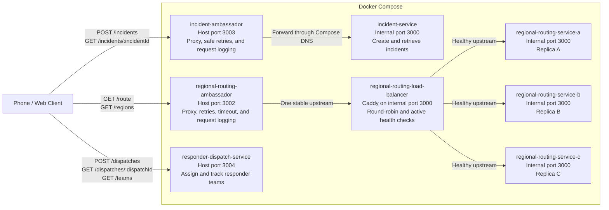

<!-- AI: This file was substantially modified with AI assistance. See ai/chats/ for disclosures and session logs. -->
# Current Service List

- `emergency-gateway`: Receives mobile emergency requests, validates their basic shape, preserves an idempotency key for safe retries, and forwards accepted requests into the incident workflow.
- `incident-service` (Owner: `@austinfairbanks`): Creates and tracks simulated emergency incidents, assigns each request an incident ID and severity level, and maintains the authoritative incident state.
- `regional-routing-service` (Owner: `@ShriRadhakrishnan1`): Three identical, stateless replicas map an incident location and emergency type to the nearest campus/venue region and an eligible local response group via `GET /route` (query params: `latitude`, `longitude`, optional `emergencyType`). Each response exposes `servedBy` so replica selection is observable.
- `regional-routing-load-balancer`: Caddy load balancer that checks each routing replica's `/health` endpoint and distributes requests across healthy replicas using round-robin selection.
- `regional-routing-ambassador` (Owner: `@ShriRadhakrishnan1`): Ambassador proxy in front of the routing load balancer; forwards lookups, applies timeout/retry under load, and logs each upstream attempt.
- `incident-ambassador` (Owner: `@Dos0n`): Ambassador proxy in front of `incident-service`; forwards `GET` and `POST` requests, retries safe (`GET`/`HEAD`) requests on timeout or 5xx, never retries `POST /incidents` to avoid duplicate incident creation, applies a simulated request-inspection delay via `setTimeout` before replying, and logs each upstream attempt.
- `responder-dispatch-service` (Owner: `@Dos0n`): Simulates notifying and assigning the appropriate security, medical, police, or crisis-response team via `POST /dispatches` (body: `incidentId`, `teamId`), tracks dispatch status through `GET /dispatches/:dispatchId` and `PATCH /dispatches/:dispatchId/status`, and lists the response-team roster via `GET /teams`.

## Sprint 3 Container Architecture



The primary services remain separate client-facing paths in Sprint 3;
`incident-service`, `regional-routing-service`, and
`responder-dispatch-service` do not call each other directly. Two of the
primary services are only reachable through their own observable ambassador
container: `incident-ambassador` is the only path to `incident-service`, and
`regional-routing-ambassador` reaches the routing replicas through Caddy.
`responder-dispatch-service` is reached directly, with no ambassador in
front of it.

The regional routing service is replicated because routing is naturally
stateless. Every replica receives the location and emergency type, loads the
same synthetic regional map, and computes the answer independently. No
request depends on mutable state held by a particular replica. Caddy can
therefore send a request to any healthy replica and remove a failed replica
without changing routing results.

## Sprint 3 Routing Replication Verification

Run these commands from the Gantry devcontainer. Start the complete system and
validate Caddy's loaded configuration:

```bash
docker compose up --build -d
docker compose exec regional-routing-load-balancer \
  caddy validate --config /etc/caddy/Caddyfile
docker compose ps
```

Send nine requests through the public routing ambassador. All three
`servedBy` values should appear:

```bash
for request_number in 1 2 3 4 5 6 7 8 9; do
  curl -fsS \
    'http://localhost:3002/route?latitude=42.3868&longitude=-72.5301&emergencyType=medical' \
    | jq -r '.servedBy'
done
```

Stop replica B, wait longer than Caddy's two-second health-check interval,
and repeat the requests. Every request should still succeed, and only replicas
A and C should appear:

```bash
docker compose stop regional-routing-service-b
sleep 3

for request_number in 1 2 3 4 5 6; do
  curl -fsS \
    'http://localhost:3002/route?latitude=42.3868&longitude=-72.5301&emergencyType=medical' \
    | jq -r '.servedBy'
done
```

Restore replica B and confirm that the full system returns to a healthy state:

```bash
docker compose start regional-routing-service-b
docker compose ps
```

Regression-check the other existing service paths:

```bash
curl -fsS http://localhost:3003/health | jq
curl -fsS http://localhost:3004/health | jq
```

### Recorded Validation: July 30, 2026

The complete system built and started with `docker compose up --build -d`, and
every service with a configured health check reported healthy. Caddy reported
`Valid configuration` with no formatting warning.

- Nine requests were served in exact round-robin order: A, B, C repeated three
  times.
- After replica B was stopped, six immediate requests and six requests after
  the health-check interval all succeeded through replicas A and C only.
- After replica B restarted and became healthy, it rejoined Caddy's rotation.
- `GET /regions` returned five regions and exposed the serving replica.
- Invalid routing input returned `400`; out-of-area coordinates returned `404`.
- The incident ambassador and responder dispatch health endpoints both
  returned `200` with `status: "ok"`.

Any pull request that adds, removes, or renames a service or infrastructure
container, or changes a connection between them, must update both the service
list and the Mermaid diagram above. The repository pull-request template
includes this as a required checklist item.
<!-- AI: End AI-assisted file. See ai/chats/ for disclosures and session logs. -->
