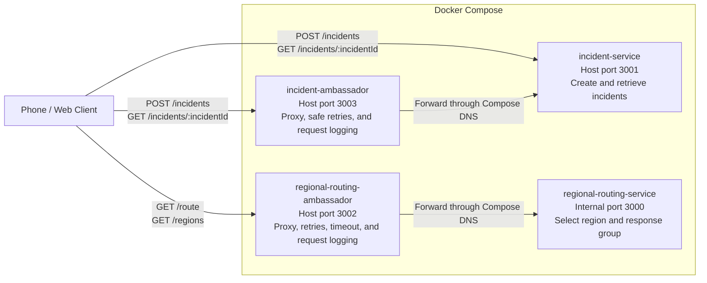

# Initial Service List

- `emergency-gateway`: Receives mobile emergency requests, validates their basic shape, preserves an idempotency key for safe retries, and forwards accepted requests into the incident workflow.
- `incident-service` (Owner: `@austinfairbanks`): Creates and tracks simulated emergency incidents, assigns each request an incident ID and severity level, and maintains the authoritative incident state.
- `regional-routing-service` (Owner: `@ShriRadhakrishnan1`): Maps an incident location and emergency type to the nearest campus/venue region and an eligible local response group via `GET /route` (query params: `latitude`, `longitude`, optional `emergencyType`).
- `regional-routing-ambassador` (Owner: `@ShriRadhakrishnan1`): Ambassador proxy in front of `regional-routing-service`; forwards lookups, applies timeout/retry under load, and logs each upstream attempt.
- `incident-ambassador` (Owner: `@Dos0n`): Ambassador proxy in front of `incident-service`; forwards `GET` and `POST` requests, retries safe (`GET`/`HEAD`) requests on timeout or 5xx, never retries `POST /incidents` to avoid duplicate incident creation, applies a simulated request-inspection delay via `setTimeout` before replying, and logs each upstream attempt.
- `responder-dispatch-service`: Simulates notifying and assigning the appropriate security, medical, police, or crisis-response team and records subsequent dispatch-status updates.

## Sprint 2 Container Architecture

The two primary services are separate client-facing paths in Sprint 2;
`incident-service` does not call `regional-routing-service`. Each primary
service has its own observable ambassador container sitting in front of it:
`incident-ambassador` proxies `incident-service`, and
`regional-routing-ambassador` proxies `regional-routing-service`.

Any pull request that adds, removes, or renames a service or infrastructure
container, or changes a connection between them, must update both the service
list and the Mermaid diagram above. The repository pull-request template
includes this as a required checklist item.
