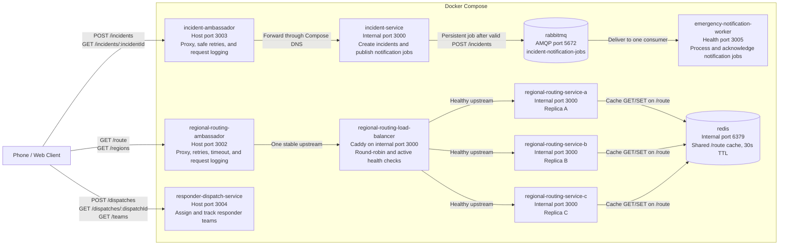

<!-- AI: This file was substantially modified with AI assistance. See AI-DISCLOSURE.md and ai/chats/2026-08-06-201302-austinf-sprint4-rabbitmq.jsonl. -->
# Service List

## Current Containerized Services

- `incident-service` (Owner: `@austinfairbanks`): Creates and tracks simulated emergency incidents, assigns each request an incident ID and severity level, maintains the authoritative incident state, and publishes one persistent notification job to RabbitMQ after a valid `POST /incidents` request.
- `rabbitmq`: Sprint 4 work-queue broker that durably stores `incident-notification-jobs` between the incident producer and notification worker; it is separate from the Sprint 3 Redis cache.
- `emergency-notification-worker` (Owner: `@austinfairbanks`): Consumes one RabbitMQ incident-notification job at a time, logs receipt and simulated notification completion, and acknowledges each valid job only after processing finishes.
- `regional-routing-service` (Owner: `@ShriRadhakrishnan1`): Three identical, stateless replicas map an incident location and emergency type to the nearest campus/venue region and an eligible local response group via `GET /route` (query params: `latitude`, `longitude`, optional `emergencyType`). Each response exposes `servedBy` so replica selection is observable. `GET /route` is Redis-cached: the cache key normalizes `latitude`/`longitude` to six decimal places and combines it with `emergencyType`, so an exact repeated lookup (e.g. many requests during an event at the Mullins Center) becomes a cache hit shared across all three replicas, without merging distinct nearby venues into the same key. Each response's `cache` field reports `"HIT"` or `"MISS"`, and every replica logs the cache key and outcome for each request. If Redis is unreachable, a lookup falls back to computing the route directly rather than failing the request.
- `regional-routing-load-balancer`: Caddy load balancer that checks each routing replica's `/health` endpoint and distributes requests across healthy replicas using round-robin selection.
- `redis`: Shared Redis cache used by all three `regional-routing-service` replicas for `GET /route` results, keyed by rounded location and emergency type with a 30-second TTL (`ROUTE_CACHE_TTL_SECONDS`).
- `regional-routing-ambassador` (Owner: `@ShriRadhakrishnan1`): Ambassador proxy in front of the routing load balancer; forwards lookups, applies timeout/retry under load, and logs each upstream attempt.
- `incident-ambassador` (Owner: `@Dos0n`): Ambassador proxy in front of `incident-service`; forwards `GET` and `POST` requests, retries safe (`GET`/`HEAD`) requests on timeout or 5xx, never retries `POST /incidents` to avoid duplicate incident creation, applies a simulated request-inspection delay via `setTimeout` before replying, and logs each upstream attempt.
- `responder-dispatch-service` (Owner: `@Dos0n`): Simulates notifying and assigning the appropriate security, medical, police, or crisis-response team via `POST /dispatches` (body: `incidentId`, `teamId`), tracks dispatch status through `GET /dispatches/:dispatchId` and `PATCH /dispatches/:dispatchId/status`, and lists the response-team roster via `GET /teams`.

## Planned Service

- `emergency-gateway` (not yet containerized): Will receive mobile emergency requests, validate their basic shape, preserve an idempotency key for safe retries, and forward accepted requests into the incident workflow.

## Current Sprint 4 Container Architecture



The primary HTTP services remain separate client-facing paths in Sprint 4;
`incident-service`, `regional-routing-service`, and
`responder-dispatch-service` do not call each other directly. A valid incident
creation now branches into asynchronous work: `incident-service` publishes a
persistent job to RabbitMQ and returns after broker confirmation without
waiting for `emergency-notification-worker` to process it. RabbitMQ holds jobs
while the worker is unavailable and redelivers a job when a worker disconnects
before acknowledging it.

Two primary services remain reachable through their observable ambassador
containers: `incident-ambassador` is the public path to `incident-service`, and
`regional-routing-ambassador` reaches the routing replicas through Caddy.
`responder-dispatch-service` is reached directly, with no ambassador in front
of it. Redis remains exclusively the shared routing cache and does not carry
Sprint 4 notification work.

The regional routing service is replicated because routing is naturally
stateless. Every replica receives the location and emergency type, loads the
same synthetic regional map, and computes the answer independently. No
request depends on mutable state held by a particular replica. Caddy can
therefore send a request to any healthy replica and remove a failed replica
without changing routing results.

## Sprint 3 Routing Replication and Caddy Verification

Run these commands from the Gantry devcontainer. Start the complete system and
validate Caddy's loaded configuration:

```bash
docker compose up --build -d
docker compose exec regional-routing-load-balancer \
  caddy validate --config /etc/caddy/Caddyfile
docker compose ps
```

Send nine requests through the public routing ambassador. All three
`servedBy` values should appear:

```bash
for request_number in 1 2 3 4 5 6 7 8 9; do
  curl -fsS \
    'http://localhost:3002/route?latitude=42.3868&longitude=-72.5301&emergencyType=medical' \
    | jq -r '.servedBy'
done
```

Stop replica B, wait longer than Caddy's two-second health-check interval,
and repeat the requests. Every request should still succeed, and only replicas
A and C should appear:

```bash
docker compose stop regional-routing-service-b
sleep 3

for request_number in 1 2 3 4 5 6; do
  curl -fsS \
    'http://localhost:3002/route?latitude=42.3868&longitude=-72.5301&emergencyType=medical' \
    | jq -r '.servedBy'
done
```

Restore replica B and confirm that the full system returns to a healthy state:

```bash
docker compose start regional-routing-service-b
docker compose ps
```

Regression-check the other existing service paths:

```bash
curl -fsS http://localhost:3003/health | jq
curl -fsS http://localhost:3004/health | jq
```

### Recorded Validation: July 30, 2026

The complete system built and started with `docker compose up --build -d`, and
every service with a configured health check reported healthy. Caddy reported
`Valid configuration` with no formatting warning.

- Nine requests were served in exact round-robin order: A, B, C repeated three
  times.
- After replica B was stopped, six immediate requests and six requests after
  the health-check interval all succeeded through replicas A and C only.
- After replica B restarted and became healthy, it rejoined Caddy's rotation.
- `GET /regions` returned five regions and exposed the serving replica.
- Invalid routing input returned `400`; out-of-area coordinates returned `404`.
- The incident ambassador and responder dispatch health endpoints both
  returned `200` with `status: "ok"`.

## Sprint 3 Redis Caching Verification

With the system running, request the same location twice through the public
routing ambassador. The first request is a cache miss and pays the simulated
`ROUTING_LATENCY_MS` delay; the second is a cache hit and returns almost
immediately, from whichever replica Caddy happens to pick next:

```bash
curl -s -w '\n%{time_total}s\n' \
  'http://localhost:3002/route?latitude=42.3800&longitude=-72.5200&emergencyType=fire'
curl -s -w '\n%{time_total}s\n' \
  'http://localhost:3002/route?latitude=42.3800&longitude=-72.5200&emergencyType=fire'
```

Each response's `cache` field reports `"MISS"` on the first call and `"HIT"`
on the second, even though `servedBy` may name a different replica, confirming
the cache is shared through Redis rather than held per-replica. Every
replica's logs record the cache key and outcome for each request:

```bash
docker compose logs regional-routing-service-a regional-routing-service-b \
  regional-routing-service-c --no-log-prefix | grep cacheStatus
```

### Recorded Validation: August 2, 2026

- A first request to a fresh coordinate pair returned `"cache":"MISS"` and
  took ~297 ms (the simulated 200 ms compute delay plus overhead); a second
  request to the same coordinates returned `"cache":"HIT"` in ~63 ms.
- The hit was served by a different replica than the miss, confirming the
  cache is shared across all three replicas through Redis rather than being
  local to one instance.
- Replica logs recorded a `"cacheStatus"` of `MISS` then `HIT` for the same
  cache key, matching the observed response behavior.
- A companion Sprint 3 k6 run generated a mixed workload of repeated and
  dispersed coordinates and observed roughly a 90%+ cache hit rate across the
  three replicas' logs, avoiding both the 0% and 100% hit-rate extremes.

To verify the cache degrades gracefully instead of failing requests, stop
Redis after warming a cache entry and request the same location again:

```bash
curl -s 'http://localhost:3002/route?latitude=42.3868&longitude=-72.5301&emergencyType=medical'
docker compose stop redis
curl -s -w '\nHTTP_STATUS:%{http_code}\n' \
  'http://localhost:3002/route?latitude=42.3912&longitude=-72.5267&emergencyType=fire'
docker compose start redis
```

The request made while Redis is down should still return `200` with a
correctly computed route (`"cache":"MISS"`), not a 5xx. Replica logs record a
`"Redis cache read failed; falling back to direct route calculation"` message
for that request.

### Recorded Validation: August 3, 2026

- With Redis stopped, a routing request still returned `200` with a correct,
  freshly computed route in ~360 ms (the simulated compute delay plus the
  now-immediate Redis rejection); replica logs recorded the fallback message
  above instead of an unhandled error.
- Restarting Redis restored caching immediately; a previously warmed cache
  key returned `"cache":"HIT"` again on the next request.

Any pull request that adds, removes, or renames a service or infrastructure
container, or changes a connection between them, must update both the service
list and the Mermaid diagram above. The repository pull-request template
includes this as a required checklist item.
<!-- AI: End AI-assisted file. See AI-DISCLOSURE.md and ai/chats/2026-08-06-201302-austinf-sprint4-rabbitmq.jsonl. -->
